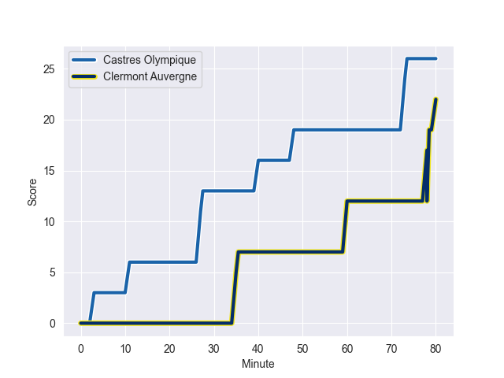
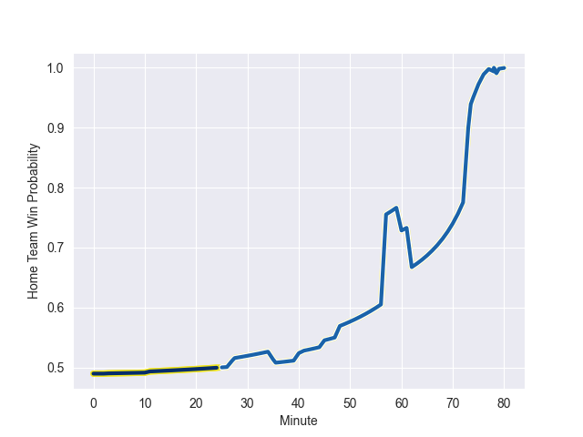

---  
layout: page  
title: Clermont Auvergne at Castres Olympique; 22-26  
date: 2022-10-29 15:00:00 18:00:00 -0500  
categories: match review  
---
# Clermont Auvergne (1565.81) at Castres Olympique (1565.13); 22-26

# Prediction: Castres Olympique by 4.9

Clermont Auvergne by 0.1 on a neutral field
## Scores over Time

## Win Probability over Time

# Pre-Match Prediction: Clermont Auvergne by 4.4

Clermont Auvergne by 0.6 on a neutral pitch

|   Away Minutes | Away Player          |   Away elo |   Away Percentile |   Number |   Home Percentile |   Home elo | Home Player          |   Home Minutes |
|---------------:|:---------------------|-----------:|------------------:|---------:|------------------:|-----------:|:---------------------|---------------:|
|             57 | Giorgi Beria         |      98.78 |                72 |        1 |                53 |      97.13 | Wayan de Benedittis  |             41 |
|             62 | Benjamin Boudou      |      93.35 |               nan |        2 |                93 |     110.49 | Gaetan Barlot        |             68 |
|             45 | Davit Kubriashvili   |     118.12 |                98 |        3 |                86 |     104.4  | Wilfrid Hounkpatin   |             51 |
|             80 | Thibaud Lanen        |      97.74 |                63 |        4 |                79 |     101.96 | Florent Vanverberghe |             62 |
|             72 | Tomas Lavanini       |     105.98 |                87 |        5 |                76 |     101.4  | Tom Staniforth       |             74 |
|             80 | Arthur Iturria       |     107.35 |                86 |        6 |                77 |     102.16 | Mathieu Babillot     |             80 |
|             54 | Alexandre Fischer    |     112.16 |                91 |        7 |                69 |      99.45 | Josaia Raisuqe       |             45 |
|             80 | Fritz Lee            |     133.79 |                99 |        8 |                60 |      98.16 | Tyler Ardron         |             80 |
|             54 | Baptiste Jauneau     |      93.38 |                38 |        9 |                53 |      95.72 | Santiago Arata       |             15 |
|             68 | Anthony Belleau      |     106.06 |                82 |       10 |                95 |     121.34 | Benjamin Urdapilleta |             80 |
|             80 | Alivereti Raka       |     110.74 |                89 |       11 |                94 |     114.85 | Filipo Nakosi        |             80 |
|             54 | Apisai Naqalevu      |     103.79 |                78 |       12 |                75 |     102.5  | Vilimoni Botitu      |             80 |
|             80 | Cheikh Tiberghien    |      96.66 |                53 |       13 |                94 |     114.96 | Adrea Cocagi         |             69 |
|             80 | Bautista Delguy      |     103.52 |                78 |       14 |                88 |     110.34 | Geoffrey Palis       |             80 |
|             80 | Jean Pascal Barraque |      96    |                44 |       15 |                72 |     102.84 | Julien Dumora        |             80 |
|             35 | Valentin Simutoga    |      95    |               nan |       16 |                19 |      93.2  | Julien Blanc         |             65 |
|             26 | Killian Tixeront     |      97.69 |                66 |       17 |                49 |      96.51 | Quentin Walcker      |             39 |
|             26 | Sebastien Bezy       |     106.58 |                86 |       18 |                36 |      93.23 | Baptiste Delaporte   |             35 |
|             26 | George Moala         |     101.91 |                74 |       19 |                90 |     108.77 | Levan Chilachava     |             29 |
|             23 | Daniel Bibi Biziwu   |     100.77 |                71 |       20 |                 7 |      84.37 | Gauthier Maravat     |             18 |
|             18 | Yohan Beheregaray    |      94.72 |                46 |       21 |               nan |      96.25 | Pierre Colonna       |             12 |
|             12 | Jules Plisson        |     106.19 |                82 |       22 |                24 |      91.35 | Antoine Zeghdar      |             11 |
|              8 | Edward Annandale     |      92.26 |               nan |       23 |                81 |     105.09 | Leone Nakarawa       |              6 |

