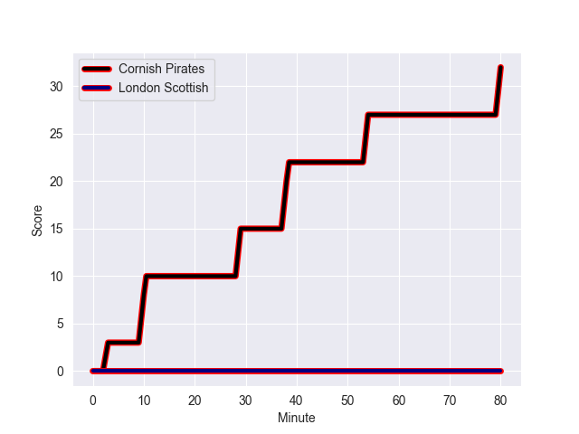
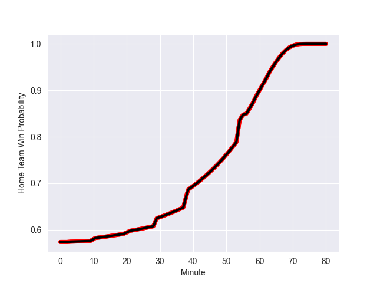

---  
layout: page  
title: London Scottish at Cornish Pirates; 0-32  
date: 2022-10-29 15:30:00 18:00:00 -0500  
categories: match review  
---
# London Scottish (1285.66) at Cornish Pirates (1414.79); 0-32

# Prediction: Cornish Pirates by 17.9

Cornish Pirates by 12.9 on a neutral field
## Scores over Time

## Win Probability over Time

# Pre-Match Prediction: Cornish Pirates by 21.7

Cornish Pirates by 16.7 on a neutral pitch

|   Away Minutes | Away Player          |   Away elo |   Away Percentile |   Number |   Home Percentile |   Home elo | Home Player            |   Home Minutes |
|---------------:|:---------------------|-----------:|------------------:|---------:|------------------:|-----------:|:-----------------------|---------------:|
|             63 | Jordan Els           |      92.72 |                29 |        1 |                13 |      88.5  | Marlen Walker          |             59 |
|             80 | Austin Wallis        |      87.87 |                10 |        2 |                40 |      93.66 | William Crane          |             59 |
|             80 | William Hobson       |      93.85 |                49 |        3 |                20 |      91.06 | Harvey Beaton          |             50 |
|             80 | David Douglas Bridge |      89.09 |                16 |        4 |                 9 |      83.83 | Cory Teague            |             80 |
|             70 | Matt Wilkinson       |      87.43 |                16 |        5 |                13 |      86.2  | Will Britton           |             57 |
|             50 | Brian Tuilagi        |      75.39 |                 1 |        6 |                22 |      91.11 | Alex Everett           |             21 |
|             80 | Will Trenholm        |      87.58 |                12 |        7 |                67 |      99.1  | John Stevens           |             80 |
|             80 | Cameron King         |      76.59 |                 2 |        8 |                55 |      96.55 | Sebastian Nagle-Taylor |             80 |
|             63 | Luca Petrozzi        |      83.53 |                 6 |        9 |                39 |      93.51 | Ruaridh Dawson         |             70 |
|             80 | Harry Sheppard       |      81.74 |                 2 |       10 |                28 |      92.33 | Arwel Robson           |             59 |
|             80 | Cassius Cleaves      |      93.48 |                37 |       11 |                93 |     114.4  | Alexander AJ Cant      |             80 |
|             20 | Bryn Bradley         |      92.41 |                28 |       12 |                25 |      91.65 | Joe Elderkin           |             80 |
|             80 | Theo Manihera        |      85.34 |                 8 |       13 |                77 |     103.38 | Rory Parata            |             57 |
|             56 | Noah Ferdinand       |      66.83 |                 0 |       14 |                15 |      88.97 | Robin Wedlake          |             80 |
|             80 | Cameron Anderson     |      83.44 |                 6 |       15 |                22 |      91.34 | Carwyn Penny           |             80 |
|             30 | Viliami Taulani      |      87.05 |                14 |       16 |               nan |      94.49 | Ollie Adkins           |             21 |
|             17 | Maurice Nwakor       |      86.85 |                12 |       17 |               nan |      93.15 | Max Norey              |             21 |
|             24 | Luke Mehson          |      93.7  |                39 |       18 |                86 |     103.48 | Jack Andrew            |             30 |
|             17 | Daniel Nutton        |      78.21 |                 2 |       19 |                50 |      95.48 | James Fender           |             23 |
|             10 | Calum Scott          |      94.81 |               nan |       20 |                49 |      95.15 | Will Gibson            |             59 |
|             60 | Zach Clow            |      88.94 |                20 |       21 |                48 |      95.05 | Harry Bazalgette       |             10 |
|            nan | nan                  |     nan    |               nan |       22 |                29 |      93.67 | Tom Kessell            |             21 |
|            nan | nan                  |     nan    |               nan |       23 |                31 |      92.55 | Tom Wyatt              |             23 |

