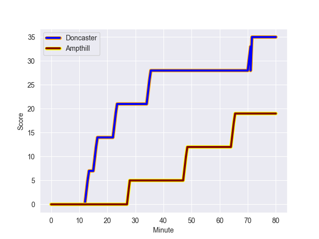
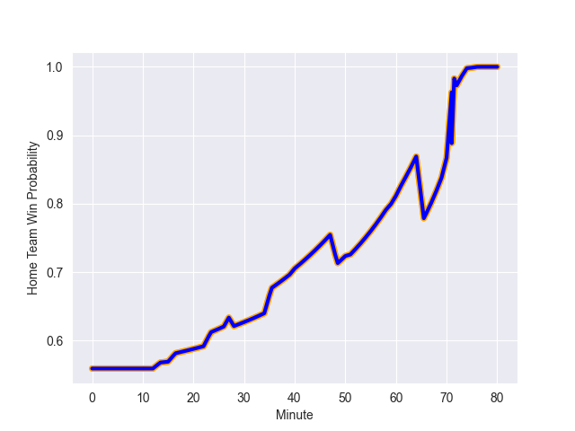

---  
layout: page  
title: Ampthill at Doncaster; 19-35  
date: 2022-10-29 15:30:00 18:00:00 -0500  
categories: match review  
---
# Ampthill (1424.28) at Doncaster (1527.77); 19-35

# Prediction: Doncaster by 17.3

Doncaster by 10.3 on a neutral field
## Scores over Time

## Win Probability over Time

# Pre-Match Prediction: Doncaster by 18.4

Doncaster by 11.4 on a neutral pitch

|   Away Minutes | Away Player      |   Away elo |   Away Percentile |   Number |   Home Percentile |   Home elo | Home Player    |   Home Minutes |
|---------------:|:-----------------|-----------:|------------------:|---------:|------------------:|-----------:|:---------------|---------------:|
|             80 | Michael Jones    |      95    |               nan |        1 |                41 |      93.99 | Ben Carlile    |             40 |
|             74 | Beck Cutting     |      89.59 |               nan |        2 |               nan |      92.77 | Will Holling   |             61 |
|             66 | 'Aleki Lutui     |      94.44 |                49 |        3 |                74 |     101.6  | Jake Armstrong |             51 |
|             80 | Charlie Beckett  |     109.89 |                90 |        4 |                21 |      88.01 | Ehize Ehizode  |             80 |
|             80 | Harry Wilson     |      97.16 |                58 |        5 |                57 |      97.07 | Ben Murphy     |             75 |
|             80 | Caleb Montgomery |      87.67 |                18 |        6 |                69 |      99.63 | Martin Molina  |             72 |
|             59 | Joe Bercis       |      97.23 |                68 |        7 |                46 |      94.78 | Sam Daly       |             80 |
|             66 | Morgan Strong    |      90.49 |                26 |        8 |                64 |      98.34 | Thom Smith     |             27 |
|             80 | Peter White      |      91.86 |                32 |        9 |                96 |     117.54 | Alex Dolly     |             75 |
|             40 | Gwyn Parks       |      98.18 |                60 |       10 |                72 |     101.28 | Sam Olver      |             80 |
|             80 | Josh Skelcey     |      81.98 |                 8 |       11 |                91 |     112.97 | Maliq Holden   |             80 |
|             80 | Joshua Bragman   |     107.59 |                85 |       12 |                50 |      96.14 | Connor Edwards |             80 |
|             58 | Charlie Hudson   |      96.89 |                54 |       13 |                86 |     108.36 | Joe Margetts   |             80 |
|             80 | Conor Rankin     |      94.65 |                46 |       14 |                82 |     105.65 | George Simpson |             63 |
|             70 | Tomas Bacon      |      95.05 |                49 |       15 |                91 |     113.29 | Harry Davey    |             80 |
|             40 | Tom Hudson       |      94.36 |                44 |       16 |                90 |     114.18 | John Kelly     |             53 |
|             22 | Will Partington  |      96.9  |                59 |       17 |               nan |      95.56 | Kai Owen       |             40 |
|             21 | Cai Devine       |     104.06 |                77 |       18 |                30 |      91.88 | Mak Wilson     |             29 |
|             14 | Joe Sproston     |      90.47 |                25 |       19 |                60 |      97.23 | George Roberts |             19 |
|             14 | Llewellyn Jones  |      70.82 |                 2 |       20 |                81 |     105.2  | Jack Spittle   |             17 |
|             10 | Lewis Finlay     |      96.86 |                55 |       21 |                63 |      99.64 | Evan Mintern   |              5 |
|              6 | Matt Gallagher   |      98.06 |                64 |       22 |                28 |      93.2  | Joe Green      |              5 |
|            nan | nan              |     nan    |               nan |       23 |                24 |      89.59 | Jared Cardew   |              8 |

