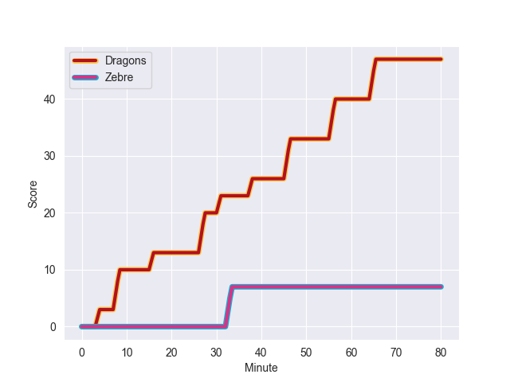
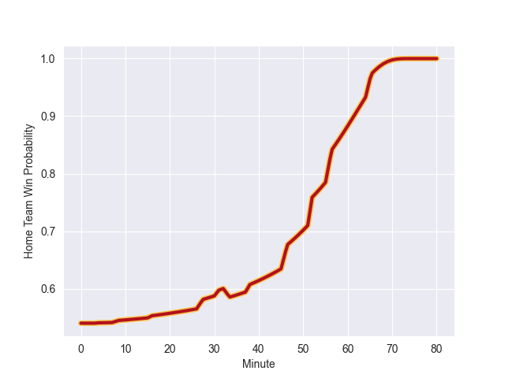

---  
layout: page  
title: Zebre at Dragons; 7-47  
date: 2022-10-29 18:15:00 18:00:00 -0500  
categories: match review  
---
# Zebre (1322.0) at Dragons (1419.49); 7-47

# Prediction: Dragons by 16.7

Dragons by 9.7 on a neutral field
## Scores over Time

## Win Probability over Time

# Pre-Match Prediction: Dragons by 18.2

Dragons by 11.2 on a neutral pitch

|   Away Minutes | Away Player            |   Away elo |   Away Percentile |   Number |   Home Percentile |   Home elo | Home Player       |   Home Minutes |
|---------------:|:-----------------------|-----------:|------------------:|---------:|------------------:|-----------:|:------------------|---------------:|
|             47 | Juan Manuel Pitinari   |      94.12 |                42 |        1 |                42 |      94.47 | Aki Seiuli        |             66 |
|             47 | Jacques du Toit        |      87.76 |                18 |        2 |                71 |      99.89 | Elliot Dee        |             70 |
|             55 | Matteo Nocera          |      96.84 |                55 |        3 |                13 |      86.52 | Lloyd Fairbrother |             56 |
|             80 | Leonard Krumov         |      71.66 |                 2 |        4 |                16 |      85.77 | Joseph Davies     |             80 |
|             47 | Andrea Zambonin        |      87.27 |                20 |        5 |                 4 |      78.76 | Sean Lonsdale     |             80 |
|             80 | Davide Ruggeri         |      94.19 |                41 |        6 |                78 |     103.09 | Aaron Wainwright  |             60 |
|             80 | Iacopo Bianchi         |      77.6  |                 3 |        7 |                 2 |      75.07 | Harrison Keddie   |             80 |
|             66 | Taina Fox-Matamua      |      96.95 |                52 |        8 |                78 |     104.72 | Ross Moriarty     |             52 |
|             52 | Chris Cook             |      88.48 |                20 |        9 |                73 |     102.05 | Rhodri Williams   |             50 |
|             52 | Tiff Eden              |      98.13 |                59 |       10 |                85 |     109.37 | Sam Davies        |             80 |
|             80 | Jacopo Trulla          |      82.37 |                 8 |       11 |                19 |      88.12 | Jared Rosser      |             73 |
|             80 | Damiano Mazza          |      76.64 |                 4 |       12 |                76 |     104.03 | Max Clark         |             58 |
|             47 | Tommaso Boni           |      71.06 |                 2 |       13 |                95 |     119.31 | Steffan Hughes    |             80 |
|             80 | Latu Latunipulu        |      71.38 |                 1 |       14 |               nan |      95    | David Richards    |             80 |
|             80 | Richard Kriel          |     109.84 |                87 |       15 |                 6 |      77.46 | Angus O'Brien     |             80 |
|             33 | Jan Uys                |      99.25 |                68 |       16 |                21 |      89.3  | Gonzalo Bertranou |             30 |
|             33 | Lorenzo Pani           |      97.2  |                57 |       17 |                75 |     102.17 | Ben Fry           |             28 |
|             33 | Alessio Sanavia        |      94.36 |               nan |       18 |                28 |      91.67 | Chris Coleman     |             24 |
|             33 | Marco Manfredi         |      72.61 |                 0 |       19 |                63 |      99.17 | Aneurin Owen      |             22 |
|             28 | Ratko Jelic            |      95    |               nan |       20 |                12 |      85.16 | Huw Taylor        |             20 |
|             28 | Geronimo Prisciantelli |     114.93 |                90 |       21 |                95 |     113.4  | Rob Evans         |             14 |
|             25 | Muhamed Hasa           |      97.86 |                62 |       22 |                63 |      98.56 | James Benjamin    |             10 |
|             14 | Giacomo Ferrari        |      95    |               nan |       23 |                93 |     118.68 | JJ Hanrahan       |              7 |

