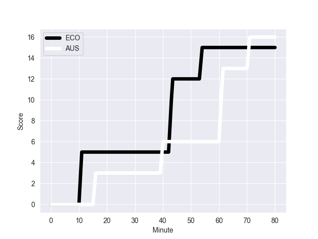
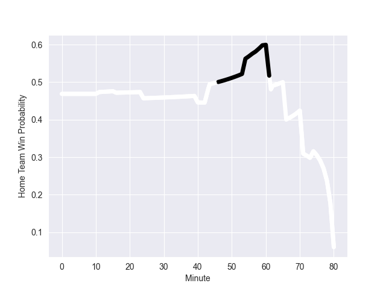

---  
layout: page  
title: AUS at ECO; 16-15  
date: 2022-10-29 18:30:00 18:00:00 -0500  
categories: match review  
---
# AUS (1648.24) at ECO (1593.81); 16-15

# Prediction: ECO by 1.6

AUS by 5.4 on a neutral field
## Scores over Time

## Win Probability over Time

# Pre-Match Prediction: AUS by 0.3

AUS by 6.7 on a neutral pitch

|   Away Minutes | Away Player     |   Away elo |   Away Percentile |   Number |   Home Percentile |   Home elo | Home Player         |   Home Minutes |
|---------------:|:----------------|-----------:|------------------:|---------:|------------------:|-----------:|:--------------------|---------------:|
|             66 | James Slipper   |     133.03 |                99 |        1 |                12 |      85.82 | Pierre Schoeman     |             60 |
|             57 | Dave Porecki    |     121.06 |                97 |        2 |                72 |     100.16 | Dave Cherry         |             60 |
|             40 | Allan Alaalatoa |     110.96 |                93 |        3 |                98 |     119.89 | Zander Fagerson     |             60 |
|             80 | Nick Frost      |      88.64 |                22 |        4 |                94 |     116.31 | Sam Skinner         |             24 |
|             62 | Cadeyrn Neville |     107.41 |                86 |        5 |                92 |     112.65 | Grant Gilchrist     |             80 |
|             80 | Jed Holloway    |      88.71 |                21 |        6 |                95 |     119.24 | Jamie Ritchie       |             80 |
|             80 | Michael Hooper  |     129.82 |                98 |        7 |                70 |     100.11 | Hamish Watson       |             80 |
|             74 | Rob Valetini    |      97.32 |                53 |        8 |                90 |     113.54 | Matt Fagerson       |             60 |
|             56 | Tate McDermott  |     103.09 |                76 |        9 |                74 |     101.93 | Ali Price           |             66 |
|             74 | Bernard Foley   |     136.53 |                98 |       10 |                99 |     138.05 | Blair Kinghorn      |             80 |
|             80 | Tom Wright      |      92.73 |                37 |       11 |                40 |      93.31 | Duhan van der Merwe |             80 |
|             80 | Hunter Paisami  |     110.49 |                88 |       12 |               nan |      73.34 | Sione Tuipulotu     |             80 |
|             80 | Len Ikitau      |     112.41 |                89 |       13 |                95 |     118.72 | Mark Bennett        |             80 |
|             80 | Andrew Kellaway |     110.48 |                88 |       14 |                95 |     120.04 | Darcy Graham        |             74 |
|             66 | Tom Banks       |     115.09 |                93 |       15 |               nan |      93.88 | Ollie Smith         |             80 |
|             23 | Folau Fainga'a  |     123.4  |                98 |       16 |                97 |     119.98 | George Turner       |             20 |
|             14 | Matt Gibbon     |     106.18 |                85 |       17 |                91 |     108.03 | Jamie Bhatti        |             20 |
|             40 | Taniela Tupou   |     102.9  |                71 |       18 |                98 |     124.39 | WP Nel              |             20 |
|             18 | Ned Hanigan     |      94.29 |                45 |       19 |                33 |      88.83 | Glen Young          |             56 |
|              6 | Langi Gleeson   |      97.37 |                62 |       20 |                 6 |      77.59 | Jack Dempsey        |             20 |
|             24 | Nic White       |     129.26 |                99 |       21 |                98 |     127.94 | George Horne        |             14 |
|              6 | Noah Lolesio    |      97.74 |                55 |       22 |                80 |     104.74 | Damien Hoyland      |              6 |
|             14 | Jock Campbell   |      95.2  |                48 |       23 |               nan |     nan    | nan                 |            nan |

