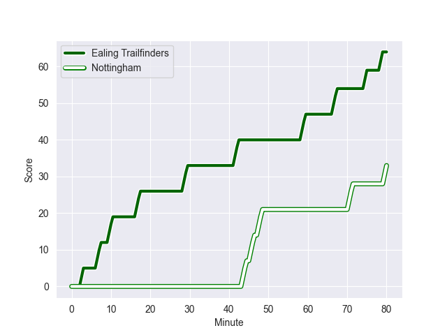
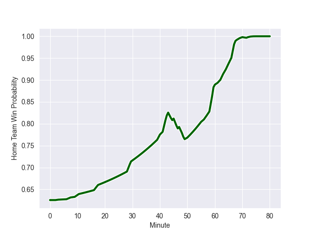

---  
layout: page  
title: Nottingham at Ealing Trailfinders; 33-64  
date: 2022-10-29 16:00:00 18:00:00 -0500  
categories: match review  
---
# Nottingham (1451.43) at Ealing Trailfinders (1626.15); 33-64

# Prediction: Ealing Trailfinders by 22.5

Ealing Trailfinders by 17.5 on a neutral field
## Scores over Time

## Win Probability over Time

# Pre-Match Prediction: Ealing Trailfinders by 25.1

Ealing Trailfinders by 20.1 on a neutral pitch

|   Away Minutes | Away Player               |   Away elo |   Away Percentile |   Number |   Home Percentile |   Home elo | Home Player         |   Home Minutes |
|---------------:|:--------------------------|-----------:|------------------:|---------:|------------------:|-----------:|:--------------------|---------------:|
|             80 | Toby Williams             |      88.1  |                12 |        1 |                95 |     111.77 | Kyle John Whyte     |             64 |
|             50 | Harry Clayton             |      99.61 |                74 |        2 |                98 |     119.95 | Shaun Malton        |             59 |
|             50 | Ben Betts                 |      93.9  |                25 |        3 |                49 |      95.85 | Ross Kane           |             59 |
|             80 | Thomas Manz               |     100.78 |                74 |        4 |                96 |     119.61 | Bobby de Wee        |             80 |
|             61 | Lewis Chessum             |      94.29 |                47 |        5 |                94 |     113.97 | Barney Maddison     |             59 |
|             56 | George Cox                |     106.7  |                85 |        6 |                64 |      98.81 | Rob Farrar          |             80 |
|             80 | Nathan Tweedy             |     103.97 |                81 |        7 |                58 |      96.74 | Carlo Tizzano       |             48 |
|             40 | Josh Poullet              |      92.8  |                32 |        8 |                98 |     128.78 | Ryan Smid           |             61 |
|             43 | Liam Slatem               |      96.35 |                56 |        9 |                88 |     109.38 | Jordan Burns        |             62 |
|             80 | Morgan Bunting            |      92.51 |                16 |       10 |                97 |     125.88 | Craig Willis        |             49 |
|             80 | Harry Graham              |      96.64 |                55 |       11 |                84 |     107.25 | Luke Daniels        |             80 |
|             80 | Jack Neville              |      96.94 |                52 |       12 |                88 |     109.93 | Steve Shingler      |             80 |
|             80 | Charlie Thacker           |     105.59 |                82 |       13 |                 4 |      82.39 | Reuben Bird-Tulloch |             80 |
|             56 | David Williams            |      87.3  |                11 |       14 |                80 |     104.84 | Jonah Holmes        |             80 |
|             80 | Jordan Olowofela          |     101.42 |                69 |       15 |                97 |     121.39 | David Johnston      |             80 |
|             40 | Scott Hall                |      80.69 |                 4 |       16 |                94 |     115.67 | Simon Uzokwe        |             32 |
|             37 | Micheal Stronge           |      89.48 |                13 |       17 |                89 |     110.23 | Max Bodilly         |             31 |
|             30 | Xavier Valentine          |      94.28 |               nan |       18 |                54 |      96.94 | Cameron Terry       |             21 |
|             30 | Jack Dickinson            |     101.91 |                78 |       19 |                55 |      96.38 | David O'Connor      |             21 |
|             24 | Marcus Alexander Ramage   |     101.7  |                72 |       20 |                47 |      96.92 | George Davis        |             21 |
|             24 | Emeka Remigius Ilione     |      94.28 |                43 |       21 |                84 |     106.96 | Jack Digby          |             19 |
|             19 | Iosefa Danny Wayne Fiaola |     103.42 |                83 |       22 |                25 |      91.95 | Jack Grant          |             18 |
|            nan | nan                       |     nan    |               nan |       23 |                69 |      99.72 | Will Davis          |             16 |

