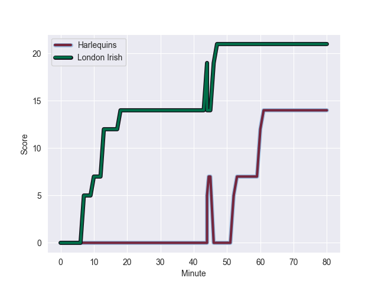
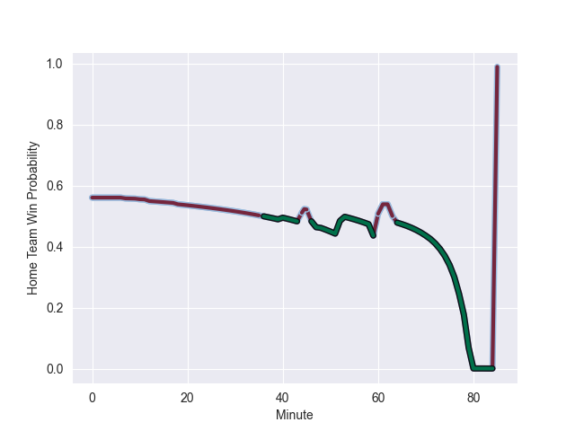

---  
layout: page  
title: London Irish at Harlequins; 21.0-14.0  
date: 2022-10-29 10:00:00 18:00:00 -0500  
categories: match review  
---
# London Irish (1073.94) at Harlequins (1179.69); 21.0-14.0

# Prediction: Harlequins by 15.6

Harlequins by 10.6 on a neutral field
## Scores over Time

## Win Probability over Time

# Pre-Match Prediction: Harlequins by 14.0

Harlequins by 9.0 on a neutral pitch

|   Away Minutes | Away Player                |   Away elo |   Away Percentile |   Number |   Home Percentile |   Home elo | Home Player       |   Home Minutes |
|---------------:|:---------------------------|-----------:|------------------:|---------:|------------------:|-----------:|:------------------|---------------:|
|             59 | Will Goodrick-Clarke       |      63.37 |                54 |        1 |                95 |      99.78 | Joe Marler        |             80 |
|             59 | Mike Willemse              |      65.12 |                53 |        2 |                74 |      69.88 | Jack Musk         |             64 |
|             59 | Lovejoy Chawatama          |      60.96 |                41 |        3 |                91 |      89.12 | Wilco Louw        |             64 |
|             80 | Chunya Munga               |      65.17 |                65 |        4 |                32 |      60.18 | George Hammond    |             80 |
|             80 | Rob Simmons                |      98.16 |                96 |        5 |                82 |      74.91 | Irne Herbst       |             80 |
|             80 | Josh Basham                |      59.86 |                36 |        6 |                85 |      78.79 | Jack Kenningham   |             80 |
|             80 | Ben Donnell                |      64.84 |                62 |        7 |                65 |      65.68 | Will Evans        |             80 |
|             48 | So'otala Fa'aso'o          |      70.78 |                73 |        8 |                91 |      87.5  | Alex Dombrandt    |             80 |
|             48 | Caolan Englefield          |      62.48 |               nan |        9 |                99 |     121.52 | Danny Care        |             80 |
|             80 | Paddy Jackson              |      97.97 |                93 |       10 |                85 |      82.49 | Tommaso Allan     |             80 |
|             80 | Ollie Hassell-Collins      |      61.25 |                44 |       11 |                72 |      69.43 | Josh Bassett      |             80 |
|             80 | Benhard Janse van Rensburg |      63.18 |                48 |       12 |                76 |      74.46 | Andre Esterhuizen |             80 |
|             63 | Luca Morisi                |      99.52 |                96 |       13 |                57 |      65.99 | Lennox Anyanwu    |             53 |
|             80 | Ben Loader                 |      64.14 |                59 |       14 |                86 |      82.65 | Joe Marchant      |             80 |
|             40 | Tom Parton                 |      80.04 |                80 |       15 |                62 |      65.23 | Nick David        |             80 |
|             21 | Agustin Creevy             |     118.59 |               100 |       16 |                37 |      60.71 | George Head       |             16 |
|             21 | Facundo Gigena             |      59.39 |                33 |       17 |               nan |      60.35 | Fin Baxter        |              0 |
|             21 | Oli Hoskins                |      69.18 |                73 |       18 |                61 |      66.51 | Simon Kerrod      |             16 |
|              0 | Api Ratuniyarawa           |      62.88 |                53 |       19 |               nan |      94.28 | Charlie Matthews  |              0 |
|             32 | Juan Martin Gonzalez       |      61.77 |                48 |       20 |                51 |      62.84 | Archie White      |              0 |
|             32 | Joe Powell                 |      65.43 |                60 |       21 |                58 |      63.82 | Lewis Gjaltema    |              0 |
|             17 | Lucio Cinti                |      64.65 |                54 |       22 |                61 |      67.02 | Will Edwards      |              0 |
|             40 | James Stokes               |      63.63 |                51 |       23 |                48 |      61.36 | Oscar Beard       |             27 |

