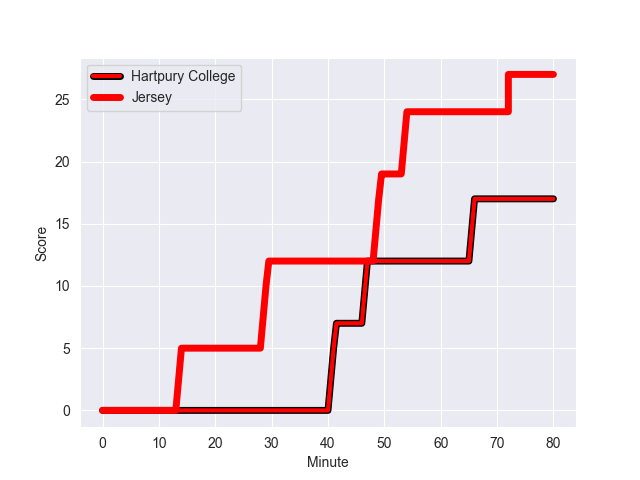
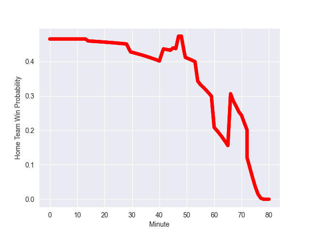

---  
layout: page  
title: Jersey at Hartpury College; 27-17  
date: 2022-10-29 14:30:00 18:00:00 -0500  
categories: match review  
---
# Jersey (1494.56) at Hartpury College (1451.01); 27-17

# Prediction: Hartpury College by 2.6

Jersey by 4.4 on a neutral field
## Scores over Time

## Win Probability over Time

# Pre-Match Prediction: Jersey by 2.1

Jersey by 9.1 on a neutral pitch

|   Away Minutes | Away Player                 |   Away elo |   Away Percentile |   Number |   Home Percentile |   Home elo | Home Player             |   Home Minutes |
|---------------:|:----------------------------|-----------:|------------------:|---------:|------------------:|-----------:|:------------------------|---------------:|
|             66 | Samuel Alexander Grahamslaw |      93.03 |                37 |        1 |               nan |      95    | Martin Mulhall          |             45 |
|             60 | Antonio TJ Harris           |      94.68 |                49 |        2 |                85 |     106.37 | Ethan Hunt              |             80 |
|             45 | Steven Longwell             |     101.44 |                74 |        3 |               nan |      96.51 | Mikey Summerfield       |             80 |
|             70 | Sean O'Connor               |     108.96 |                89 |        4 |                29 |      90.59 | Jack Davies             |             80 |
|             80 | Macauley Cook               |     138.66 |                99 |        5 |                74 |     101.65 | Dale Lemon              |             72 |
|             80 | James Dun                   |      79.69 |                 5 |        6 |               nan |      97.83 | Jack Bartlett           |             49 |
|             80 | Lewis Wynne                 |      92.19 |                35 |        7 |                63 |      98.24 | Jake Polledri           |             80 |
|             45 | Alun Lawrence               |      96.44 |                50 |        8 |                10 |      82.22 | Mitch Eadie             |             60 |
|             55 | James Elliott               |     109.79 |                89 |        9 |                67 |      99.19 | Jean-Baptiste Bruzulier |             49 |
|             80 | Russell Bennett             |      96.91 |                54 |       10 |                74 |     101.61 | George Barton           |             80 |
|             80 | Tomi Lewis                  |      95.24 |                49 |       11 |                18 |      87.09 | William Butler          |             66 |
|             67 | Jordan Holgate              |      95.3  |                47 |       12 |                55 |      97.58 | James Williams          |             80 |
|             80 | Alex McHenry                |      87.37 |                18 |       13 |                58 |      97.87 | Joseph Jenkins          |             80 |
|             60 | Ben Woollett                |      96.6  |                55 |       14 |                58 |      97.32 | Bradley Denty           |             80 |
|             80 | Scott Van Breda             |     114.08 |                92 |       15 |                57 |      97.55 | Tommy Mathews           |             80 |
|             35 | Adam Nicol                  |      92.16 |                36 |       16 |               nan |      96.3  | Tom Sims                |             35 |
|             35 | Max Argyle                  |     102.25 |                76 |       17 |               nan |      98.16 | Matty Jones             |             31 |
|             25 | James Mitchell              |      97.04 |                57 |       18 |                44 |      94.14 | Joe Howard              |             31 |
|             20 | Eoghan Clarke               |     102.13 |                79 |       19 |               nan |      97.84 | Samuel Lewis            |             20 |
|             20 | Ryan Hutler                 |      93.66 |                51 |       20 |                53 |      96.74 | Matthew McNab           |             14 |
|             14 | Greg McGrath                |      91.42 |                30 |       21 |                66 |     102.13 | Harry Short             |              8 |
|             13 | Dan Barnes                  |     103.04 |                80 |       22 |               nan |     nan    | nan                     |            nan |
|             10 | James Scott                 |      89.52 |                27 |       23 |               nan |     nan    | nan                     |            nan |

