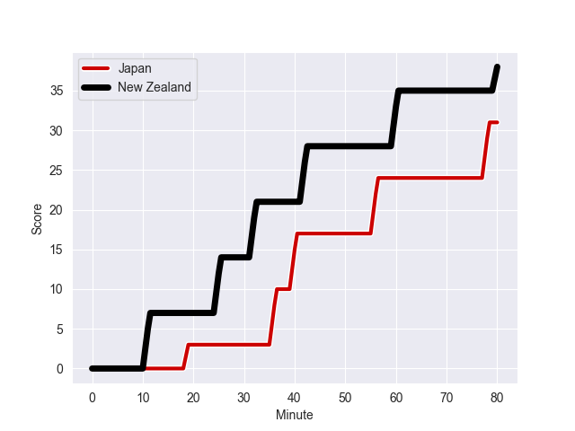
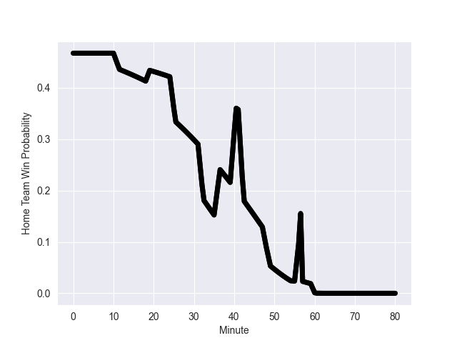

---  
layout: page  
title: New Zealand at Japan; 38.0-31.0  
date: 2022-10-29 01:50:00 18:00:00 -0500  
categories: match review  
---
# New Zealand (1170.38) at Japan (1123.17); 38.0-31.0

# Prediction: Japan by 0.3

New Zealand by 4.7 on a neutral field
## Scores over Time

## Win Probability over Time

# Pre-Match Prediction: New Zealand by 1.8

New Zealand by 3.2 on a neutral pitch

|   Away Minutes | Away Player         |   Away elo |   Away Percentile |   Number |   Home Percentile |   Home elo | Home Player            |   Home Minutes |
|---------------:|:--------------------|-----------:|------------------:|---------:|------------------:|-----------:|:-----------------------|---------------:|
|             55 | George Bower        |      57.87 |                17 |        1 |                90 |      85.11 | Keita Inagaki          |             47 |
|             55 | Samisoni Taukei'aho |      70.67 |                73 |        2 |                80 |      75.06 | Atsushi Sakate         |             82 |
|             55 | Nepo Laulala        |      79.18 |                87 |        3 |                65 |      65.99 | Jiwon Koo              |             71 |
|             82 | Brodie Retallick    |      84.99 |                89 |        4 |                70 |      68.02 | Warner Dearns          |             82 |
|             82 | Tupou Vaa'i         |      61.45 |                46 |        5 |                83 |      77.72 | Jack Cornelsen         |             82 |
|             63 | Shannon Frizell     |      67.52 |                69 |        6 |                98 |     108.67 | Michael Leitch         |             62 |
|             82 | Sam Cane            |     122.59 |                99 |        7 |                78 |      75.44 | Kazuki Himeno          |             82 |
|             66 | Hoskins Sotutu      |      84.49 |                89 |        8 |               nan |      64.36 | Tevita Tatafu          |             49 |
|             62 | Finlay Christie     |      72.5  |                73 |        9 |                84 |      78.22 | Yutaka Nagare          |             62 |
|             82 | Richie Mo'unga      |      94.75 |                92 |       10 |                86 |      87.26 | Takuya Yamasawa        |             49 |
|             82 | Caleb Clarke        |      68.4  |                71 |       11 |                 3 |      49.18 | Siosaia Fifita         |             57 |
|             69 | Roger Tuivasa-Sheck |      48.65 |                 3 |       12 |                83 |      80.44 | Ryoto Nakamura         |             82 |
|             64 | Braydon Ennor       |      68.36 |                66 |       13 |                84 |      80.98 | Dylan Riley            |             82 |
|             82 | Sevu Reece          |      85.97 |                88 |       14 |                96 |      98.09 | Kotaro Matsushima      |             82 |
|             82 | Stephen Perofeta    |      81.09 |                78 |       15 |                10 |      53.06 | Ryohei Yamanaka        |             82 |
|             27 | Codie Taylor        |      62.9  |                52 |       16 |               nan |      59.25 | Takeshi Hino           |              0 |
|             27 | Ofa Tu'ungafasi     |      77.98 |                86 |       17 |                39 |      60.84 | Craig Millar           |             35 |
|             27 | Tyrel Lomax         |      68.51 |                71 |       18 |               nan |      60    | Shuhei Takeuchi        |             11 |
|             19 | Patrick Tuipulotu   |     113    |                98 |       19 |               nan |      60    | Kanji Shimokawa        |             20 |
|             16 | Dalton Papali'i     |      64.61 |                61 |       20 |               nan |      60.72 | Faulua Makisi          |             33 |
|             20 | Aaron Smith         |      88.18 |                89 |       21 |               nan |      56.08 | Naoto Saito            |             20 |
|             13 | David Havili        |      84.82 |                88 |       22 |                27 |      58.73 | Seungsin Lee           |             33 |
|             18 | Anton Lienert-Brown |      91.69 |                93 |       23 |                98 |     104.77 | Gerhard van den Heever |             25 |

