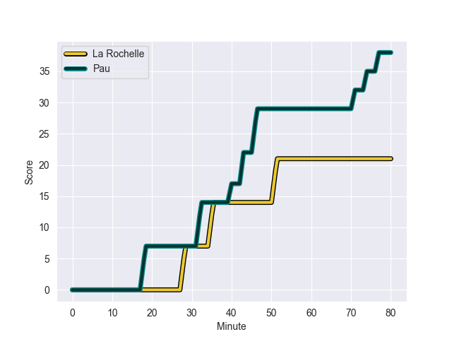
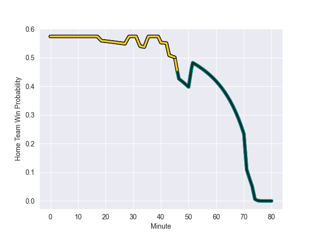

---  
layout: page  
title: Pau at La Rochelle; 38-21  
date: 2022-10-29 17:00:00 18:00:00 -0500  
categories: match review  
---
# Pau (2134.77) at La Rochelle (2181.1); 38-21

# Prediction: La Rochelle by 11.6

La Rochelle by 4.6 on a neutral field
## Scores over Time

## Win Probability over Time

# Pre-Match Prediction: La Rochelle by 10.1

La Rochelle by 3.1 on a neutral pitch

|   Away Minutes | Away Player               |   Away elo |   Away Percentile |   Number |   Home Percentile |   Home elo | Home Player                |   Home Minutes |
|---------------:|:--------------------------|-----------:|------------------:|---------:|------------------:|-----------:|:---------------------------|---------------:|
|             80 | ÂPaul Tailhades           |      95    |               nan |        1 |               nan |      95    | ÂThierry Paiva             |             80 |
|             80 | ÂRomain Ruffenach         |      95    |               nan |        2 |               nan |      95    | ÂQuentin Lespiaucq-Brettes |             80 |
|             80 | ÂGuram Papidze            |      91.14 |               nan |        3 |               nan |      95    | ÂGeorges-Henri Colombe     |             80 |
|             80 | ÂLekima Vuda Tagitagivalu |      91.14 |               nan |        4 |               nan |      95    | ÂThomas Lavault            |             80 |
|             80 | ÂFabrice Metz             |      95    |               nan |        5 |               nan |      95    | ÂWilliam Skelton           |             80 |
|             80 | ÂBeka Gorgadze            |      95    |               nan |        6 |               nan |      95    | ÂRĂ©mi Bourdeau            |             80 |
|             80 | ÂLuke Whitelock           |      91.14 |                28 |        7 |               nan |      95    | ÂKyle Hatherell            |             80 |
|             80 | ÂJordan Joseph            |      91.14 |               nan |        8 |               nan |      95    | ÂMatthias Haddad           |             80 |
|             80 | ÂThibault Daubagna        |      91.14 |                28 |        9 |               nan |      95    | ÂTawera Kerr-Barlow        |             80 |
|             80 | ÂZack Henry               |      91.14 |               nan |       10 |               nan |      95    | ÂAntoine Hastoy            |             80 |
|             80 | ÂVincent Pinto            |      95    |               nan |       11 |               nan |      95    | ÂDillyn Leyds              |             80 |
|             80 | ÂÉmilien Gailleton       |      91.14 |                30 |       12 |               nan |      95    | ÂLevani Botia              |             80 |
|             80 | ÂYvan Reilhac             |      95    |               nan |       13 |               nan |      95    | ÂRaymond Rhule             |             80 |
|             80 | ÂDaniel Ikpefan           |      95    |               nan |       14 |               nan |      95    | ÂTeddy Thomas              |             80 |
|             80 | ÂJack Maddocks            |      91.14 |                31 |       15 |               nan |      95    | ÂBrice Dulin               |             80 |
|             80 | ÂSteven Cummins           |      91.14 |                31 |       16 |               nan |      95    | ÂUJ Seuteni                |             80 |
|             80 | ÂYouri Delhommel          |      91.14 |                29 |       17 |               nan |      95    | ÂLeo Aouf                  |             80 |
|             80 | ÂClovis Le Bail           |      91.14 |               nan |       18 |               nan |      95    | ÂUltan Dillane             |             80 |
|             80 | ÂRĂ©mi Seneca             |      95    |               nan |       19 |               nan |      95    | ÂAleksandre Kuntelia       |             80 |
|             80 | ÂSiate Tokolahi           |      91.14 |               nan |       20 |               nan |      95    | ÂRĂ©mi Picquette           |             80 |
|             80 | ÂSacha Zegueur            |      91.14 |                30 |       21 |               nan |      95    | ÂLouis Penverne            |             80 |
|             80 | ÂReece Hewat              |      95    |               nan |       22 |               nan |      93.05 | Â                          |             80 |
|             80 | ÂClement Mondinat         |      95    |               nan |       23 |               nan |      93.05 | Â                          |             80 |

