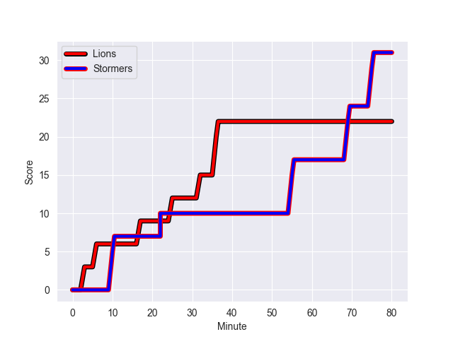

---  
layout: page  
title: Stormers at Lions; 31-22  
date: 2022-10-29 16:00:00 18:00:00 -0500  
categories: match review  
---
# Stormers (1657.19) at Lions (1533.64); 31-22

# Prediction: Stormers by 5.4

Stormers by 12.4 on a neutral field
## Scores over Time

## Win Probability over Time

# Pre-Match Prediction: Stormers by 0.7

Stormers by 6.3 on a neutral pitch

|   Away Minutes | Away Player                      |   Away elo |   Away Percentile |   Number |   Home Percentile |   Home elo | Home Player              |   Home Minutes |
|---------------:|:---------------------------------|-----------:|------------------:|---------:|------------------:|-----------:|:-------------------------|---------------:|
|             50 | Brok Harris                      |     146.41 |               100 |        1 |                93 |     110.43 | Jean-Pierre Smith        |             56 |
|             50 | Joseph Dweba                     |      96.6  |                56 |        2 |                28 |      90.68 | PJ Botha                 |             67 |
|             50 | Neethling Fouche                 |     105.63 |                84 |        3 |                97 |     118.67 | Ruan Dreyer              |             56 |
|             52 | Ernst van Rhyn                   |     118.52 |                94 |        4 |                70 |      99.92 | Willem Alberts           |             50 |
|             80 | Marvin Orie                      |      94.75 |                50 |        5 |                86 |     106.88 | Reinhard Nothnagel       |             80 |
|             52 | Junior Pokomela                  |      99.86 |                72 |        6 |                 5 |      80.04 | Emmanuel Tshituka        |             80 |
|             66 | Hacjivah Dayimani                |     117.57 |                92 |        7 |                92 |     115.37 | Ruan Venter              |             55 |
|             80 | Evan Roos                        |      99.98 |                65 |        8 |                80 |     105.53 | Francke Horn             |             80 |
|             58 | Albertus Paul de Wet             |      92.5  |                47 |        9 |                87 |     108.34 | Sanele Nohamba           |             55 |
|             80 | Manie Libbok                     |     101.54 |                74 |       10 |                18 |      88.13 | Jordan Hendrikse         |             55 |
|             80 | Leolin Zas                       |     111.48 |                89 |       11 |                82 |     105.81 | Quan Horn                |             80 |
|             80 | Sacha Mngomezulu                 |      97.56 |                61 |       12 |                88 |     110.9  | Marius Louw              |             74 |
|             80 | Daniel du Plessis                |     118.66 |                94 |       13 |                74 |     102.8  | Henco van Wyk            |             80 |
|             56 | Angelo Davids                    |     110.74 |                88 |       14 |                46 |      94.48 | Edwill van der Merwe     |             80 |
|             80 | Clayton Blommetjies              |     107.76 |                81 |       15 |                79 |     105.64 | Andries Coetzee          |             80 |
|             30 | Alistair Vermaak                 |     109.29 |                91 |       16 |                67 |      98.6  | Pieter Jansen van Vuuren |             30 |
|             30 | JJ Kotze                         |      92.54 |                46 |       17 |                81 |     106.53 | Gianni Dean Lombard      |             25 |
|             30 | Sazi Sandi                       |      86.89 |                11 |       18 |                47 |      94.02 | Sibusiso Sangweni        |             25 |
|             28 | Ben-Jason Dixon                  |     103.19 |                81 |       19 |                19 |      91.24 | Morne Van den Berg       |             25 |
|             28 | Kuyenzeka Kwenama Praisegod Xaba |      82.52 |                 8 |       20 |                93 |     113.02 | Ruan Smith               |             24 |
|             80 | SuleimanHartzenberg              |      98.76 |                65 |       21 |               nan |      96.72 | Morgan Naude             |             24 |
|             22 | Herschel Jantjies                |     119.14 |                96 |       22 |                89 |     108.52 | Jaco Visagie             |             13 |
|             14 | Willie Engelbrecht               |     110.03 |                88 |       23 |                78 |     106.68 | Zander du Plessis        |              6 |

