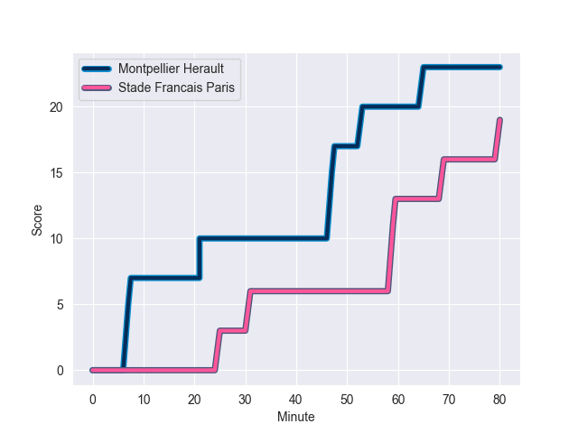
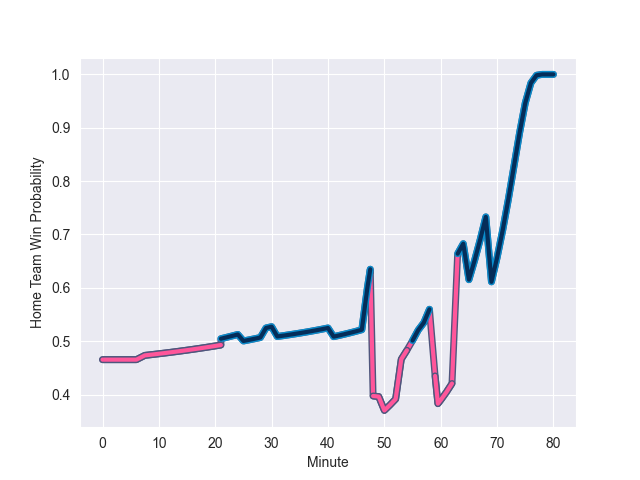

---  
layout: page  
title: Stade Francais Paris at Montpellier Herault; 19-23  
date: 2022-10-29 17:00:00 18:00:00 -0500  
categories: match review  
---
# Stade Francais Paris (1533.76) at Montpellier Herault (1481.78); 19-23

# Prediction: Stade Francais Paris by 0.2

Stade Francais Paris by 5.2 on a neutral field
## Scores over Time

## Win Probability over Time

# Pre-Match Prediction: Stade Francais Paris by 1.6

Stade Francais Paris by 6.6 on a neutral pitch

|   Away Minutes | Away Player             |   Away elo |   Away Percentile |   Number |   Home Percentile |   Home elo | Home Player              |   Home Minutes |
|---------------:|:------------------------|-----------:|------------------:|---------:|------------------:|-----------:|:-------------------------|---------------:|
|             44 | Moses Alo-Emile         |      99.63 |                71 |        1 |                92 |     108.15 | Enzo Forletta            |             57 |
|             41 | Laurent Panis           |      90.09 |                13 |        2 |                47 |      94.86 | Vincent Giudicelli       |             48 |
|             49 | Nemo Roelofse           |      98.79 |                66 |        3 |                 9 |      86.61 | Titi Lamositele          |             48 |
|             80 | Paul Gabrillagues       |      97.85 |                64 |        4 |                86 |     107.02 | Yacouba Camara           |             80 |
|             49 | Baptiste Pesenti        |      92.25 |                31 |        5 |                85 |     105.15 | Bastien Chalureau        |             48 |
|             58 | Mathieu Hirigoyen       |      85.41 |                 5 |        6 |                14 |      88.51 | Romain Macurdy           |             29 |
|             80 | Romain Briatte          |      91.1  |                22 |        7 |                11 |      86.61 | Alexandre Becognee       |             80 |
|             80 | Giovanni Habel-Kueffner |     120.14 |                94 |        8 |                63 |      98.6  | Zach Mercer              |             80 |
|             50 | Morgan Parra            |      92.92 |                32 |        9 |                86 |     106.43 | Cobus Reinach            |             63 |
|             50 | Nicolas Sanchez         |     118.69 |                93 |       10 |                73 |     101.26 | Louis Carbonel           |             80 |
|             63 | Stéphane Ahmed          |     110.78 |                89 |       11 |                94 |     115.9  | Vincent Rattez           |             65 |
|             80 | Alex Arrate             |      91.57 |                24 |       12 |                65 |      99.38 | Paolo Garbisi            |             80 |
|             80 | Jeremy Ward             |     104.08 |                78 |       13 |                 5 |      82.9  | Thomas Darmon            |             80 |
|             80 | Harry Glover            |     120.97 |                97 |       14 |                11 |      87.21 | Gabriel Ngandebe         |             80 |
|             80 | Kylan Hamdaoui          |     110.11 |                89 |       15 |                90 |     110.82 | Anthony Bouthier         |             80 |
|             39 | Lucas Peyresblanques    |     101.12 |                72 |       16 |                80 |     104.18 | Marco Tauleigne          |             51 |
|             36 | Vasil Kakovin           |      93.97 |                39 |       17 |                15 |      85.92 | Tyler Duguid             |             32 |
|             31 | Giorgi Melikidze        |     101.1  |                74 |       18 |                67 |      98.92 | Henry Thomas             |             32 |
|             31 | JJ van der Mescht       |     102.73 |                80 |       19 |                77 |     100.98 | Brandon Paenga-Amosa     |             32 |
|             30 | James Hall              |     111    |                89 |       20 |                64 |      98.34 | Simon-Pierre Chauvac     |             23 |
|             30 | Joris Segonds           |     119.69 |                94 |       21 |                26 |      91.83 | Louis Foursans-Bourdette |             17 |
|             22 | Ryan Chapuis            |      80.45 |                 2 |       22 |                86 |     108.47 | Ben Lam                  |             15 |
|             17 | Sione Tui               |      91.02 |                19 |       23 |               nan |     nan    | nan                      |            nan |

