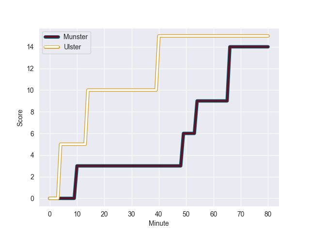
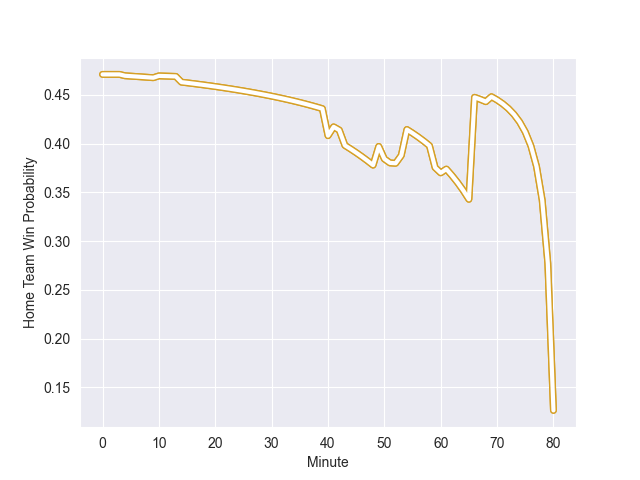

---  
layout: page  
title: Ulster at Munster; 15-14  
date: 2022-10-29 18:15:00 18:00:00 -0500  
categories: match review  
---
# Ulster (1599.34) at Munster (1548.9); 15-14

# Prediction: Munster by 2.0

Ulster by 5.0 on a neutral field
## Scores over Time

## Win Probability over Time

# Pre-Match Prediction: Ulster by 2.9

Ulster by 4.1 on a neutral pitch

|   Away Minutes | Away Player      |   Away elo |   Away Percentile |   Number |   Home Percentile |   Home elo | Home Player      |   Home Minutes |
|---------------:|:-----------------|-----------:|------------------:|---------:|------------------:|-----------:|:-----------------|---------------:|
|             40 | Andrew Warwick   |      98.38 |                57 |        1 |                99 |     126.7  | Dave Kilcoyne    |             59 |
|             59 | Tom Stewart      |      97.36 |                60 |        2 |                92 |     111.44 | Diarmuid Barron  |             59 |
|             80 | Marty Moore      |     105.47 |                83 |        3 |                72 |     100.55 | John Ryan        |             59 |
|             80 | Alan O'Connor    |     109.68 |                89 |        4 |                44 |      93.29 | Edwin Edogbo     |             80 |
|             53 | Sam Carter       |     120.46 |                96 |        5 |                65 |      98.75 | Eoin O'Connor    |             80 |
|             52 | David McCann     |     101.38 |                73 |        6 |                87 |     109    | Jack O'Donoghue  |             50 |
|             80 | Jordi Murphy     |     105.05 |                82 |        7 |                57 |      97.03 | John Hodnett     |             80 |
|             80 | Duane Vermeulen  |     147.36 |               100 |        8 |                44 |      93.79 | Alex Kendellen   |             80 |
|             43 | Nathan Doak      |      88.29 |                16 |        9 |                41 |      92.54 | Paddy Patterson  |             69 |
|             80 | Billy Burns      |     118.68 |                93 |       10 |                73 |     102.89 | Jack Crowley     |             80 |
|             80 | Ethan McIlroy    |     101.48 |                72 |       11 |                18 |      88.65 | Patrick Campbell |             61 |
|             41 | Luke Marshall    |     116.26 |                93 |       12 |                93 |     116.56 | Rory Scannell    |             80 |
|             80 | James Hume       |      98.89 |                63 |       13 |                88 |     110.3  | Malakai Fekitoa  |             80 |
|             80 | Ben Moxham       |      92.97 |                46 |       14 |                97 |     124.15 | Shane Daly       |             80 |
|             80 | Stewart Moore    |     112.57 |                90 |       15 |                49 |      95.33 | Mike Haley       |             80 |
|             39 | Angus Curtis     |      93.34 |                31 |       16 |                41 |      92.78 | Fineen Wycherley |             21 |
|             37 | John Cooney      |     111.36 |                90 |       17 |               nan |      95.32 | Roman Salanoa    |             21 |
|             40 | Rory Sutherland  |      98.19 |                69 |       18 |                82 |     104.24 | Niall Scannell   |             21 |
|             28 | Matthew Rea      |      93.71 |                43 |       19 |                85 |     107.64 | Simon Zebo       |             19 |
|             27 | Cormac Izuchukwu |      96.08 |               nan |       20 |                83 |     107.14 | Neil Cronin      |             11 |
|             21 | John Andrew      |      84.32 |                 8 |       21 |               nan |      91.88 | Cian Hurley      |             30 |

