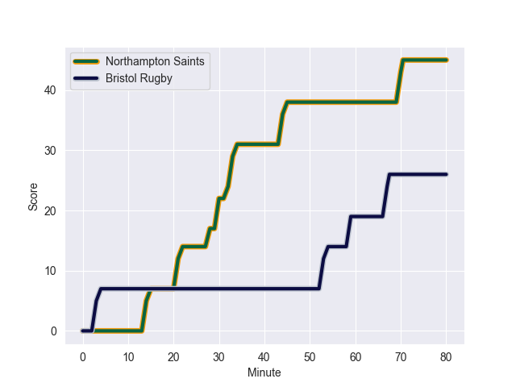
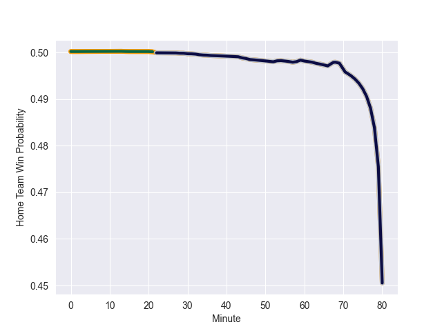

---  
layout: page  
title: Bristol Rugby at Northampton Saints; 31-45  
date: 2022-10-29 10:00:00 18:00:00 -0500  
categories: match review  
---
# Bristol Rugby (1069.4) at Northampton Saints (1074.22); 31-45

# Prediction: Northampton Saints by 5.5

Northampton Saints by 0.5 on a neutral field
## Scores over Time

## Win Probability over Time

# Pre-Match Prediction: Northampton Saints by 0.7

Bristol Rugby by 4.3 on a neutral pitch

|   Away Minutes | Away Player     |   Away elo |   Away Percentile |   Number |   Home Percentile |   Home elo | Home Player          |   Home Minutes |
|---------------:|:----------------|-----------:|------------------:|---------:|------------------:|-----------:|:---------------------|---------------:|
|             48 | Jake Woolmore   |      71.79 |                80 |        1 |                58 |      62.96 | Emmanuel Iyogun      |             52 |
|             71 | Harry Thacker   |      72.14 |                79 |        2 |                97 |     104.79 | Mike Haywood         |             58 |
|             63 | Max Lahiff      |      92.27 |                93 |        3 |                81 |      73.13 | Paul Hill            |             58 |
|             81 | Joe Batley      |      61.96 |                47 |        4 |                39 |      60.2  | Lukhan Salakaia-Loto |             72 |
|             22 | Joe Joyce       |      70.76 |                75 |        5 |                82 |      75.07 | Alex Moon            |             81 |
|             81 | Magnus Bradbury |      66.8  |                67 |        6 |                85 |      81.12 | Sam Graham           |             81 |
|             46 | Samuel Lewis    |      83.13 |               nan |        7 |                34 |      59.02 | Aaron Hinkley        |             81 |
|             81 | Fitz Harding    |      69.43 |                70 |        8 |                24 |      57.33 | Juarno Augustus      |             36 |
|             81 | Andy Uren       |      43.02 |                 0 |        9 |                86 |      83.8  | Alex Mitchell        |             68 |
|             60 | Callum Sheedy   |      81.37 |                79 |       10 |                49 |      62.61 | Fin Smith            |             56 |
|             46 | Henry Purdy     |      79.87 |                86 |       11 |                77 |      71.75 | Ollie Sleightholme   |             81 |
|             81 | Sam Bedlow      |      73.48 |                75 |       12 |                78 |      75.82 | Rory Hutchinson      |             81 |
|             81 | Piers O'Conor   |      51.33 |                 7 |       13 |                67 |      68.97 | Fraser Dingwall      |             60 |
|             81 | Luke Morahan    |     115.71 |                99 |       14 |                76 |      74.37 | Matt Proctor         |             81 |
|             22 | Charles Piutau  |      99.04 |                96 |       15 |                52 |      63.62 | George Hendy         |             81 |
|             10 | Will Capon      |      49.91 |                 2 |       16 |                79 |      73.44 | Sam Matavesi         |             23 |
|             33 | Yann Thomas     |      93.08 |                93 |       17 |                59 |      62.3  | Ethan Waller         |             29 |
|             18 | Jay Tyack       |      64.91 |                61 |       18 |                 9 |      52.2  | Alfie Petch          |             23 |
|             59 | Chris Vui       |      58.19 |                30 |       19 |                59 |      64.28 | Brandon Nansen       |              9 |
|             35 | Jake Heenan     |      61.8  |                48 |       20 |                76 |      71.49 | Angus Scott-Young    |             45 |
|             35 | Will Porter     |      54.31 |                12 |       21 |                 3 |      50.97 | Tom James            |             13 |
|             21 | AJ MacGinty     |      84.82 |                84 |       22 |                75 |      76.6  | James Grayson        |             25 |
|             59 | Jack Bates      |      52.33 |                 9 |       23 |                96 |      97.4  | Tom Collins          |             21 |

