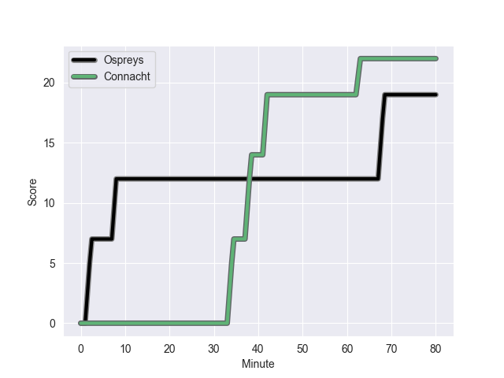
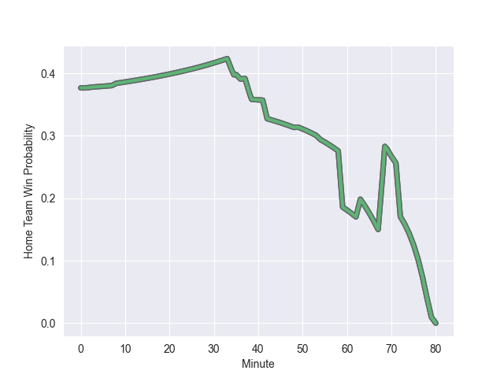

---  
layout: page  
title: Connacht at Ospreys; 22-19  
date: 2022-10-29 20:35:00 18:00:00 -0500  
categories: match review  
---
# Connacht (1529.33) at Ospreys (1310.44); 22-19

# Prediction: Connacht by 14.9

Connacht by 21.9 on a neutral field
## Scores over Time

## Win Probability over Time

# Pre-Match Prediction: Connacht by 19.3

Connacht by 26.3 on a neutral pitch

|   Away Minutes | Away Player           |   Away elo |   Away Percentile |   Number |   Home Percentile |   Home elo | Home Player            |   Home Minutes |
|---------------:|:----------------------|-----------:|------------------:|---------:|------------------:|-----------:|:-----------------------|---------------:|
|             54 | Denis Buckley         |     103.14 |                78 |        1 |               nan |      94.55 | Rhys Henry             |             54 |
|             49 | Dylan Tierney-Martin  |      93.49 |                39 |        2 |                90 |     108.01 | Scott Baldwin          |             54 |
|             49 | Jack Aungier          |     101.34 |                61 |        3 |                 1 |      70.44 | Tom Botha              |             54 |
|             59 | Oisin Dowling         |      90.57 |                23 |        4 |                52 |      94.33 | Rhys Davies            |             72 |
|             80 | Gavin Thornbury       |     105.26 |                83 |        5 |                39 |      92.49 | Huw Owen-Sutton        |             80 |
|             54 | Shamus Hurley-Langton |      96.83 |                57 |        6 |                26 |      90.03 | Ethan Roots            |             80 |
|             80 | Conor Oliver          |     104.45 |                80 |        7 |                29 |      89.76 | Harri Deaves           |             59 |
|             80 | Jarrad Butler         |     100.07 |                61 |        8 |                 1 |      72.3  | Morgan Morris          |             80 |
|             63 | Caolin Blade          |      98.74 |                64 |        9 |                49 |      92.94 | Reuben Morgan-Williams |             80 |
|             80 | Jack Carty            |     108.97 |                84 |       10 |                24 |      90.15 | Jack Walsh             |             80 |
|             80 | John Porch            |     121.8  |                96 |       11 |                 0 |      64.75 | Keelan Giles           |             80 |
|             80 | David Hawkshaw        |     105.9  |                82 |       12 |                62 |      98.86 | Keiran Williams        |             80 |
|             80 | Tom Farrell           |      88.69 |                21 |       13 |               nan |      83.61 | Tiaan Thomas-Wheeler   |             80 |
|             70 | Alex Wootton          |     106.84 |                84 |       14 |                 5 |      79.51 | Luke Morgan            |             80 |
|             36 | Tiernan O'Halloran    |      97.4  |                57 |       15 |                22 |      88.16 | Max Nagy               |             80 |
|             31 | Grant Stewart         |      93.59 |               nan |       16 |                26 |      90.78 | Garyn Phillips         |             26 |
|             44 | Adam Byrne            |     112.43 |                89 |       17 |                 9 |      84.77 | Sam Parry              |             26 |
|             26 | Jordan Duggan         |      94.48 |                39 |       18 |               nan |      95    | Tristan Davies         |             21 |
|             31 | Sam Illo              |      95    |               nan |       19 |               nan |      95    | Ben Warren             |             26 |
|             26 | Paul Boyle            |     102.64 |                74 |       20 |               nan |      94.12 | Jack Regan             |              8 |
|             21 | Darragh Murray        |      95.04 |               nan |       21 |               nan |     nan    | nan                    |            nan |
|             17 | Kieran Marmion        |     113.23 |                92 |       22 |               nan |     nan    | nan                    |            nan |
|             10 | Tom Daly              |      80.06 |                 5 |       23 |               nan |     nan    | nan                    |            nan |

