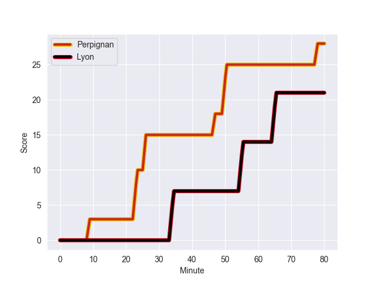
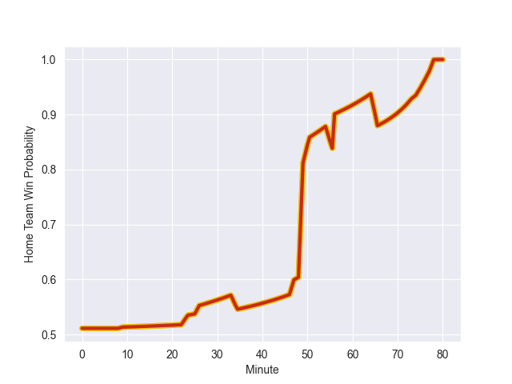

---  
layout: page  
title: Lyon at Perpignan; 21-28  
date: 2022-10-29 17:00:00 18:00:00 -0500  
categories: match review  
---
# Lyon (1476.59) at Perpignan (1480.97); 21-28

# Prediction: Perpignan by 7.4

Perpignan by 0.4 on a neutral field
## Scores over Time

## Win Probability over Time

# Pre-Match Prediction: Perpignan by 9.1

Perpignan by 2.1 on a neutral pitch

|   Away Minutes | Away Player            |   Away elo |   Away Percentile |   Number |   Home Percentile |   Home elo | Home Player           |   Home Minutes |
|---------------:|:-----------------------|-----------:|------------------:|---------:|------------------:|-----------:|:----------------------|---------------:|
|             49 | Hamza Kaabeche         |      90.43 |                22 |        1 |                14 |      86.71 | Xavier Chiocci        |             49 |
|             49 | Yanis Charcosset       |      96.41 |                55 |        2 |                10 |      85.75 | Mike Tadjer Barbosa   |             49 |
|             49 | Feao Fotuaika          |     106.37 |                85 |        3 |                95 |     113.97 | Arthur Joly           |             49 |
|             20 | Joel Kpoku             |      90.63 |                29 |        4 |                 3 |      79.31 | Tristan Labouteley    |             80 |
|             80 | Temo Mayanavanua       |      95.71 |                53 |        5 |                79 |     103.44 | Piula Faasalele       |             56 |
|             55 | Patrick Sobela         |     109.29 |                87 |        6 |                87 |     110.63 | Joaquin Oviedo        |             49 |
|             80 | Beka Saghinadze        |     106.7  |                84 |        7 |                48 |      94.64 | Kelian Galletier      |             56 |
|             40 | Maxime Gouzou          |      82.72 |                11 |        8 |                76 |     103.76 | Genesis Mamea Lemalu  |             80 |
|             49 | Jean-Marc Doussain     |     116.63 |                95 |        9 |                87 |     108.25 | Tom Ecochard          |             31 |
|             80 | Fletcher Smith         |      82.78 |                 8 |       10 |                79 |     104.19 | Jake McIntyre         |             80 |
|             80 | Josua Tuisova Ratulevu |     136.65 |                99 |       11 |                99 |     131.4  | Mathieu Acebes        |             80 |
|             80 | Kyle Godwin            |     108.03 |                85 |       12 |                87 |     109.45 | Jeronimo de la Fuente |             49 |
|             74 | Josiah Maraku          |      69.78 |                 1 |       13 |                43 |      94.44 | Afusipa Taumoepeau    |             80 |
|             80 | Xavier Mignot          |      99.07 |                66 |       14 |                69 |      99.87 | Lucas Dubois          |             80 |
|             80 | Davit Niniashvili      |      97.27 |                57 |       15 |                11 |      83.3  | Tristan Tedder        |             80 |
|             31 | Jerome Rey             |      59.26 |                 0 |       16 |                 6 |      82.11 | Sadek Deghmache       |             49 |
|             31 | Guillaume Marchand     |      82.17 |                 7 |       17 |                83 |     107.16 | Ma'afu Fia            |             31 |
|             31 | Paulo Tafili           |      92.2  |                26 |       18 |                11 |      86.29 | Giorgi Tetrashvili    |             31 |
|             60 | Theo William           |      94.61 |                49 |       19 |                86 |     108.89 | George Tilsley        |             31 |
|             25 | Felix Lambey           |     118.89 |                95 |       20 |                30 |      91.39 | Lucas Velarte         |             31 |
|             40 | Mickael Guillard       |      99.06 |                67 |       21 |                10 |      83.24 | Victor Moreaux        |             24 |
|             31 | Jonathan Pelissie      |     104.68 |                81 |       22 |                91 |     113.53 | Alan Brazo            |             24 |
|              6 | Alfred Parisien        |      92.2  |                34 |       23 |                 6 |      82.47 | Seilala Lam           |             31 |

