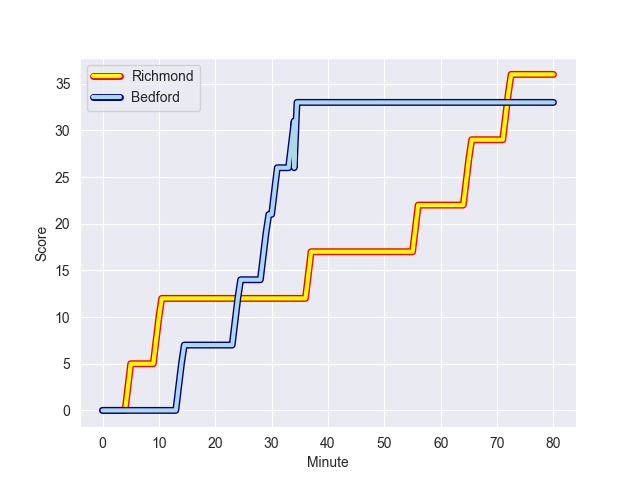
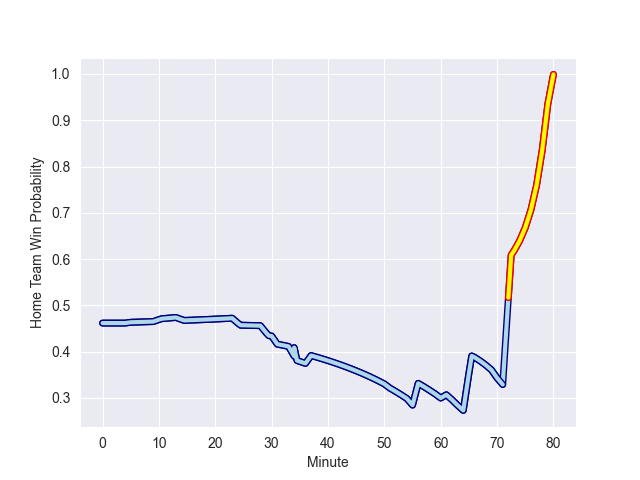

---  
layout: page  
title: Bedford at Richmond; 33-36  
date: 2022-10-29 16:00:00 18:00:00 -0500  
categories: match review  
---
# Bedford (1430.53) at Richmond (1363.49); 33-36

# Prediction: Bedford by 1.7

Bedford by 6.7 on a neutral field
## Scores over Time

## Win Probability over Time

# Pre-Match Prediction: Bedford by 3.9

Bedford by 8.9 on a neutral pitch

|   Away Minutes | Away Player          |   Away elo |   Away Percentile |   Number |   Home Percentile |   Home elo | Home Player        |   Home Minutes |
|---------------:|:---------------------|-----------:|------------------:|---------:|------------------:|-----------:|:-------------------|---------------:|
|             55 | Joey Conway          |      88.33 |                13 |        1 |               nan |      92.57 | Luke Spring        |             46 |
|             55 | James Fish           |      95.12 |                49 |        2 |                24 |      90.76 | Callum Torpey      |             46 |
|             64 | Ehren Painter        |      98.93 |                68 |        3 |                 8 |      86.1  | Jimmy Litchfield   |             61 |
|             80 | Robin Williams       |      98.51 |                67 |        4 |               nan |      94.69 | Jake Monson        |             80 |
|             51 | Jordan Onojaife      |      88.65 |                19 |        5 |                21 |      89.44 | Will Carrick-Smith |             80 |
|             80 | Luke Frost           |      88.95 |                16 |        6 |                11 |      86.86 | Ethan Benson       |             61 |
|             66 | Jac Arthur           |      94.04 |                40 |        7 |                83 |     105.12 | Tobias Saysell     |             80 |
|             80 | Tui Uru              |      92.51 |                29 |        8 |                 1 |      73.43 | Mark Bright        |             80 |
|             61 | Alex Day             |     107.05 |                87 |        9 |                64 |      97.97 | James Lennon       |             70 |
|             61 | William Maisey       |     100.6  |                71 |       10 |                20 |      90.56 | Bill Johnston      |             80 |
|             80 | Dean Adamson         |      93.99 |                41 |       11 |                45 |      94.83 | Hamish Graham      |             80 |
|             80 | Joel Matavesi        |      99.22 |                64 |       12 |                16 |      89.13 | Paul Kiernan       |             59 |
|             80 | Michael Le Bourgeois |      97.97 |                59 |       13 |                37 |      93.32 | James Little       |             80 |
|             80 | Patrick Tapley       |      97.66 |                57 |       14 |                16 |      89.33 | Alexander O'Meara  |             80 |
|             51 | Sean French          |      90.88 |                22 |       15 |                 9 |      85.72 | Ted Landray        |             56 |
|             29 | Tom Lockett          |      95.22 |               nan |       16 |                15 |      89.43 | Alexander Post     |             34 |
|             29 | Jamie Elliott        |      89.41 |                15 |       17 |               nan |      94.07 | George Cave        |             34 |
|             25 | Jack Hughes          |      94.94 |                47 |       18 |               nan |      94.25 | Zuriel Makele      |             24 |
|             25 | Lewis Holsey         |     100.81 |                77 |       19 |                18 |      89.86 | Tom Mills          |             21 |
|             19 | Jake Garside         |      95.1  |                54 |       20 |                23 |      89.63 | Ntinga Mpiko       |             19 |
|             19 | Louis Grimoldby      |      85.29 |                 7 |       21 |                37 |      92.43 | David Massey       |             19 |
|             16 | Corrie Barrett       |      94.51 |                42 |       22 |                12 |      87.53 | Stephen Kerins     |             10 |
|             14 | Charles Rylands      |      92.87 |                47 |       23 |               nan |     nan    | nan                |            nan |

