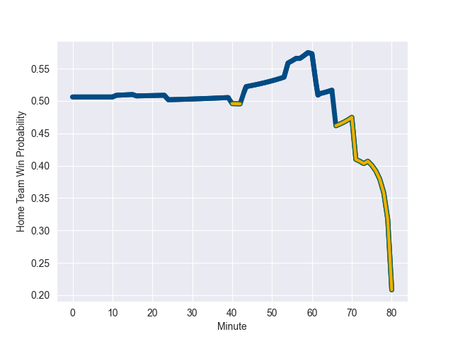

---  
layout: page  
title: Australia at Scotland; 16-15  
date: 2022-10-29 18:30:00 18:00:00 -0500  
categories: match review  
---
# Australia (1582.23) at Scotland (1593.0); 16-15

# Prediction: Scotland by 6.1

Scotland by 1.1 on a neutral field
## Scores over Time

## Win Probability over Time

# Pre-Match Prediction: Scotland by 4.1

Australia by 0.9 on a neutral pitch

|   Away Minutes | Away Player     |   Away elo |   Away Percentile |   Number |   Home Percentile |   Home elo | Home Player         |   Home Minutes |
|---------------:|:----------------|-----------:|------------------:|---------:|------------------:|-----------:|:--------------------|---------------:|
|             66 | James Slipper   |     122.19 |                99 |        1 |                11 |      87.74 | Pierre Schoeman     |             60 |
|             57 | Dave Porecki    |     102.71 |                81 |        2 |                74 |      99.49 | Dave Cherry         |             60 |
|             40 | Allan Alaalatoa |     113.83 |                96 |        3 |                98 |     117.54 | Zander Fagerson     |             60 |
|             80 | Nick Frost      |      87.06 |                18 |        4 |                93 |     113.06 | Sam Skinner         |             24 |
|             62 | Cadeyrn Neville |     100.83 |                74 |        5 |                95 |     116.78 | Grant Gilchrist     |             80 |
|             80 | Jed Holloway    |      90.48 |                24 |        6 |                96 |     118.38 | Jamie Ritchie       |             80 |
|             80 | Michael Hooper  |     122.77 |                98 |        7 |                82 |     104.37 | Hamish Watson       |             80 |
|             74 | Rob Valetini    |     101.7  |                76 |        8 |                89 |     110.96 | Matt Fagerson       |             60 |
|             56 | Tate McDermott  |     103.94 |                83 |        9 |                70 |      99.95 | Ali Price           |             66 |
|             74 | Bernard Foley   |     120.78 |                95 |       10 |                99 |     133.95 | Blair Kinghorn      |             80 |
|             80 | Tom Wright      |      91.87 |                26 |       11 |                75 |     101.78 | Duhan van der Merwe |             80 |
|             80 | Hunter Paisami  |     106.84 |                83 |       12 |                 3 |      79.19 | Sione Tuipulotu     |             80 |
|             80 | Len Ikitau      |     108.06 |                86 |       13 |                96 |     117.87 | Mark Bennett        |             80 |
|             80 | Andrew Kellaway |     101.79 |                71 |       14 |                93 |     114.58 | Darcy Graham        |             74 |
|             66 | Tom Banks       |     113.16 |                93 |       15 |                24 |      91.07 | Ollie Smith         |             80 |
|             23 | Folau Fainga'a  |     114.75 |                97 |       16 |                94 |     112.11 | George Turner       |             20 |
|             14 | Matt Gibbon     |     101.06 |                77 |       17 |                83 |     103.22 | Jamie Bhatti        |             20 |
|             40 | Taniela Tupou   |     103.8  |                83 |       18 |                98 |     117.7  | WP Nel              |             20 |
|             18 | Ned Hanigan     |      96.02 |                53 |       19 |                31 |      91.76 | Glen Young          |             56 |
|              6 | Langi Gleeson   |      96.02 |                53 |       20 |                 3 |      79.58 | Jack Dempsey        |             20 |
|             24 | Nic White       |     124.07 |                98 |       21 |                97 |     118.89 | George Horne        |             14 |
|              6 | Noah Lolesio    |      99.03 |                67 |       22 |                54 |      96.93 | Damien Hoyland      |              6 |
|             14 | Jock Campbell   |      93.48 |                38 |       23 |               nan |     nan    | nan                 |            nan |

