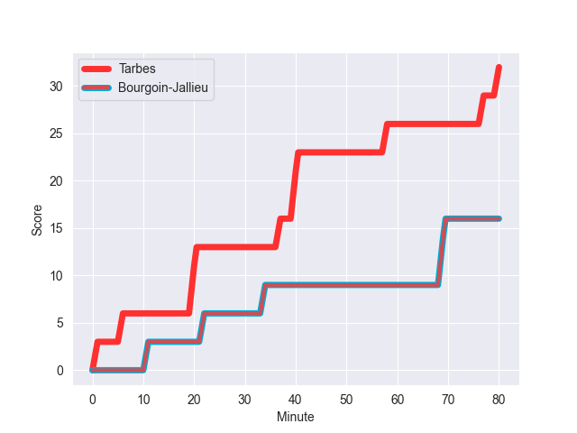
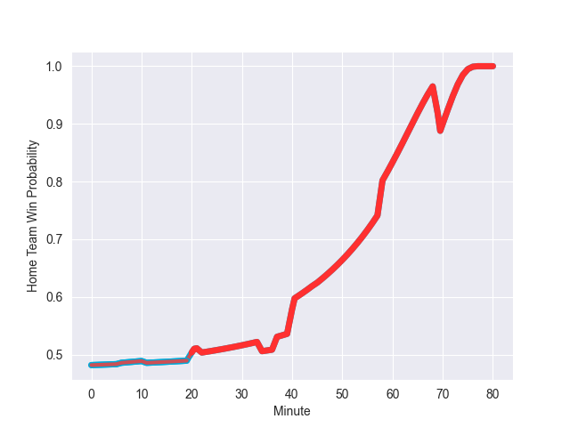

---  
layout: page  
title: Bourgoin-Jallieu at Tarbes; 16-32  
date: 2022-10-29 19:00:00 18:00:00 -0500  
categories: match review  
---
# Bourgoin-Jallieu (1416.17) at Tarbes (1400.22); 16-32

# Prediction: Tarbes by 5.4

Bourgoin-Jallieu by 1.6 on a neutral field
## Scores over Time

## Win Probability over Time

# Pre-Match Prediction: Bourgoin-Jallieu by 5.6

Bourgoin-Jallieu by 1.4 on a neutral pitch

|   Away Minutes | Away Player           |   Away elo |   Away Percentile |   Number |   Home Percentile |   Home elo | Home Player            |   Home Minutes |
|---------------:|:----------------------|-----------:|------------------:|---------:|------------------:|-----------:|:-----------------------|---------------:|
|             51 | Romain Favaretto      |      90.49 |                25 |        1 |                35 |      91.34 | Alexandre Combier      |             50 |
|             55 | Mohamed Khribache     |      92.97 |                41 |        2 |                15 |      86.42 | Florian Lamothe        |             47 |
|             45 | Oktay Yilmaz          |      99.57 |                66 |        3 |                18 |      87.66 | Alexandre Duny         |             50 |
|             58 | Robin Gascou          |      88.06 |                20 |        4 |                65 |      97.99 | Antoine Bousquet       |             58 |
|             80 | Léandre Cotte         |      98.33 |                64 |        5 |                65 |      98.68 | Jimi Maximin           |             58 |
|             45 | Théo Lepage           |     104.65 |                81 |        6 |                73 |     101.58 | Léo Saint-Guilhem      |             80 |
|             80 | Kevin Chaudouard      |      99.96 |                69 |        7 |                91 |     113.13 | Aurelien Ricart        |             80 |
|             45 | Lakisipone Lee        |      93.48 |                38 |        8 |                10 |      81.38 | Len Massyn             |             80 |
|             53 | Adrien Pontarollo     |      97.28 |                56 |        9 |                89 |     114.49 | Thomas Lhusero         |             47 |
|             80 | Romain Sola           |      90.53 |                29 |       10 |                 5 |      80.61 | Anthony Fuertes        |             80 |
|             80 | Remi Bouet            |      95.31 |                51 |       11 |                81 |     105.06 | Jonathan Duffau        |             80 |
|             53 | Benjamin Noble        |     102.13 |                75 |       12 |                83 |     106.26 | Josaia Vakacegu        |             80 |
|             80 | Pablo Patilla         |      92.8  |                38 |       13 |                92 |     114.05 | Alofa Alofa            |             53 |
|             80 | Matthieu Nicolas      |      86.62 |                15 |       14 |                 0 |      69.15 | Johan Paulet           |             68 |
|             80 | Nicolas Cachet        |      92.31 |                39 |       15 |                 0 |      68.68 | Maxime Oltmann         |             80 |
|             29 | Nugzar Somkhishvili   |      92.24 |                33 |       16 |                64 |      97.52 | Antoine Palisse        |             30 |
|             25 | Maxime Castant        |      90.6  |                24 |       17 |                53 |      95.76 | Enzo Mondon            |             33 |
|             35 | Michael Simutoga      |      99.21 |                67 |       18 |                37 |      92.97 | Aleksi Tchitchiashvili |             30 |
|             22 | Kemueli Lavetanakoroi |      99.98 |                71 |       19 |                 2 |      73.85 | Paul Sajous            |             22 |
|             35 | Theophile Cotte       |      82.1  |                 6 |       20 |                21 |      88.23 | Jone Trevor Seuvou     |             22 |
|             35 | Poutasi Luafutu       |      95.54 |                48 |       21 |                11 |      83.95 | Thibaut Dulucq         |             33 |
|             27 | Quentin Lefort        |      94.11 |                44 |       22 |                48 |      95.77 | William Pees           |             27 |
|             27 | Christopher Bosch     |      98.25 |                60 |       23 |                49 |      94.93 | Thibaut Trotta         |             12 |

