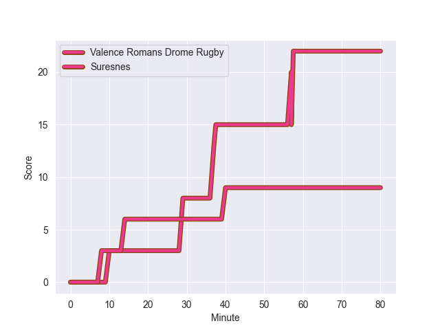
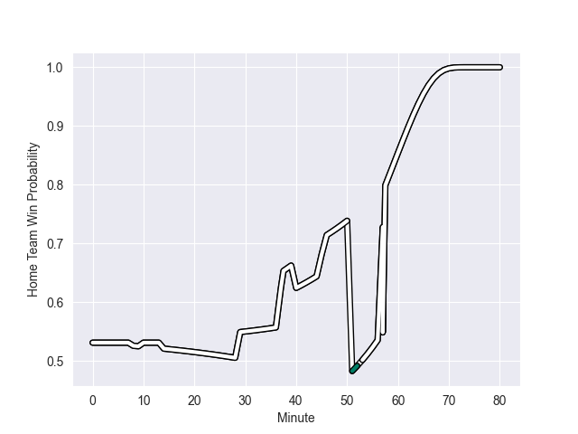

---  
layout: page  
title: Suresnes at Valence Romans Drome Rugby; 9-22  
date: 2022-10-29 19:00:00 18:00:00 -0500  
categories: match review  
---
# Suresnes (1379.91) at Valence Romans Drome Rugby (1455.36); 9-22

# Prediction: Valence Romans Drome Rugby by 14.5

Valence Romans Drome Rugby by 7.5 on a neutral field
## Scores over Time

## Win Probability over Time

# Pre-Match Prediction: Valence Romans Drome Rugby by 13.3

Valence Romans Drome Rugby by 6.3 on a neutral pitch

|   Away Minutes | Away Player             |   Away elo |   Away Percentile |   Number |   Home Percentile |   Home elo | Home Player         |   Home Minutes |
|---------------:|:------------------------|-----------:|------------------:|---------:|------------------:|-----------:|:--------------------|---------------:|
|             46 | Sébastien Lafrancesca   |      95.24 |                55 |        1 |                40 |      93.12 | Andrea Pontanier    |             50 |
|             51 | Thomas Bordes           |      85.52 |                12 |        2 |                17 |      87.84 | Dorian Marco Pena   |             50 |
|             51 | Victor Damian Arias     |     106.96 |                87 |        3 |                32 |      92.87 | Cyril Balust        |             45 |
|             46 | Youssouf Yatera         |      92.37 |                42 |        4 |                77 |     102.67 | Darrell Dyer        |             50 |
|             53 | Wian Vosloo             |      95.24 |                50 |        5 |                90 |     110.74 | Ian Groenewald      |             80 |
|             80 | Théo David Nathan Tanda |      94.31 |                48 |        6 |                 1 |      72.09 | Axel Bruchet        |             80 |
|             61 | Florian Desbordes       |      76.4  |                 3 |        7 |                38 |      92.55 | Matthew Gicquel     |             80 |
|             80 | Antonie Claassen        |     126.3  |                96 |        8 |                53 |      97.41 | Dylan Hayes         |             55 |
|             67 | Enzo Barbarit           |      79.12 |                 5 |        9 |                14 |      87.03 | Tim Menzel          |             59 |
|             80 | Ignacio Mieres          |     113.38 |                89 |       10 |                23 |      89.82 | Lucas Meret         |             80 |
|             58 | Jean-Baptiste Fuster    |      83.59 |                13 |       11 |                73 |     101.57 | Tim Giresse         |             80 |
|             80 | Clément Amon            |      74.82 |                 3 |       12 |                46 |      95.2  | Ben Neiceru         |             45 |
|             80 | Arthur Proult           |      86.54 |                16 |       13 |                75 |     102.63 | Jonathan Quinnez    |             80 |
|             80 | Thomas Baudy            |      81.56 |                 9 |       14 |                90 |     112.93 | Mason Emerson       |             80 |
|             80 | Goulwen Gueho           |      95.34 |                49 |       15 |                52 |      96.12 | Joris Moura         |             68 |
|             34 | Lucas Dycke             |      92.83 |                36 |       16 |                52 |      96.13 | Vincent Pelo        |             35 |
|             34 | Christopher van Leeuwen |      75.83 |                 4 |       17 |                90 |     112.63 | Charles Bouldoire   |             35 |
|             29 | Leandro Mario Assi      |     102.2  |                76 |       18 |                77 |     102.73 | Francois Uys        |             30 |
|             29 | Anthony Bajart          |      88.79 |                24 |       19 |                80 |     103.59 | Mehdi Boundjema     |             30 |
|             27 | Yakine Djebarri         |      88.52 |                22 |       20 |                85 |     105.84 | Sami Zouhair        |             30 |
|             22 | Alexis Clément          |      86.11 |                14 |       21 |                77 |     102.92 | Ioane Iashagashvili |             25 |
|             19 | Louis-Mathieu Jazeix    |      86.54 |                15 |       22 |                36 |      92.63 | Léopold Dupas       |             21 |
|             13 | Quentin Dauvergne       |      85.05 |                11 |       23 |                10 |      81.64 | Guillaume Cazes     |             12 |

