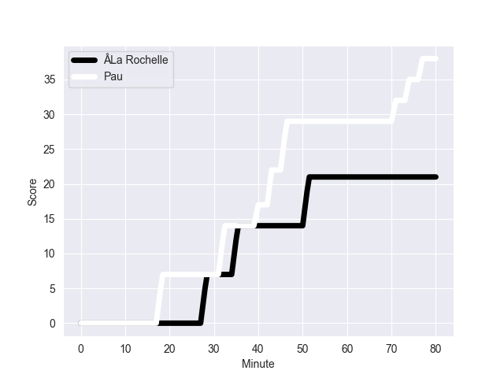
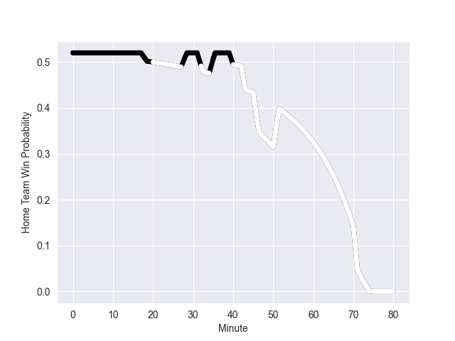

---  
layout: page  
title: Pau at ÂLa Rochelle; 38-21  
date: 2022-10-29 17:00:00 18:00:00 -0500  
categories: match review  
---
# Pau (2147.9) at ÂLa Rochelle (2182.73); 38-21

# Prediction: ÂLa Rochelle by 8.5

ÂLa Rochelle by 3.5 on a neutral field
## Scores over Time

## Win Probability over Time

# Pre-Match Prediction: ÂLa Rochelle by 7.3

ÂLa Rochelle by 2.3 on a neutral pitch

|   Away Minutes | Away Player               |   Away elo |   Away Percentile |   Number |   Home Percentile |   Home elo | Home Player                |   Home Minutes |
|---------------:|:--------------------------|-----------:|------------------:|---------:|------------------:|-----------:|:---------------------------|---------------:|
|             80 | ÂPaul Tailhades           |      95    |               nan |        1 |               nan |      95    | ÂThierry Paiva             |             80 |
|             80 | ÂRomain Ruffenach         |      95    |               nan |        2 |               nan |      95    | ÂQuentin Lespiaucq-Brettes |             80 |
|             80 | ÂGuram Papidze            |      92.15 |               nan |        3 |               nan |      95    | ÂGeorges-Henri Colombe     |             80 |
|             80 | ÂLekima Vuda Tagitagivalu |      92.15 |               nan |        4 |               nan |      95    | ÂThomas Lavault            |             80 |
|             80 | ÂFabrice Metz             |      95    |               nan |        5 |               nan |      95    | ÂWilliam Skelton           |             80 |
|             80 | ÂBeka Gorgadze            |      95    |               nan |        6 |               nan |      95    | ÂRĂ©mi Bourdeau            |             80 |
|             80 | ÂLuke Whitelock           |      92.15 |                29 |        7 |               nan |      95    | ÂKyle Hatherell            |             80 |
|             80 | ÂJordan Joseph            |      92.15 |               nan |        8 |               nan |      95    | ÂMatthias Haddad           |             80 |
|             80 | ÂThibault Daubagna        |      92.15 |                26 |        9 |               nan |      95    | ÂTawera Kerr-Barlow        |             80 |
|             80 | ÂZack Henry               |      92.15 |               nan |       10 |               nan |      95    | ÂAntoine Hastoy            |             80 |
|             80 | ÂVincent Pinto            |      95    |               nan |       11 |               nan |      95    | ÂDillyn Leyds              |             80 |
|             80 | ÂÉmilien Gailleton       |      92.15 |                27 |       12 |               nan |      95    | ÂLevani Botia              |             80 |
|             80 | ÂYvan Reilhac             |      95    |               nan |       13 |               nan |      95    | ÂRaymond Rhule             |             80 |
|             80 | ÂDaniel Ikpefan           |      95    |               nan |       14 |               nan |      95    | ÂTeddy Thomas              |             80 |
|             80 | ÂJack Maddocks            |      92.15 |                30 |       15 |               nan |      95    | ÂBrice Dulin               |             80 |
|             80 | ÂSteven Cummins           |      92.15 |                33 |       16 |               nan |      95    | ÂUJ Seuteni                |             80 |
|             80 | ÂYouri Delhommel          |      92.15 |                27 |       17 |               nan |      95    | ÂLeo Aouf                  |             80 |
|             80 | ÂClovis Le Bail           |      92.15 |               nan |       18 |               nan |      95    | ÂUltan Dillane             |             80 |
|             80 | ÂRĂ©mi Seneca             |      95    |               nan |       19 |               nan |      95    | ÂAleksandre Kuntelia       |             80 |
|             80 | ÂSiate Tokolahi           |      92.15 |               nan |       20 |               nan |      95    | ÂRĂ©mi Picquette           |             80 |
|             80 | ÂSacha Zegueur            |      92.15 |                29 |       21 |               nan |      95    | ÂLouis Penverne            |             80 |
|             80 | ÂReece Hewat              |      95    |               nan |       22 |               nan |      93.86 | Â                          |             80 |
|             80 | ÂClement Mondinat         |      95    |               nan |       23 |               nan |      93.86 | Â                          |             80 |

