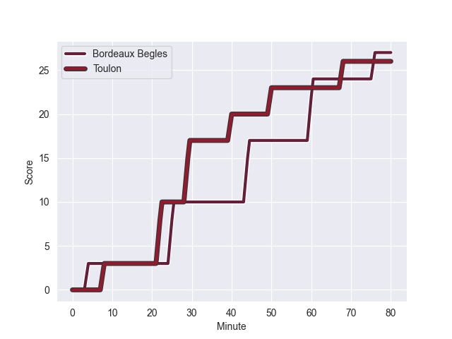
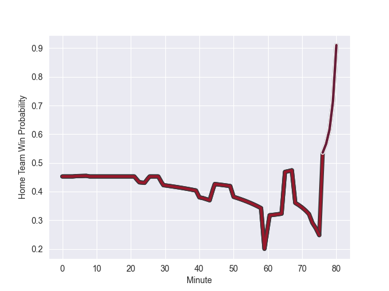

---  
layout: page  
title: Toulon at Bordeaux Begles; 26-27  
date: 2022-10-30 21:05:00 18:00:00 -0500  
categories: match review  
---
# Toulon (1599.62) at Bordeaux Begles (1518.29); 26-27

# Prediction: Toulon by 1.1

Toulon by 8.1 on a neutral field
## Scores over Time

## Win Probability over Time

# Pre-Match Prediction: Toulon by 1.5

Toulon by 8.5 on a neutral pitch

|   Away Minutes | Away Player                    |   Away elo |   Away Percentile |   Number |   Home Percentile |   Home elo | Home Player               |   Home Minutes |
|---------------:|:-------------------------------|-----------:|------------------:|---------:|------------------:|-----------:|:--------------------------|---------------:|
|             56 | Bruce Devaux                   |      86.92 |                17 |        1 |                54 |      97.17 | Jefferson Poirot          |             41 |
|             56 | Anthony Etrillard              |     102.34 |                81 |        2 |                 9 |      84.64 | Maxime Lamothe            |             80 |
|             56 | Kieran Brookes                 |      85.46 |                 9 |        3 |                99 |     126.69 | Vadim Cobilas             |             41 |
|             73 | Swan Rebbadj                   |      89.7  |                26 |        4 |                11 |      82.07 | Thomas Jolmes             |             41 |
|             80 | Brian Alainu'uese              |     107.72 |                87 |        5 |                94 |     117.28 | Cyril Cazeaux             |             80 |
|             80 | Cornell du Preez               |      96.12 |                54 |        6 |                98 |     125.2  | Jandré Marais             |             33 |
|             65 | Facundo Isa                    |     123.32 |                97 |        7 |                44 |      93.85 | Mahamadou Diaby           |             80 |
|             80 | Sergio Parisse                 |     111.13 |                88 |        8 |                71 |     101.71 | Bastien Vergnes Taillefer |             80 |
|             65 | Baptiste Serin                 |     109.54 |                89 |        9 |                 8 |      83.17 | Yann Lesgourgues          |             59 |
|             80 | Ihaia West                     |     111.28 |                86 |       10 |                92 |     121.49 | Zack Holmes               |             80 |
|             80 | Jiuta Wainiqolo                |      93.12 |                39 |       11 |                96 |     121.45 | Madosh Tambwe             |             80 |
|             79 | Duncan Paia'aua                |      99.19 |                64 |       12 |                56 |      97.4  | Tani Vili                 |             80 |
|             80 | Waisea Nayacalevu Vuidravuwalu |     118.56 |                94 |       13 |                37 |      93.34 | Pablo Uberti              |             59 |
|             80 | Cheslin Kolbe                  |     151.2  |                99 |       14 |                55 |      96.76 | Santiago Cordero          |             80 |
|             80 | Thomas Salles                  |     103.89 |                76 |       15 |                24 |      90.01 | Louis Bielle-Biarrey      |             80 |
|             24 | Emerick Setiano                |     106.86 |                92 |       16 |                57 |      96.93 | Pierre Bochaton           |             47 |
|             24 | Teddy Baubigny                 |      92.79 |                41 |       17 |                24 |      89.98 | Kane Douglas              |             39 |
|             24 | Beka Gigashvili                |     106.99 |                87 |       18 |                95 |     112.18 | Lekso Kaulashvili         |             39 |
|             15 | Benoit Paillaugue              |     110.16 |                88 |       19 |                96 |     117.28 | Ben Tameifuna             |             39 |
|             15 | Mathieu Bastareaud             |     113.01 |                90 |       20 |               nan |      83.11 | Jules Gimbert             |             21 |
|              1 | Jérémy Sinzelle                |      79.44 |                 5 |       21 |                 4 |      78.41 | Federico Mori             |             21 |
|              7 | Sitaleki Timani                |     119.39 |                96 |       22 |               nan |     nan    | nan                       |            nan |

