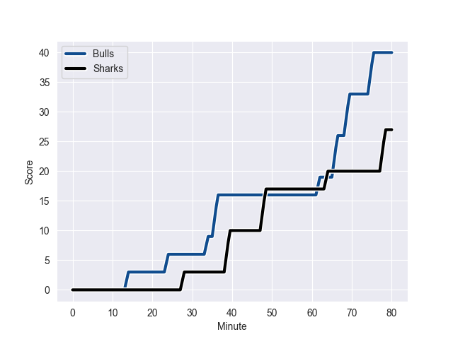
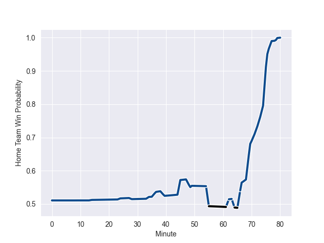

---  
layout: page  
title: Sharks at Bulls; 27-40  
date: 2022-10-30 00:00:00 18:00:00 -0500  
categories: match review  
---
# Sharks (1539.21) at Bulls (1557.84); 27-40

# Prediction: Bulls by 8.9

Bulls by 1.9 on a neutral field
## Scores over Time

## Win Probability over Time

# Pre-Match Prediction: Bulls by 10.2

Bulls by 3.2 on a neutral pitch

|   Away Minutes | Away Player           |   Away elo |   Away Percentile |   Number |   Home Percentile |   Home elo | Home Player         |   Home Minutes |
|---------------:|:----------------------|-----------:|------------------:|---------:|------------------:|-----------:|:--------------------|---------------:|
|             45 | Ntuthuko Mchunu       |      98.87 |                65 |        1 |                91 |     109.12 | Gerhard Steenekamp  |             49 |
|             45 | Kerron van Vuuren     |      89.11 |                19 |        2 |                99 |     134.46 | Bismarck du Plessis |             55 |
|             45 | Thomas du Toit        |     106.93 |                87 |        3 |                21 |      89.05 | Francois Klopper    |             49 |
|             80 | Gerbrandt Grobler     |      87.75 |                20 |        4 |                86 |     108.45 | Walt Steenkamp      |             58 |
|             73 | Hyron Andrews         |     101.93 |                75 |        5 |                81 |     104.59 | Ruan Nortje         |             76 |
|             49 | Dylan Richardson      |     100.98 |                72 |        6 |                67 |      99.06 | Marcell Coetzee     |             80 |
|             55 | Vincent Tshituka      |     110.71 |                89 |        7 |                48 |      94.56 | Marco van Staden    |             80 |
|             80 | Phepsi Buthelezi      |     105.65 |                80 |        8 |                56 |      97.37 | WJ Steenkamp        |             80 |
|             62 | Cameron Wright        |      98.65 |                62 |        9 |                88 |     110.1  | Zak Burger          |             55 |
|             80 | Boeta Chamberlain     |     103.84 |                79 |       10 |                84 |     108.88 | Chris Smith         |             80 |
|             80 | Thaakir Abrahams      |      98.28 |                62 |       11 |                88 |     110.34 | Sbu Nkosi           |             42 |
|              9 | Ben Tapuai            |     100.92 |                68 |       12 |                97 |     125.17 | Harold Vorster      |             80 |
|             80 | Francois Venter       |     115.62 |                93 |       13 |                29 |      91.44 | Cornal Hendricks    |             80 |
|             80 | Werner Kok            |     103.22 |                77 |       14 |                91 |     114.14 | David Kriel         |             77 |
|             80 | Aphelele Fassi        |     124.15 |                97 |       15 |                46 |      94.41 | Johan Goosen        |             80 |
|             71 | Marnus Potgieter      |     100.68 |                68 |       16 |                17 |      87.45 | Stravino Jacobs     |             38 |
|             35 | Dian Bleuler          |      94.08 |                42 |       17 |                47 |      96.98 | Dylan Smith         |             31 |
|             35 | Daniel Viljoen Jooste |      95.17 |                49 |       18 |                66 |     100.18 | Simphiwe Matanzima  |             31 |
|             35 | Carlu Sadie           |      82.81 |                 5 |       19 |                 6 |      83.84 | Jan Hendrik Wessels |             25 |
|             31 | Henco Venter          |     102.69 |                76 |       20 |                85 |     107.51 | Embrose Papier      |             25 |
|             25 | Sikhumbuzo Notshe     |     115.2  |                91 |       21 |                45 |      93.73 | Janko Swanepoel     |             22 |
|             18 | Grant Williams        |     106.16 |                82 |       22 |                12 |      84.66 | Ruan Vermaak        |              4 |
|              7 | Justin Johan Basson   |      91.22 |                32 |       23 |                80 |     104.37 | Wandisile Simelane  |              3 |

