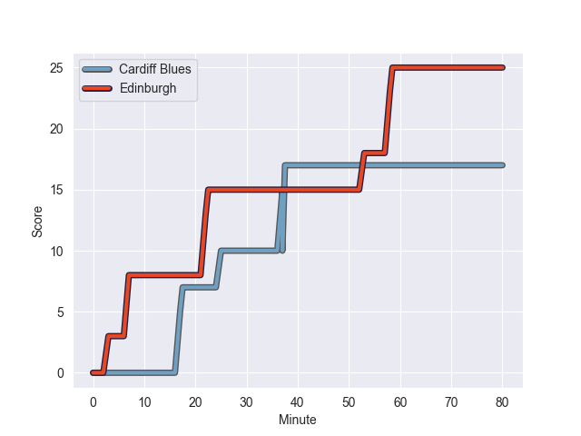
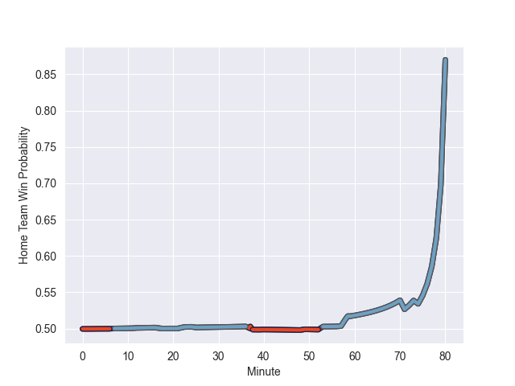

---  
layout: page  
title: Edinburgh at Cardiff Blues; 25-17  
date: 2022-10-30 16:00:00 18:00:00 -0500  
categories: match review  
---
# Edinburgh (1467.55) at Cardiff Blues (1467.36); 25-17

# Prediction: Cardiff Blues by 7.0

Edinburgh by 0.0 on a neutral field
## Scores over Time

## Win Probability over Time

# Pre-Match Prediction: Edinburgh by 5.2

Edinburgh by 1.8 on a neutral pitch

|   Away Minutes | Away Player       |   Away elo |   Away Percentile |   Number |   Home Percentile |   Home elo | Home Player         |   Home Minutes |
|---------------:|:------------------|-----------:|------------------:|---------:|------------------:|-----------:|:--------------------|---------------:|
|             71 | Boan Venter       |     107.77 |                89 |        1 |                24 |      90.13 | Rhys Carré          |             65 |
|             12 | Adam McBurney     |      88.51 |                18 |        2 |                18 |      91.7  | Kirby Myhill        |             57 |
|             49 | Luan de Bruin     |      97.37 |                57 |        3 |                54 |      97.71 | Dimitri Arhip       |             74 |
|             40 | Pierce Phillips   |      88.83 |                24 |        4 |                26 |      89.73 | Josh Turnbull       |             66 |
|             80 | Jamie Hodgson     |      96.9  |                57 |        5 |                12 |      82.96 | Rory Thornton       |             80 |
|             70 | Ben Muncaster     |      98.9  |                70 |        6 |                78 |     102.96 | James Botham        |             80 |
|             80 | Luke Crosbie      |     113.86 |                92 |        7 |                84 |     106.48 | Thomas Young        |             80 |
|             80 | Viliame Mata      |      90.27 |                24 |        8 |                59 |      98.69 | James Ratti         |             49 |
|             59 | Charlie Shiel     |     106.6  |                83 |        9 |                89 |     109.96 | Lloyd Williams      |             80 |
|             80 | Charlie Savala    |      94.92 |                57 |       10 |                84 |     109.17 | Jarrod Evans        |             80 |
|             80 | Wes Goosen        |     111.86 |                90 |       11 |                19 |      88.56 | Theo Cabango        |             80 |
|             74 | Chris Dean        |      84.36 |                12 |       12 |                53 |      96.73 | Max Llewellyn       |             80 |
|             80 | Matt Currie       |     104.36 |                79 |       13 |                26 |      93.28 | Mason Grady         |             71 |
|             80 | Jack Blain        |      95.84 |                51 |       14 |                95 |     121.02 | Jason Harries       |             80 |
|             80 | Emiliano Boffelli |      76.68 |                 3 |       15 |                19 |      87.19 | Ben Thomas          |             80 |
|             68 | Harrison Courtney |      95.59 |               nan |       16 |               nan |      88.77 | Gwilym Bradley      |             31 |
|             40 | Marshall Sykes    |     100.15 |                73 |       17 |                11 |      85.45 | Liam Belcher        |             23 |
|             31 | Angus Williams    |     101.45 |                72 |       18 |                45 |      94.17 | Corey Domachowski   |             15 |
|             21 | Henry Pyrgos      |      96.48 |                55 |       19 |                99 |     129.68 | Liam Williams       |             14 |
|             10 | Connor Boyle      |      98.34 |                69 |       20 |                16 |      87.58 | William Davies-King |              6 |
|              9 | Nick Auterac      |     100.63 |               nan |       21 |               nan |      90.97 | Cam Winnett         |              9 |
|              6 | Cameron Scott     |      95    |               nan |       22 |               nan |     nan    | nan                 |            nan |

