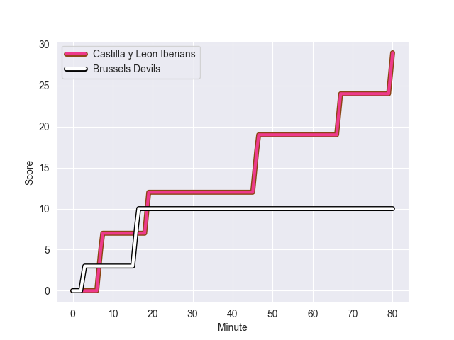
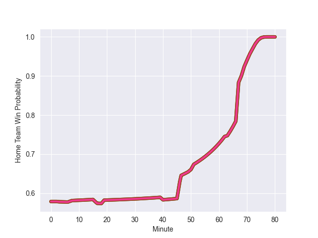

---  
layout: page  
title: Brussels Devils at Castilla y Leon Iberians; 10-29  
date: 2022-10-30 14:00:00 18:00:00 -0500  
categories: match review  
---
# Brussels Devils (1306.29) at Castilla y Leon Iberians (1444.29); 10-29

# Prediction: Castilla y Leon Iberians by 20.8

Castilla y Leon Iberians by 13.8 on a neutral field
## Scores over Time

## Win Probability over Time

# Pre-Match Prediction: Castilla y Leon Iberians by 24.2

Castilla y Leon Iberians by 17.2 on a neutral pitch

|   Away Minutes | Away Player              |   Away elo |   Away Percentile |   Number |   Home Percentile |   Home elo | Home Player              |   Home Minutes |
|---------------:|:-------------------------|-----------:|------------------:|---------:|------------------:|-----------:|:-------------------------|---------------:|
|             46 | Brandon Faddar           |      95.51 |                49 |        1 |                45 |      94.6  | Raul Calzon              |             50 |
|             51 | Aster Van Nieuwenhove    |      95.47 |                51 |        2 |               nan |      96.48 | Tsotne Tchurumbindze     |             50 |
|             72 | Romain Pinte             |      80.53 |                 4 |        3 |               nan |      95    | Mauro Genco              |             50 |
|             51 | Yannick Leenknecht       |      92.88 |                42 |        4 |                76 |     102.8  | Victor Sanchez Borrego   |             63 |
|             69 | Dries De Keyser          |     100.21 |                71 |        5 |               nan |      95    | Ben Wood                 |              5 |
|             80 | Robin Vermeersch         |      80    |                 5 |        6 |                41 |      92.79 | Rodrigo Fernandez        |             80 |
|             80 | Fior Van den Bussche     |      89.5  |                29 |        7 |               nan |      95    | Jorge Ortiz              |             80 |
|             80 | Sacha Yoko               |      86.93 |                21 |        8 |               nan |      95    | Ewart Potgieter          |             80 |
|             11 | Stef Vermeir             |      94.84 |                48 |        9 |               nan |      95    | Pablo Silva              |             80 |
|             80 | Gauthier Petit           |      38.18 |                 0 |       10 |                77 |     102.95 | Sam Katz                 |             40 |
|             80 | Romain Ziani             |      95.34 |                49 |       11 |                54 |      96.53 | Martiniano Cian          |             80 |
|             80 | Hugo De Francq           |      86.28 |                16 |       12 |                71 |     102.88 | Balthazar Taibo          |             80 |
|             80 | Victor André             |      92.32 |                35 |       13 |                62 |      98.76 | Alejandro Alonso         |             40 |
|             80 | Lucas Michiels           |      95    |               nan |       14 |                45 |      94.43 | Miguel Lainz             |             63 |
|             80 | Julien Maamaatuaiahutapu |      95    |               nan |       15 |               nan |      95    | Damian Ezequiel Huber    |             80 |
|             69 | Thomas Delebecque        |      95    |               nan |       16 |               nan |      95    | Federico Ehgartner       |             75 |
|             34 | Ayrton Stainer           |      86.84 |                12 |       17 |               nan |      95    | Jerry Junior Davoibaravi |             40 |
|             29 | Jacques Genin            |      95    |               nan |       18 |               nan |      95    | Javier Lopez             |             40 |
|             29 | Joachim Piérart          |      76.79 |                 2 |       19 |                41 |      93.75 | Juan Ignacio Perez       |             30 |
|             11 | Thomas Lurkin            |      74.13 |                 2 |       20 |                52 |      95.5  | Pablo Miejimolle         |             30 |
|              8 | Lucas Deplechin          |      95    |               nan |       21 |                68 |     100.61 | Joaquin Dominguez        |             30 |
|            nan | nan                      |     nan    |               nan |       22 |                31 |      91.35 | David Barrios            |             17 |
|            nan | nan                      |     nan    |               nan |       23 |               nan |      89.43 | Gabriel Velez            |             17 |

