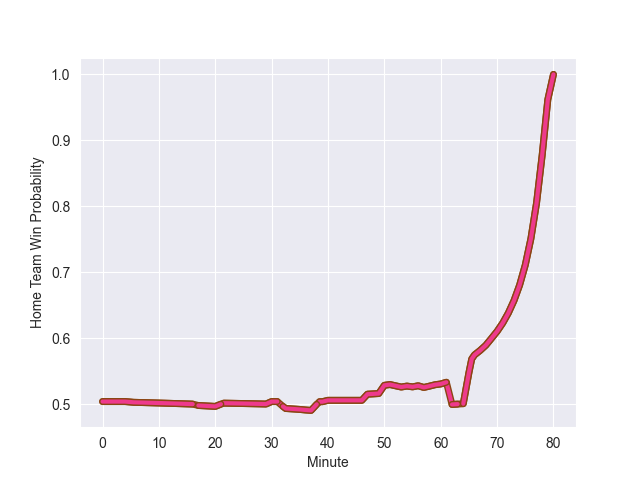

---  
layout: page  
title: Narbonne at Chambery; 22-30  
date: 2022-10-30 15:00:00 18:00:00 -0500  
categories: match review  
---
# Narbonne (1367.18) at Chambery (1377.87); 22-30

# Prediction: Chambery by 4.1

Chambery by 1.1 on a neutral field
## Scores over Time

## Win Probability over Time

# Pre-Match Prediction: Chambery by 7.7

Chambery by 4.7 on a neutral pitch

|   Away Minutes | Away Player        |   Away elo |   Away Percentile |   Number |   Home Percentile |   Home elo | Home Player              |   Home Minutes |
|---------------:|:-------------------|-----------:|------------------:|---------:|------------------:|-----------:|:-------------------------|---------------:|
|             53 | Sylvain Abadie     |      80.43 |                 5 |        1 |               nan |      96.52 | Géraud Clermont          |             36 |
|             60 | Jordan Rochier     |      94.17 |                46 |        2 |                50 |      96.81 | Julien Primault          |             57 |
|             52 | Matthieu Loudet    |      83.06 |                 7 |        3 |                53 |      97.46 | Giorgi Pertaia           |             50 |
|             55 | Mohamed Kbaier     |      88.35 |                23 |        4 |                10 |      81.23 | Steevy Cerqueira         |             80 |
|             80 | Valentin Sese      |      88.83 |                24 |        5 |                10 |      81.22 | Romain Guyot             |             66 |
|             65 | Arthur Christienne |      94.53 |                45 |        6 |                91 |     114.5  | Pierre-Nicolas Dance     |             57 |
|             80 | Paul Belzons       |      66.33 |                 1 |        7 |                25 |      89.44 | Colin Lebian             |             80 |
|             80 | Thibault Clauzade  |     105.29 |                80 |        8 |                85 |     110.04 | Jean-Baptiste Grenod     |             80 |
|             55 | Pierrick Nova      |      77.43 |                 4 |        9 |                17 |      87.77 | Thibault Dufau           |             60 |
|             40 | Tom Chauvet        |      86.25 |                14 |       10 |                11 |      83.56 | Thibault Moreno          |             69 |
|             80 | Sébastien Giorgis  |      93.26 |                39 |       11 |                84 |     107.91 | Mosese Mawalu            |             80 |
|             80 | Jose Lima          |      99.97 |                64 |       12 |                 2 |      69.7  | Vereniki Goneva          |             80 |
|             80 | Pierre-Hugo Ducom  |     104.78 |                79 |       13 |                 3 |      74.79 | Victor Pisano            |             80 |
|             80 | Save Totovosau     |      78.86 |                 5 |       14 |                55 |      96.93 | Theo Velten              |             80 |
|             80 | James Kane         |     113.18 |                91 |       15 |                43 |      93.73 | Thomas Hecquet           |             65 |
|             27 | Geoffrey Moise     |      97.93 |                57 |       16 |               nan |      93.95 | Pierre-Mathieu Fernandes |             44 |
|             20 | Christophe David   |     104.63 |                81 |       17 |                15 |      87    | Gauthier Brute de Remur  |             23 |
|             28 | Avto Gogiashvili   |      96.05 |               nan |       18 |                48 |      97.89 | Nail Audoire             |             30 |
|             25 | Manuel Plaza       |      85.63 |                16 |       19 |                33 |      91.77 | Fabien Witz              |             14 |
|             15 | Bill Caffo         |      98.25 |                60 |       20 |                47 |      95.85 | Thomas Coignat           |             23 |
|             25 | Pablo Barbaste     |      93.83 |               nan |       21 |                51 |      95.63 | Hugo Deschaux            |             20 |
|             40 | Lucas Lebraud      |      75.09 |                 3 |       22 |                41 |      92.89 | Jules Dorrival           |             11 |
|            nan | nan                |     nan    |               nan |       23 |                51 |      96.88 | Bastien Reymond          |             15 |

