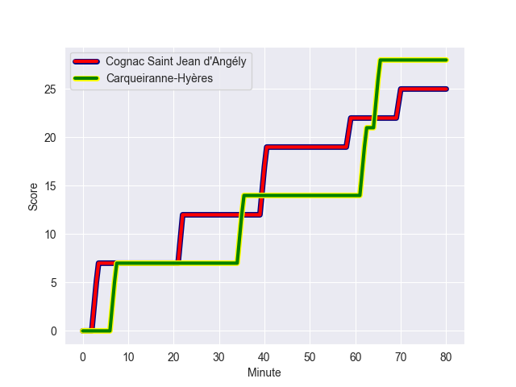
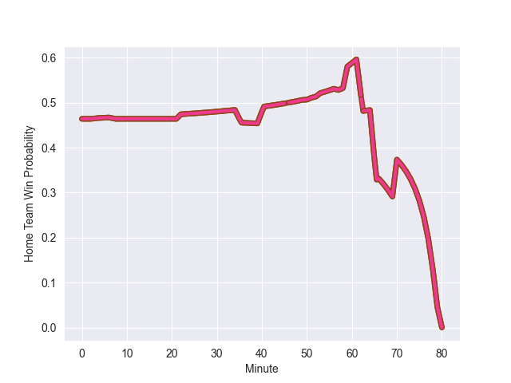

---  
layout: page  
title: Carqueiranne-Hyères at Cognac Saint Jean d'Angély; 28-25  
date: 2022-10-30 15:00:00 18:00:00 -0500  
categories: match review  
---
# Carqueiranne-Hyères (1384.86) at Cognac Saint Jean d'Angély (1322.16); 28-25

# Prediction: Cognac Saint Jean d'Angély by 0.7

Carqueiranne-Hyères by 6.3 on a neutral field
## Scores over Time

## Win Probability over Time

# Pre-Match Prediction: Carqueiranne-Hyères by 0.6

Carqueiranne-Hyères by 6.4 on a neutral pitch

|   Away Minutes | Away Player            |   Away elo |   Away Percentile |   Number |   Home Percentile |   Home elo | Home Player          |   Home Minutes |
|---------------:|:-----------------------|-----------:|------------------:|---------:|------------------:|-----------:|:---------------------|---------------:|
|             66 | Liam Chad Hendricks    |      88.04 |                21 |        1 |                58 |      97.59 | Giorgi Zakashvili    |             70 |
|             63 | Michael Tyumenev       |      77.06 |                 2 |        2 |                11 |      86.45 | Paul Sauzaret        |             50 |
|             51 | Costel Burtila         |      94.89 |                46 |        3 |                11 |      85.48 | Giorgi Sharashidze   |             66 |
|             57 | Lucas Cazac            |      65.77 |                 0 |        4 |                11 |      82.3  | Utu Maninoa          |             80 |
|             66 | Cesar Damiani          |      73.35 |                 3 |        5 |                71 |     100.63 | Filipe Manu          |             50 |
|             80 | Florian Munoz Rivero   |     101.36 |                73 |        6 |                21 |      88.15 | Matthieu Thomas      |             70 |
|             80 | Joachim Beaumont       |      96.13 |                54 |        7 |                 1 |      72.43 | Lucas Gulizzi        |             70 |
|             80 | Cristian Chirica       |      79.64 |                 6 |        8 |                18 |      87.35 | Daniel Faleafa       |             80 |
|             57 | Thomas Sonetti         |      98.7  |                66 |        9 |                33 |      90.9  | William Beaudon      |             80 |
|             53 | Lachie Munro           |     103.86 |                79 |       10 |                10 |      84.39 | Serafin Bordoli      |             50 |
|             80 | Vincent Alessi         |      83.31 |                 9 |       11 |                 1 |      67.71 | Jone Tuva            |             70 |
|             80 | Romain Leveque         |     104.4  |                79 |       12 |                95 |     118.92 | Rhema Sagote         |             80 |
|             57 | Charles Brousse        |     114.73 |                92 |       13 |                14 |      85.44 | Eneri Lotawa         |             80 |
|             80 | David Smith            |     111.48 |                89 |       14 |                16 |      87.01 | Vincent Pageneau     |             80 |
|             80 | Josselyn Bouchon       |      93.25 |                42 |       15 |                15 |      85.63 | Dany Antunes         |             80 |
|             14 | Eli Serra-Miglietti    |      93.35 |                39 |       16 |               nan |      93.03 | Bryan Bruno          |             10 |
|             17 | Pierre Traiter         |      96.3  |                58 |       17 |                39 |      92.59 | Maxime Gau           |             30 |
|             29 | Lasha Mchelidze        |      91.53 |                29 |       18 |               nan |      94.78 | Alico Kaikatsishvili |             14 |
|             23 | Geoffrey Nouhaillaguet |      86.65 |                17 |       19 |                44 |      93.51 | Ratu Jone Naulunisau |             30 |
|             14 | Sven D'Hooghe          |      85.11 |               nan |       20 |                 0 |      57.81 | Thomas Toevalu       |             10 |
|             23 | Rémi Dubié             |      89.42 |                19 |       21 |                43 |      93.88 | Isimeli Kuruibua     |             10 |
|             27 | Théo Defrance          |      94.65 |               nan |       22 |                 6 |      82.43 | Mathis Garnier       |             30 |
|             23 | Dylan Sage             |      89.75 |                25 |       23 |                29 |      91.21 | Nils Guyon           |             10 |

