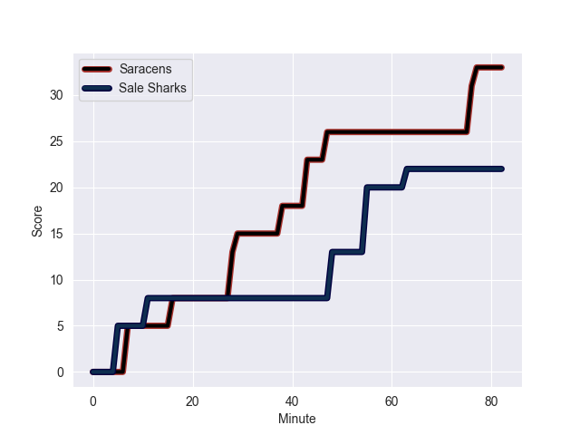
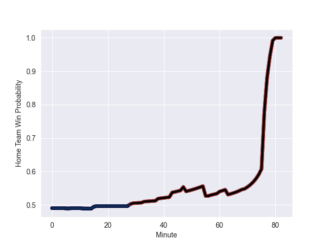

---  
layout: page  
title: Sale Sharks at Saracens; 22-33  
date: 2022-10-30 11:00:00 18:00:00 -0500  
categories: match review  
---
# Sale Sharks (1577.04) at Saracens (1556.51); 22-33

# Prediction: Saracens by 4.9

Sale Sharks by 2.1 on a neutral field
## Scores over Time

## Win Probability over Time

# Pre-Match Prediction: Sale Sharks by 1.9

Sale Sharks by 5.1 on a neutral pitch

|   Away Minutes | Away Player        |   Away elo |   Away Percentile |   Number |   Home Percentile |   Home elo | Home Player        |   Home Minutes |
|---------------:|:-------------------|-----------:|------------------:|---------:|------------------:|-----------:|:-------------------|---------------:|
|             56 | Simon McIntyre     |     115.27 |                95 |        1 |                36 |      92.88 | Eroni Mawi         |             69 |
|             57 | Tommy Taylor       |      96.74 |               nan |        2 |                64 |      99.68 | Theo Dan           |             69 |
|             57 | Nic Schonert       |      95.17 |                48 |        3 |                67 |      99.32 | Christian Judge    |             47 |
|             33 | Cobus Wiese        |      95.43 |                52 |        4 |                 6 |      79.4  | Callum Hunter-Hill |             79 |
|             82 | Josh Beaumont      |     109.75 |               nan |        5 |                80 |     104.59 | Theo McFarland     |             82 |
|             60 | Jono Ross          |     106.17 |                84 |        6 |                49 |      95.77 | Andy Christie      |             79 |
|             79 | Ben Curry          |      94.96 |                49 |        7 |                94 |     116.86 | Ben Earl           |             82 |
|             82 | Daniel du Preez    |     124.46 |                96 |        8 |                97 |     123.49 | Jackson Wray       |             82 |
|             82 | Gus Warr           |      94.02 |                40 |        9 |                59 |      97.53 | Ivan van Zyl       |             79 |
|             82 | Robert du Preez    |      85.69 |                13 |       10 |                61 |      97.98 | Manu Vunipola      |             15 |
|             76 | Tom O'Flaherty     |     117.65 |                94 |       11 |                67 |      99.59 | Elliot Daly        |             82 |
|             82 | Sam Hill           |     107.86 |                85 |       12 |                99 |     134.18 | Nick Tompkins      |             79 |
|             82 | Sam James          |     129.01 |                98 |       13 |                39 |      93.17 | Alex Lozowski      |             82 |
|             69 | Arron Reed         |     114.03 |                90 |       14 |                18 |      87.89 | Alex Lewington     |             82 |
|             82 | Joe Carpenter      |      92.23 |                37 |       15 |                96 |     120.67 | Alex Goode         |             82 |
|             25 | Ewan Ashman        |      93.99 |                46 |       16 |                19 |      88.83 | Ethan Lewis        |             13 |
|             26 | Ross Harrison      |     121.91 |                97 |       17 |               nan |      83.12 | James Flynn        |             13 |
|             25 | James Harper       |      98.31 |               nan |       18 |                60 |      98.1  | Marco Riccioni     |             35 |
|             49 | Matt Postlethwaite |      89.89 |                26 |       19 |                 9 |      80.85 | Andrew Kitchener   |              3 |
|             22 | Sam Dugdale        |      94.85 |                46 |       20 |                28 |      90.57 | Toby Knight        |              3 |
|              0 | Joe Simpson        |     106.43 |               nan |       21 |               nan |      85.02 | Ruben de Haas      |              3 |
|              3 | Tom Curtis         |      93.01 |               nan |       22 |               nan |      92.22 | Josh Hallett       |              3 |
|             19 | Byron McGuigan     |     127.21 |                98 |       23 |                96 |     121.74 | Sean Maitland      |             67 |

