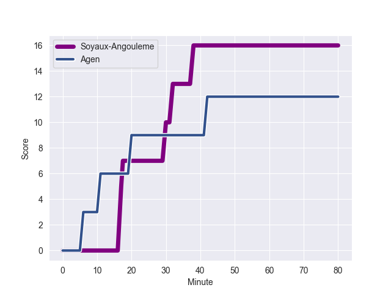
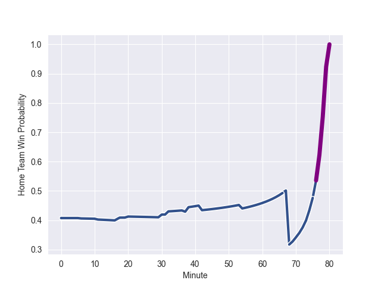

---  
layout: page  
title: Agen at Soyaux-Angouleme; 12-16  
date: 2022-11-03 21:00:00 18:00:00 -0500  
categories: match review  
---
# Agen (1551.31) at Soyaux-Angouleme (1399.55); 12-16

# Prediction: Agen by 8.2

Agen by 15.2 on a neutral field
## Scores over Time

## Win Probability over Time

# Pre-Match Prediction: Agen by 12.1

Agen by 19.1 on a neutral pitch

|   Away Minutes | Away Player          |   Away elo |   Away Percentile |   Number |   Home Percentile |   Home elo | Home Player            |   Home Minutes |
|---------------:|:---------------------|-----------:|------------------:|---------:|------------------:|-----------:|:-----------------------|---------------:|
|             54 | Florent Guion        |      73.57 |                 2 |        1 |                55 |     100.37 | Omar Odishvili         |             68 |
|             54 | Clement Martinez     |     112.22 |                93 |        2 |                61 |      97.51 | Kevin Le Guen          |             68 |
|             37 | Walter Desmaison     |      96.2  |                52 |        3 |                61 |      98.27 | Seydou Diakité         |             68 |
|             80 | Joe Maksymiw         |     101.96 |                75 |        4 |                90 |     110.74 | Sikeli Nabou           |             80 |
|             58 | Evan Olmstead        |      84.08 |                14 |        5 |                31 |      91.03 | Janse Roux             |             74 |
|             80 | Arnaud Duputs        |     116.94 |                94 |        6 |                 6 |      80.94 | Gautier Gibouin        |             68 |
|             54 | Vincent Farre        |     103.19 |                78 |        7 |                14 |      86.12 | Germain Burgaud        |             80 |
|             54 | Fotu Lokotui         |     112.44 |                88 |        8 |                 6 |      79.73 | Yassine Jarmouni       |             80 |
|             68 | Dorian Bellot        |      97.63 |                57 |        9 |                62 |      98.21 | Manu Saubusse          |             80 |
|             20 | Thomas Vincent       |     117.97 |                92 |       10 |                84 |     109.21 | Matthieu Ugalde        |             80 |
|             80 | Iban Etcheverry      |     118.13 |                94 |       11 |                26 |      90.5  | Marvin Lestremau       |             80 |
|             80 | Kolinio Ramoka       |     101.57 |                71 |       12 |                28 |      90.78 | Nasoni Naqiri Kunavore |             70 |
|             80 | Harry Sloan          |     118.66 |                95 |       13 |                10 |      81.76 | Ledua Mau              |             80 |
|             80 | Tevita Railevu       |     101.34 |                73 |       14 |                51 |      94.28 | Pierre Lafitte         |             80 |
|             80 | Jean-Marcelin Buttin |     102.3  |                72 |       15 |                23 |      89    | Rémi Brosset           |             80 |
|             60 | Danré Gerber         |     101.02 |                69 |       16 |                76 |     102.48 | Hubert Texier          |             12 |
|             43 | Théo Sauzaret        |     105.59 |                79 |       17 |                46 |      94.03 | Patxi Bidart           |             12 |
|             26 | Antoine Erbani       |      98.46 |                65 |       18 |                13 |      86.18 | Elias El Ansari        |             12 |
|             26 | Hans Lombard-Buret   |      93.46 |                28 |       19 |                66 |      97.45 | Nolan Pienaar          |             12 |
|             26 | Loris Zarantonello   |      94.95 |                42 |       20 |                49 |      95.33 | Maxime Laforgue        |             10 |
|             26 | Martin Devergie      |     111.28 |                88 |       21 |                44 |      92.02 | Ian Kitwanga           |              6 |
|             22 | Malik Hamadache      |      96.32 |                53 |       22 |               nan |     nan    | nan                    |            nan |
|             12 | Theo Idjellidaine    |      87.37 |                15 |       23 |               nan |     nan    | nan                    |            nan |

