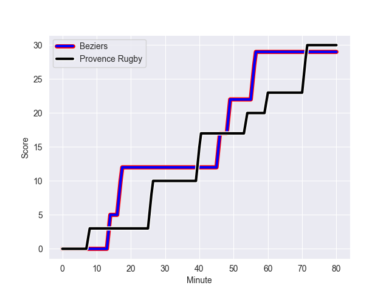
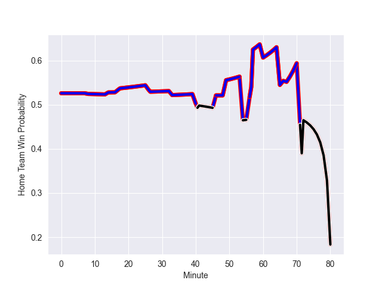

---  
layout: page  
title: Provence Rugby at Beziers; 30-29  
date: 2022-11-04 19:30:00 18:00:00 -0500  
categories: match review  
---
# Provence Rugby (1369.64) at Beziers (1413.31); 30-29

# Prediction: Beziers by 11.4

Beziers by 4.4 on a neutral field
## Scores over Time

## Win Probability over Time

# Pre-Match Prediction: Beziers by 13.6

Beziers by 6.6 on a neutral pitch

|   Away Minutes | Away Player           |   Away elo |   Away Percentile |   Number |   Home Percentile |   Home elo | Home Player              |   Home Minutes |
|---------------:|:----------------------|-----------:|------------------:|---------:|------------------:|-----------:|:-------------------------|---------------:|
|             80 | Federico Wegrzyn      |     110.2  |                92 |        1 |               nan |     107.4  | Yannick Arroyo           |             33 |
|             50 | Loick Jammes          |      77.78 |                 3 |        2 |                22 |      89.92 | Marco Pinto Ferrer       |             54 |
|             26 | Thomas Vernet         |      89.65 |                22 |        3 |               nan |     116.93 | John-Hubert Meyer        |             65 |
|             80 | Jérôme Dufour         |      97.56 |                70 |        4 |                41 |      92.82 | Pierre Gayraud           |             54 |
|             54 | Clément Chartier      |      96.23 |                54 |        5 |                41 |      92.89 | John Madigan             |             80 |
|             80 | Carl Axtens           |      87.95 |                19 |        6 |                 4 |      77.54 | Jean-Baptiste Barrère    |             80 |
|             80 | Jessy Jegerlehner     |      57.72 |                 0 |        7 |                 6 |      81.42 | Pierrick Gunther         |             80 |
|             50 | Malohi Suta           |      94.16 |               nan |        8 |                20 |      88.71 | Sias Koen                |             57 |
|             72 | Joris Cazenave        |      74.73 |                 2 |        9 |                98 |     125.7  | Josh Valentine           |             67 |
|             50 | Johnny McPhillips     |      89.5  |                22 |       10 |                35 |      92.12 | Romain Uruty             |             80 |
|             80 | Nadir Bouhedjeur      |     103.07 |                77 |       11 |                17 |      87.2  | Pierre Courtaud          |             54 |
|             80 | Louis Marrou          |     111.84 |                89 |       12 |                11 |      84.43 | Jarrod Poi               |             80 |
|             41 | Hugo Navizet          |      90.56 |                32 |       13 |                70 |     101.2  | James Tofa               |             41 |
|             80 | Léo Drouet            |     102.2  |                75 |       14 |                58 |      97.39 | Watisoni Votu            |             80 |
|             80 | Adrien Lapegue-Lafaye |      73.13 |                 3 |       15 |                25 |      89.69 | Charly Malie             |             80 |
|             31 | Matt Tierney          |      90.68 |               nan |       16 |                13 |      86.42 | Zhorzhi (Jorji) Saldadze |             47 |
|             39 | Adrian Sanday         |      98.54 |                65 |       17 |                51 |      96.11 | Gabin Lorre              |             39 |
|             30 | Lucas Martin          |      94.11 |                46 |       18 |                52 |      95.6  | Clément Esteriola        |             26 |
|             30 | Bilel Taieb           |      81.03 |                 6 |       19 |                42 |      92.97 | Clément Bitz             |             26 |
|             30 | Enzo Selponi          |     123.08 |                96 |       20 |                87 |     112.08 | Adrien Latorre           |             26 |
|             26 | Hans N'kinsi          |      74.92 |                 4 |       21 |                42 |      93.32 | Thomas Hoarau            |             23 |
|             23 | Mohammed Loukia       |      90.24 |               nan |       22 |                49 |      95.3  | John Henry Fincham       |             15 |
|              8 | Simon Tarel           |      95    |               nan |       23 |                61 |      98.03 | Mitchell Short           |             13 |

