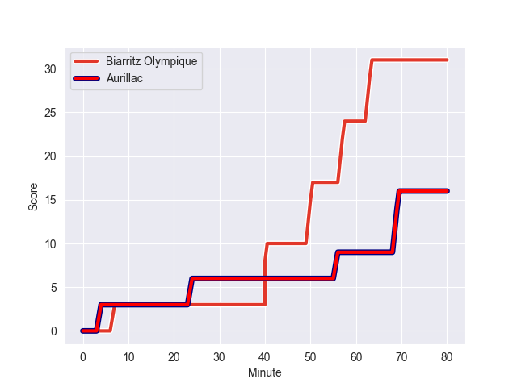
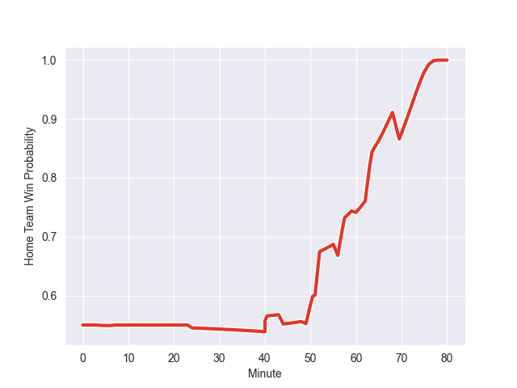

---  
layout: page  
title: Aurillac at Biarritz Olympique; 16-31  
date: 2022-11-04 21:00:00 18:00:00 -0500  
categories: match review  
---
# Aurillac (1359.21) at Biarritz Olympique (1446.09); 16-31

# Prediction: Biarritz Olympique by 11.7

Biarritz Olympique by 8.7 on a neutral field
## Scores over Time

## Win Probability over Time

# Pre-Match Prediction: Biarritz Olympique by 10.9

Biarritz Olympique by 7.9 on a neutral pitch

|   Away Minutes | Away Player           |   Away elo |   Away Percentile |   Number |   Home Percentile |   Home elo | Home Player       |   Home Minutes |
|---------------:|:----------------------|-----------:|------------------:|---------:|------------------:|-----------:|:------------------|---------------:|
|             49 | Robert Rodgers        |      89.71 |               nan |        1 |                32 |      92.11 | Baptiste Erdocio  |             75 |
|             52 | Ronan Loughnane       |      95    |               nan |        2 |                47 |      94.17 | Thomas Sauveterre |             80 |
|             49 | Henzo Kiteau          |      91.61 |               nan |        3 |                94 |     113.54 | Guy Millar        |             70 |
|             80 | Georgi Javakhia       |     101.94 |                74 |        4 |                11 |      85.31 | Dave O'Callaghan  |             52 |
|             60 | Jean-Baptiste Singer  |      84.64 |                14 |        5 |                60 |      97.82 | Josh Tyrell       |             80 |
|             80 | Beka Shvangiradze     |      89.43 |                25 |        6 |                42 |      93.52 | Simon Augry       |             80 |
|             80 | Théo Cambon           |      85    |                12 |        7 |                66 |      99.67 | Thomas Hebert     |             80 |
|             60 | Latuka Maituku        |      80.19 |                10 |        8 |                46 |      95    | Charlie Francoz   |             60 |
|             65 | David Delarue         |      84.64 |                11 |        9 |                 8 |      82.8  | Barnabe Couilloud |             80 |
|             60 | Marc Palmier          |      97.93 |                62 |       10 |                43 |      94.15 | Baptiste Germain  |             44 |
|             80 | AJ Coertzen           |      83.2  |                 9 |       11 |                36 |      92.59 | Steeve Barry      |             80 |
|             60 | Christa Powell        |      82.12 |                10 |       12 |                60 |      98.45 | Auguste Cadot     |             80 |
|             80 | Elijah Niko           |     104.48 |                77 |       13 |                84 |     108.15 | Tyler Morgan      |             70 |
|             80 | Giorgi Gogoladze      |      90.14 |                24 |       14 |                97 |     125.39 | Henry Speight     |             70 |
|             80 | Anderson Neisen       |      80.1  |                 8 |       15 |                48 |      94.68 | Joe Jonas         |             80 |
|             31 | Julien Royer          |      80.31 |                 6 |       16 |                 0 |      51.1  | Gilles Bosch      |             36 |
|             31 | Giorgi Kartvelishvili |     112.84 |                93 |       17 |               nan |      95    | Temo Matiu        |             28 |
|             28 | Luka Nioradze         |     106.32 |                84 |       18 |                50 |      94.69 | Johan Aliouat     |             20 |
|             20 | Dylan Cretin          |     107.72 |                81 |       19 |                46 |      94.26 | Quentin Samaran   |             10 |
|             20 | Eoghan Masterson      |      96.47 |                55 |       20 |                46 |      94.53 | Yohann Artru      |             10 |
|             20 | Lucas Vaccaro         |      90.37 |                28 |       21 |                93 |     117.69 | Joe Tomane        |             10 |
|             20 | Antoine Aucagne       |      84.69 |                13 |       22 |                21 |      89.94 | Luka Tchelidze    |              5 |
|             15 | Boris Hadinegoro      |      95    |               nan |       23 |               nan |     nan    | nan               |            nan |

