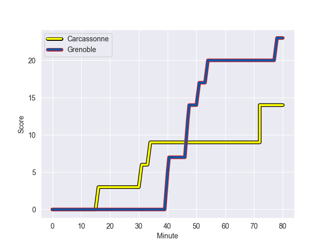
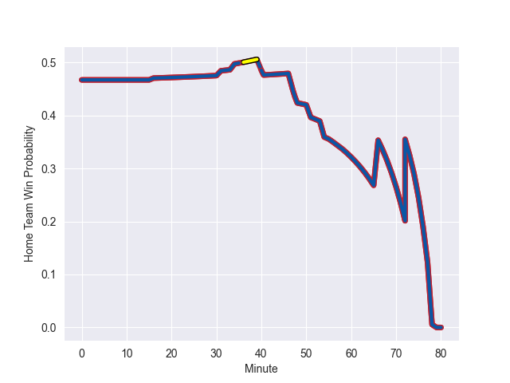

---  
layout: page  
title: Grenoble at Carcassonne; 23-14  
date: 2022-11-04 19:00:00 18:00:00 -0500  
categories: match review  
---
# Grenoble (1417.78) at Carcassonne (1370.15); 23-14

# Prediction: Grenoble by 1.8

Grenoble by 4.8 on a neutral field
## Scores over Time

## Win Probability over Time

# Pre-Match Prediction: Grenoble by 3.7

Grenoble by 6.7 on a neutral pitch

|   Away Minutes | Away Player                 |   Away elo |   Away Percentile |   Number |   Home Percentile |   Home elo | Home Player         |   Home Minutes |
|---------------:|:----------------------------|-----------:|------------------:|---------:|------------------:|-----------:|:--------------------|---------------:|
|             58 | Zack Gauthier               |     106.55 |                85 |        1 |                 7 |      82.73 | Youssef Amrouni     |             48 |
|             60 | Lilian Rossi                |     104.03 |                74 |        2 |                 6 |      81.8  | Raphael Carbou      |             73 |
|             48 | Regis Montagne              |      97.39 |                56 |        3 |                10 |      84.18 | Soso Bekoshvili     |             48 |
|             80 | Thomas Lainault             |      97.21 |                60 |        4 |                26 |      88.94 | Simon Meka          |             80 |
|             63 | Pio Muarua                  |     104.92 |                80 |        5 |                92 |     113.14 | Rob Harley          |             80 |
|             58 | Antonin Berruyer            |      86.58 |                15 |        6 |                 1 |      67.43 | Stephane Onambele   |             63 |
|             80 | Steeve Blanc-Mappaz         |     102.43 |                69 |        7 |                32 |      91.68 | Etienne Herjean     |             80 |
|             80 | Thibaut Martel              |      75.08 |                 3 |        8 |                41 |      94.1  | Tim Agaba           |             73 |
|             63 | Felipe Ezcurra              |     123.81 |                97 |        9 |                70 |     100.4  | Pierre Pages        |             80 |
|             66 | Romain Barthelemy           |      92.42 |                35 |       10 |                69 |     100.43 | Dorian Jones        |             51 |
|             80 | Karim Qadiri                |      87.46 |                17 |       11 |                81 |     106.5  | Martin Dulon        |             80 |
|             80 | Terrence Hepetema           |      87.31 |                17 |       12 |                15 |      85.13 | Pierre Aguillon     |             80 |
|             80 | Atunaisa Taulanga Vaka Manu |      80.85 |                 7 |       13 |                55 |      97.13 | Nick Grigg          |             80 |
|             80 | Wilfried Hulleu             |      90    |                22 |       14 |                 5 |      78.52 | Maxime Marty        |             55 |
|             80 | Julien Farnoux              |      96.87 |                55 |       15 |                64 |      98.96 | Léo Darrelatour     |             80 |
|             32 | Irakli Aptsiauri            |      92.91 |                36 |       16 |                 5 |      79.36 | Jules Martinez      |             32 |
|             22 | Marko Gazzotti              |      94.77 |               nan |       17 |                 0 |      64.32 | Vakhtangi Akhobadze |             32 |
|             22 | Luka Goginava               |      97.2  |                53 |       18 |                73 |     102.54 | Damien Añon         |             29 |
|             20 | Jean Charles Orioli         |      82.53 |                 7 |       19 |                18 |      86.02 | Clément Clavières   |             25 |
|             17 | Adrien Vigne                |      89.25 |                25 |       20 |               nan |      95    | Guilhem Vettore     |             17 |
|             17 | Eric Escande                |      99.7  |                66 |       21 |                26 |      90.41 | Connor Sa           |              7 |
|             14 | Corentin Glenat             |      96.89 |                50 |       22 |                 4 |      78.44 | Gregory Annetta     |              7 |

