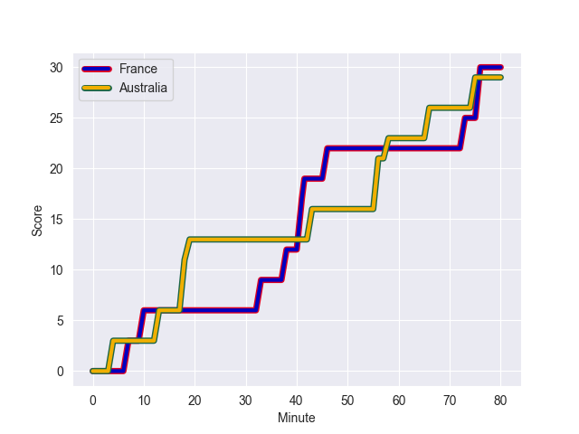
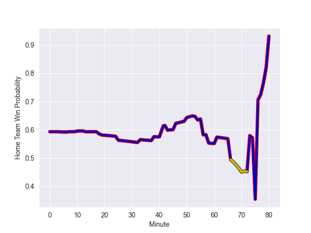

---  
layout: page  
title: Australia at France; 29.0-30.0  
date: 2022-11-04 21:00:00 18:00:00 -0500  
categories: match review  
---
# Australia (1616.99) at France (1780.46); 29.0-30.0

# Prediction: France by 19.3

France by 16.3 on a neutral field
## Scores over Time

## Win Probability over Time

# Pre-Match Prediction: France by 20.1

France by 17.1 on a neutral pitch

|   Away Minutes | Away Player     |   Away elo |   Away Percentile |   Number |   Home Percentile |   Home elo | Home Player       |   Home Minutes |
|---------------:|:----------------|-----------:|------------------:|---------:|------------------:|-----------:|:------------------|---------------:|
|             78 | James Slipper   |     130.25 |                99 |        1 |                95 |     115.98 | Cyril Baille      |             54 |
|             53 | Dave Porecki    |     111.83 |                92 |        2 |                94 |     115.38 | Julien Marchand   |             54 |
|             71 | Taniela Tupou   |     105.43 |                76 |        3 |                98 |     121.23 | Uini Atonio       |             54 |
|             80 | Nick Frost      |      88.36 |                23 |        4 |                60 |      97.5  | Cameron Woki      |             50 |
|             54 | Cadeyrn Neville |     106    |                81 |        5 |                95 |     118.96 | Thibaud Flament   |             80 |
|             80 | Jed Holloway    |      87.1  |                17 |        6 |                89 |     115.15 | Anthony Jelonch   |             80 |
|             71 | Michael Hooper  |     134.23 |                99 |        7 |                98 |     128.96 | Charles Ollivon   |             80 |
|             80 | Rob Valetini    |     101.65 |                66 |        8 |                96 |     128.72 | Gregory Alldritt  |             80 |
|             61 | Nic White       |     126.68 |                99 |        9 |                99 |     131.24 | Antoine Dupont    |             80 |
|             72 | Bernard Foley   |     135.83 |                98 |       10 |                90 |     116.11 | Romain Ntamack    |             58 |
|             80 | Tom Wright      |      87.76 |                17 |       11 |                90 |     113.94 | Yoram Moefana     |             80 |
|             25 | Lalakai Foketi  |      83.86 |                13 |       12 |                93 |     117.46 | Jonathan Danty    |             80 |
|             80 | Len Ikitau      |     111.93 |                88 |       13 |                97 |     125.84 | Gael Fickou       |             66 |
|             80 | Andrew Kellaway |     107.82 |                84 |       14 |                87 |     111.35 | Damian Penaud     |             80 |
|             80 | Jock Campbell   |      96.1  |                50 |       15 |                96 |     126.54 | Thomas Ramos      |             80 |
|             27 | Folau Fainga'a  |     121.29 |                98 |       16 |                95 |     115.79 | Peato Mauvaka     |             26 |
|              2 | Matt Gibbon     |     104.57 |                80 |       17 |                73 |     100.23 | Dany Priso        |             26 |
|              9 | Tom Robertson   |     101.07 |                70 |       18 |                81 |     104.89 | Sipili Falatea    |             26 |
|             26 | Will Skelton    |     108.21 |                85 |       19 |                94 |     117.23 | Romain Taofifenua |             30 |
|              9 | Pete Samu       |     103.72 |                76 |       20 |                98 |     128.54 | Matthis Lebel     |             14 |
|             19 | Jake Gordon     |      83.91 |                10 |       21 |                82 |     108.55 | Sekou Macalou     |              0 |
|             55 | Hunter Paisami  |     107.55 |                83 |       22 |               100 |     141.99 | Maxime Lucu       |              0 |
|              8 | Reece Hodge     |     102.73 |                72 |       23 |                85 |     110.74 | Matthieu Jalibert |             22 |

