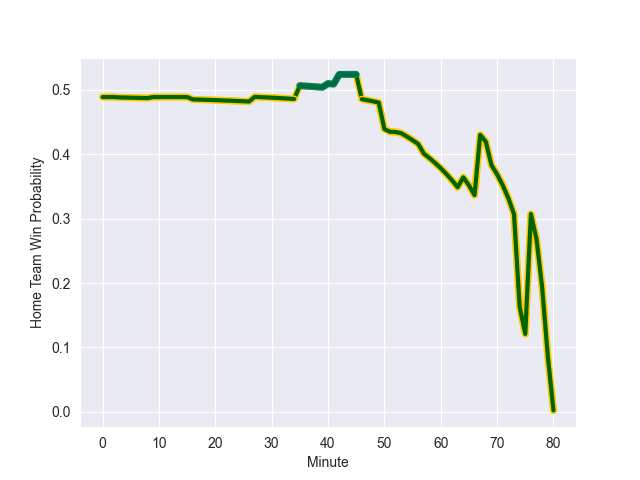

---  
layout: page  
title: South Africa at Ireland; 16.0-19.0  
date: 2022-11-04 17:30:00 18:00:00 -0500  
categories: match review  
---
# South Africa (1723.52) at Ireland (1701.9); 16.0-19.0

# Prediction: Ireland by 0.8

South Africa by 2.2 on a neutral field
## Scores over Time

## Win Probability over Time

# Pre-Match Prediction: South Africa by 3.8

Ireland by 0.8 on a neutral pitch

|   Away Minutes | Away Player          |   Away elo |   Away Percentile |   Number |   Home Percentile |   Home elo | Home Player         |   Home Minutes |
|---------------:|:---------------------|-----------:|------------------:|---------:|------------------:|-----------:|:--------------------|---------------:|
|             57 | Steven Kitshoff      |     120.32 |                97 |        1 |                83 |     104.88 | Andrew Porter       |             69 |
|             57 | Malcolm Marx         |     119.38 |                97 |        2 |                69 |      99.72 | Dan Sheehan         |             64 |
|             46 | Frans Malherbe       |     104.46 |                80 |        3 |                95 |     116.28 | Tadhg Furlong       |             40 |
|             80 | Eben Etzebeth        |     117.93 |                94 |        4 |                95 |     118.15 | Tadhg Beirne        |             64 |
|             35 | Lood de Jager        |      90.67 |                29 |        5 |                94 |     118.11 | James Ryan          |             80 |
|             80 | Siya Kolisi          |     103.81 |                75 |        6 |                16 |      86.95 | Peter O'Mahony      |             69 |
|             64 | Pieter-Steph du Toit |      92.46 |                37 |        7 |                98 |     128.31 | Josh van der Flier  |             80 |
|             52 | Jasper Wiese         |     109.02 |                83 |        8 |                94 |     123.76 | Caelan Doris        |             80 |
|             52 | Jaden Hendrikse      |     104.9  |                79 |        9 |                98 |     125.36 | Conor Murray        |             35 |
|             80 | Damian Willemse      |     112.04 |                88 |       10 |                94 |     124.16 | Johnny Sexton       |             77 |
|             65 | Makazole Mapimpi     |     115.38 |                91 |       11 |                84 |     107.71 | Mack Hansen         |             80 |
|             80 | Damian de Allende    |     111.89 |                88 |       12 |                99 |     133.75 | Stuart McCloskey    |             27 |
|             80 | Jesse Kriel          |     126.5  |                97 |       13 |                86 |     110.11 | Garry Ringrose      |             80 |
|             68 | Kurt-Lee Arendse     |     118.09 |                94 |       14 |                61 |      98.22 | Robert Baloucoune   |             80 |
|             80 | Cheslin Kolbe        |     152.53 |                99 |       15 |                97 |     123.53 | Hugo Keenan         |             80 |
|             23 | Bongi Mbonambi       |     114.72 |                93 |       16 |                84 |     106.24 | Rob Herring         |             16 |
|             23 | Ox Nche              |     105.23 |                81 |       17 |                95 |     115.4  | Cian Healy          |             11 |
|             34 | Vincent Koch         |      91.43 |                50 |       18 |                77 |     103.3  | Finlay Bealham      |             40 |
|             45 | Franco Mostert       |     125.64 |                97 |       19 |                69 |     100.26 | Kieran Treadwell    |             16 |
|             28 | Kwagga Smith         |     109.13 |                85 |       20 |                96 |     127.78 | Jack Conan          |             11 |
|             16 | Deon Fourie          |     144.06 |                99 |       21 |                95 |     117.87 | Jamison Gibson-Park |             45 |
|             28 | Faf de Klerk         |     112.78 |                91 |       22 |                54 |      97.25 | Joey Carbery        |              3 |
|             27 | Willie le Roux       |     124.19 |                97 |       23 |                94 |     118.4  | Jimmy O'Brien       |             53 |

