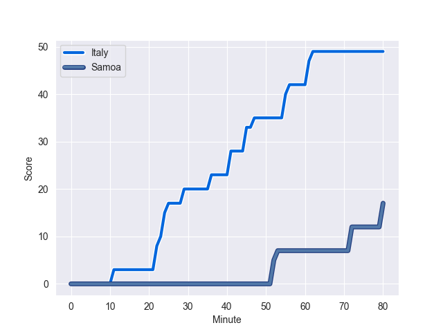
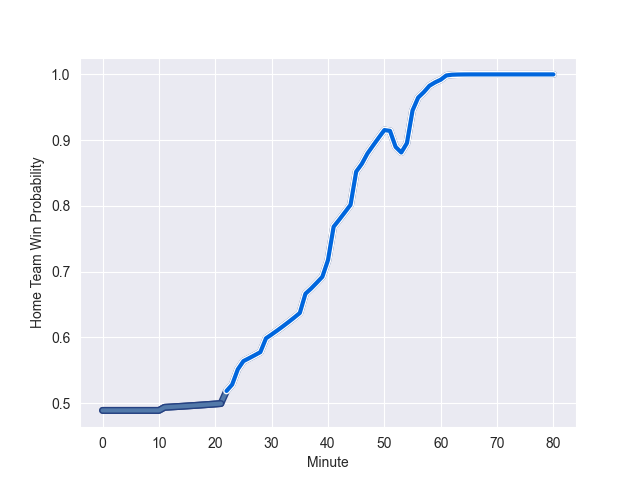

---  
layout: page  
title: Samoa at Italy; 17.0-49.0  
date: 2022-11-04 14:00:00 18:00:00 -0500  
categories: match review  
---
# Samoa (1555.21) at Italy (1535.89); 17.0-49.0

# Prediction: Italy by 1.1

Samoa by 1.9 on a neutral field
## Scores over Time

## Win Probability over Time

# Pre-Match Prediction: Samoa by 1.9

Samoa by 1.1 on a neutral pitch

|   Away Minutes | Away Player         |   Away elo |   Away Percentile |   Number |   Home Percentile |   Home elo | Home Player        |   Home Minutes |
|---------------:|:--------------------|-----------:|------------------:|---------:|------------------:|-----------:|:-------------------|---------------:|
|             56 | Jordan Lay          |      92.83 |                38 |        1 |                46 |      95.07 | Danilo Fischetti   |             56 |
|             56 | Seilala Lam         |      82.39 |                 8 |        2 |                85 |     106.83 | Giacomo Nicotera   |             51 |
|             53 | Michael Alaalatoa   |      99.05 |                64 |        3 |                77 |     103.2  | Simone Ferrari     |             62 |
|             47 | Brian Alainu'uese   |     103.56 |                77 |        4 |                52 |      95.7  | David Sisi         |             51 |
|             80 | Chris Vui           |     105.07 |                77 |        5 |                73 |     101.66 | Federico Ruzza     |             80 |
|             80 | Theo McFarland      |     106.6  |                83 |        6 |                28 |      90.35 | Manuel Zuliani     |             40 |
|             58 | Jordan Taufua       |     114.34 |                88 |        7 |                92 |     114.55 | Michele Lamaro     |             80 |
|             80 | Fritz Lee           |     143.83 |               100 |        8 |                82 |     107.81 | Lorenzo Cannone    |             80 |
|             53 | Ere Enari           |      94.42 |                44 |        9 |                 9 |      82.98 | Stephen Varney     |             65 |
|             47 | Rodney Iona         |      95    |               nan |       10 |                81 |     106.5  | Paolo Garbisi      |             80 |
|             80 | Nigel Ah Wong       |     113.46 |                89 |       11 |                93 |     117.81 | Monty Ioane        |             80 |
|             80 | D'Angelo Leuila     |      98.08 |                59 |       12 |                92 |     115.39 | Luca Morisi        |             51 |
|             80 | Ulupano Seuteni     |      96.13 |                54 |       13 |                64 |      99.93 | Juan Ignacio Brex  |             80 |
|             62 | Alapati Leiua       |      97.82 |                57 |       14 |                38 |      92.93 | Pierre Bruno       |             80 |
|             80 | Danny Toala         |     105.74 |                79 |       15 |                79 |     106.4  | Tommaso Allan      |             47 |
|             24 | Manu Leiataua       |      92.02 |                27 |       16 |                44 |      92.89 | Gianmarco Lucchesi |             29 |
|             24 | Nephi Leatigaga     |      88.58 |                18 |       17 |                64 |      99.01 | Ivan Nemer         |             24 |
|             27 | Jeff Toomaga-Allen  |     113.45 |                94 |       18 |                44 |      94.2  | Pietro Ceccarelli  |             18 |
|             33 | Taleni Seu          |     118.87 |                92 |       19 |                10 |      80.56 | Niccolo Cannone    |             29 |
|             22 | Talalelei Gray      |      90.41 |                26 |       20 |                87 |     109.24 | Toa Halafihi       |             40 |
|             27 | Jonathan Taumateine |      89.55 |                23 |       21 |               nan |      95.68 | Manfredi Albanese  |             15 |
|             33 | Duncan Paia'aua     |      99.51 |                62 |       22 |                87 |     111.54 | Enrico Lucchin     |             29 |
|             18 | Tomasi Alosio       |      99.95 |                65 |       23 |                82 |     105.78 | Tommaso Menoncello |             33 |

