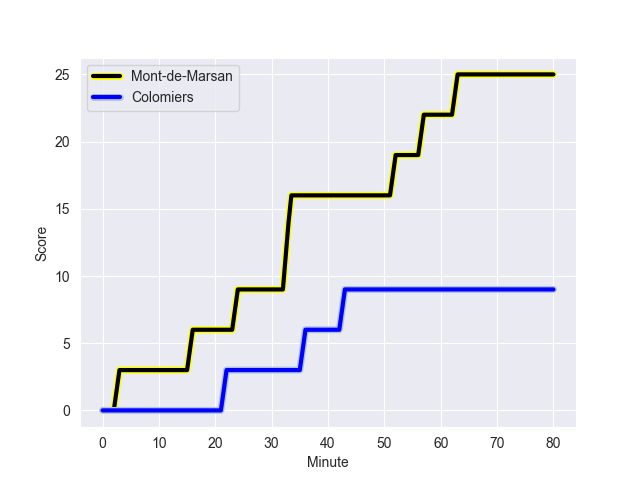
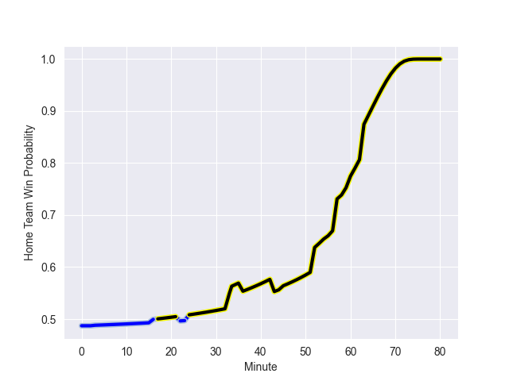

---  
layout: page  
title: Colomiers at Mont-de-Marsan; 9-25  
date: 2022-11-04 19:30:00 18:00:00 -0500  
categories: match review  
---
# Colomiers (1432.89) at Mont-de-Marsan (1410.62); 9-25

# Prediction: Mont-de-Marsan by 4.8

Colomiers by 2.2 on a neutral field
## Scores over Time

## Win Probability over Time

# Pre-Match Prediction: Colomiers by 4.8

Colomiers by 2.2 on a neutral pitch

|   Away Minutes | Away Player           |   Away elo |   Away Percentile |   Number |   Home Percentile |   Home elo | Home Player           |   Home Minutes |
|---------------:|:----------------------|-----------:|------------------:|---------:|------------------:|-----------:|:----------------------|---------------:|
|             45 | Hugo Djehi            |      93.9  |                32 |        1 |                13 |      86.18 | Jean-Luc Innocente    |             52 |
|             55 | Andrew Ready          |      94.8  |                42 |        2 |                 5 |      78.92 | Simon Labouyrie       |             52 |
|             45 | Robin Bellemand       |      95.49 |                42 |        3 |                17 |      87.56 | Gheorge Gajion        |             68 |
|             55 | Maxime Granouillet    |      89    |                23 |        4 |                53 |      94.2  | Romain Durand         |             80 |
|             80 | Alexandre Ricard      |     100.41 |                71 |        5 |                51 |      94.41 | Andrei Garbuzov       |             31 |
|             52 | Anthony Coletta       |      72.41 |                 1 |        6 |                77 |     102.89 | Yann Brethous         |             80 |
|             80 | Aldric Lescure        |     100.81 |                72 |        7 |                66 |      98.99 | Nicolas Garrault      |             80 |
|             52 | Yann Peysson          |      87    |                17 |        8 |                18 |      86.88 | Thibault Tauleigne    |             58 |
|             60 | Ugo Seguela           |     110.34 |                87 |        9 |                86 |     106.61 | Martin Doan           |             72 |
|             80 | Romuald Séguy         |      94.27 |                44 |       10 |                88 |     112.57 | Willie du Plessis     |             62 |
|             80 | Valentin Saurs        |      90.46 |                25 |       11 |                 5 |      79.88 | Julien Cabannes       |             80 |
|             52 | Johan Deysel (Jnr)    |     108.18 |                85 |       12 |                58 |      97.95 | Jules Even            |             60 |
|             80 | Fabien Perrin         |     109.12 |                87 |       13 |                21 |      88.76 | Simon Renda           |             80 |
|             80 | Peni Rokoduguni       |      95.65 |                46 |       14 |                15 |      86.49 | Pierre Sayerse        |             80 |
|             80 | Thomas Girard         |      86.72 |                18 |       15 |                87 |     110.86 | Yoann Laousse Azpiazu |             80 |
|             35 | Thomas Dubois         |      82.3  |                 7 |       16 |                32 |      91.25 | Leandro Cedaro        |             49 |
|             35 | Marco Fepulea'i       |     101.9  |                75 |       17 |                22 |      90.1  | Romain Laterrade      |             28 |
|             28 | Pierre-Samuel Pacheco |      89.9  |                21 |       18 |                58 |      95.4  | Dino Casadei          |             28 |
|             28 | Waël Ponpon           |      87.21 |                13 |       19 |                 4 |      78.96 | Léo Banos             |             22 |
|             28 | Simon Delas           |      93.46 |               nan |       20 |                86 |     108.97 | Jeronimo de la Fuente |             20 |
|             25 | Jean Thomas           |      96.48 |                41 |       21 |                 7 |      80.57 | Simon Desaubies       |             18 |
|             25 | Hika Elliot           |     114.71 |                94 |       22 |                14 |      87.84 | Mattéo Lalanne        |             12 |
|             20 | Edoardo Gori          |      98.37 |                64 |       23 |               nan |      95    | Baptiste Canut        |              8 |

