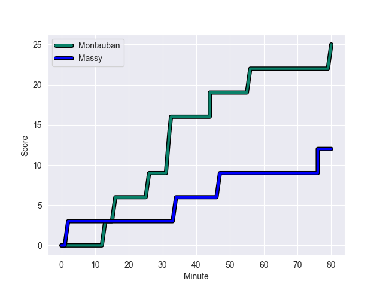
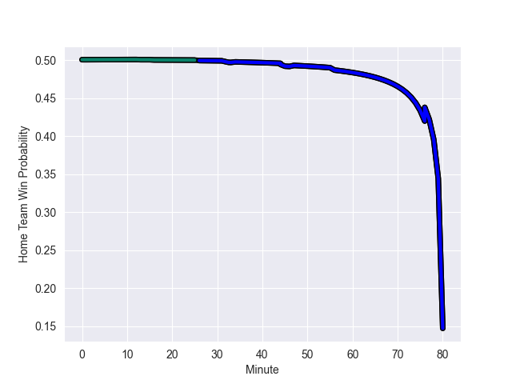

---  
layout: page  
title: Massy at Montauban; 12-25  
date: 2022-11-04 19:30:00 18:00:00 -0500  
categories: match review  
---
# Massy (1403.18) at Montauban (1408.43); 12-25

# Prediction: Montauban by 3.5

Montauban by 0.5 on a neutral field
## Scores over Time

## Win Probability over Time

# Pre-Match Prediction: Montauban by 0.9

Massy by 3.9 on a neutral pitch

|   Away Minutes | Away Player           |   Away elo |   Away Percentile |   Number |   Home Percentile |   Home elo | Home Player        |   Home Minutes |
|---------------:|:----------------------|-----------:|------------------:|---------:|------------------:|-----------:|:-------------------|---------------:|
|             45 | Robin Poipy           |     103.27 |                73 |        1 |                91 |     108.19 | Nicolas Agnesi     |             49 |
|             45 | Mamoudou Meite        |      92.87 |                31 |        2 |                 7 |      82.01 | Kevin Firmin       |             58 |
|             45 | Guiterembi Vickos     |     104.62 |                75 |        3 |                 3 |      78.71 | Mirian Burduli     |             49 |
|             57 | Andrew Chauveau       |      78.76 |                 7 |        4 |                 0 |      61.74 | Kevin Gimeno       |             49 |
|             80 | Dion Evrard Oulai     |      80.26 |                 8 |        5 |                81 |     106.58 | Alexandre Manukula |             80 |
|             80 | Jean Maurice Decubber |      95.44 |                50 |        6 |                 4 |      78.01 | Frédéric Quercy    |             80 |
|             80 | Abongile Nonkontwana  |      94.48 |                47 |        7 |                 3 |      76.41 | Stéphane Munoz     |             65 |
|             57 | Clement Lanen         |      92.85 |                37 |        8 |                22 |      88.5  | Quentin Witt       |             80 |
|             50 | Gaetan Pichon         |      94.48 |                45 |        9 |               nan |      96.03 | Alexis Bernadet    |             80 |
|             80 | Massimo Ortolan       |     103.09 |                73 |       10 |                89 |     115.21 | Jérôme Bosviel     |             80 |
|             80 | Nathan Farissier      |      96.46 |                52 |       11 |                40 |      93.34 | Bastien Guillemin  |             73 |
|             80 | Mathieu Guillomot     |      83.97 |                13 |       12 |                27 |      92.29 | Raphael Sanchez    |             49 |
|             80 | Victorien Jacomme     |     100.19 |                65 |       13 |                32 |      91.14 | Paul Bonnefond     |             80 |
|             45 | Kimami Sitauti        |      99.55 |                63 |       14 |                97 |     123.17 | Semesa Rokoduguni  |             80 |
|             45 | Romain Clouté         |      97.83 |                54 |       15 |                92 |     114.4  | Maxime Salles      |             80 |
|             35 | Yanis Dit Robaglia    |      94.83 |                47 |       16 |                 2 |      76.14 | Lucas Seyrolle     |             31 |
|             35 | Corentin Chabeaudie   |      82.12 |                 7 |       17 |                 8 |      80.22 | Dimitri Vaotoa     |             31 |
|             35 | Juan Kotze            |      92.36 |                38 |       18 |                10 |      84.31 | Victor Laval       |             31 |
|             35 | Fernandez Correa      |      83.39 |                 8 |       19 |                34 |      90.88 | Taleta Tupuola     |             31 |
|             35 | Nicolas Ferrer        |     100.2  |                68 |       20 |                40 |      92.85 | Arnaud Feltrin     |             22 |
|             30 | Benjamin Prier        |     107.79 |                82 |       21 |               nan |      94.58 | Kyllian Ringuet    |             15 |
|             23 | Ewan Coetzee          |      77.07 |                 5 |       22 |                36 |      92.54 | Romain Riguet      |              7 |
|             23 | Mehdi Tlili           |      94.11 |               nan |       23 |               nan |     nan    | nan                |            nan |

