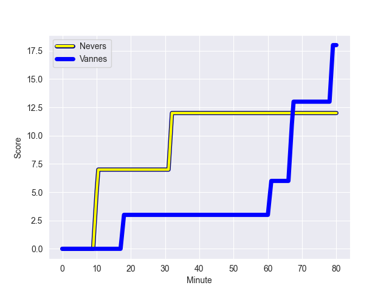
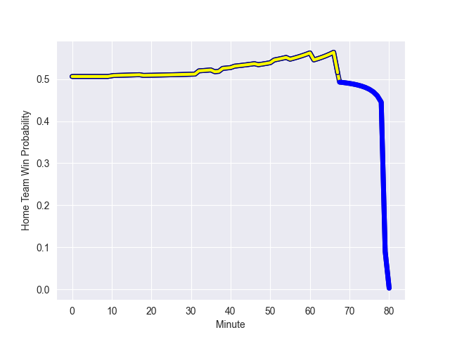

---  
layout: page  
title: Vannes at Nevers; 18-12  
date: 2022-11-04 19:30:00 18:00:00 -0500  
categories: match review  
---
# Vannes (1507.73) at Nevers (1491.28); 18-12

# Prediction: Nevers by 1.4

Vannes by 1.6 on a neutral field
## Scores over Time

## Win Probability over Time

# Pre-Match Prediction: Vannes by 1.4

Vannes by 1.6 on a neutral pitch

|   Away Minutes | Away Player             |   Away elo |   Away Percentile |   Number |   Home Percentile |   Home elo | Home Player              |   Home Minutes |
|---------------:|:------------------------|-----------:|------------------:|---------:|------------------:|-----------:|:-------------------------|---------------:|
|             51 | Andy Bordelai           |      98.93 |                63 |        1 |                13 |      86.36 | Tomike Mataradze         |             38 |
|             51 | Pat Leafa               |      99.32 |                67 |        2 |                91 |     111.26 | Issam Hamel              |             55 |
|             51 | Paga Tafili             |     116.87 |                96 |        3 |                21 |      90.69 | Aselo Ikahehegi          |             41 |
|             80 | Joe Edwards             |     103.84 |                78 |        4 |                87 |     109.07 | Will Skelton             |             60 |
|             51 | Ewan Thomas Johnson     |      98.22 |                64 |        5 |                10 |      80.84 | Christiaan van der Merwe |             60 |
|             47 | Juan Bautista Pedemonte |      93.65 |                43 |        6 |                98 |     127.98 | Hugues Bastide           |             80 |
|             80 | Francisco Gorrissen     |     133.37 |                98 |        7 |                56 |     100.22 | Shaun Adendorff          |             80 |
|             80 | Karl Chateau            |      72.56 |                 2 |        8 |                96 |     120.23 | Jason-Colin Fraser       |             60 |
|             55 | Alexandre Gouaux        |      94.41 |                55 |        9 |                80 |     105.85 | Guillaume Manevy         |             69 |
|             80 | Maxime Lafage           |      90.43 |                25 |       10 |                70 |     100.57 | Yohan Le Bourhis         |             80 |
|             69 | Théo Bastardie          |      95    |               nan |       11 |                83 |     106.74 | Lucas Blanc              |             75 |
|             36 | Sacha Valleau           |      90.26 |                28 |       12 |                 9 |      81.99 | Rudy Derrieux            |             80 |
|             80 | Theo Costosseque        |      91.05 |                31 |       13 |                 2 |      72.04 | Alifereti Loaloa         |             80 |
|             80 | Nathanael Hulleu        |      98.29 |                61 |       14 |                85 |     108.77 | Andrzej Charlat          |             80 |
|             80 | Nick Abendanon          |     125.01 |                98 |       15 |                60 |      98.49 | Thomas Zenon             |             80 |
|             44 | Romaric Camou           |     111.59 |                88 |       16 |                92 |     111.42 | Aitor Kitutu             |             42 |
|             33 | Léon Boulier            |     106.63 |                79 |       17 |                42 |      93.32 | Ilia Kaikatsishvili      |             39 |
|             29 | John Afoa               |      92.94 |                36 |       18 |                10 |      83.95 | Elia Elia                |             25 |
|             29 | Ximun Bessonart         |      87.62 |                17 |       19 |                52 |      95.75 | Maxence Barjaud          |             20 |
|             29 | Edoardo Iachizzi        |     106.64 |                82 |       20 |                 7 |      81.16 | Luka Plataret            |             20 |
|             29 | Cyril Blanchard         |     100.13 |                71 |       21 |                 9 |      81.45 | Maka Polutele            |             20 |
|             25 | Hugo Zabalza            |      90.81 |                27 |       22 |                64 |      98.92 | Yoan Cottin              |             11 |
|             11 | Jean Chezeau            |      95    |               nan |       23 |                 4 |      77.51 | Aviata Silago            |              5 |

