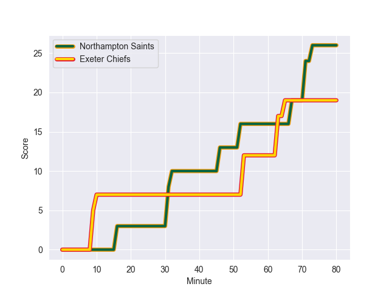
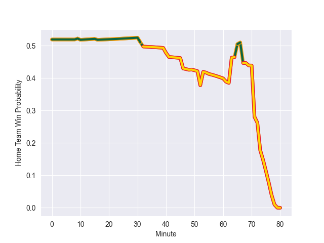

---  
layout: page  
title: Exeter Chiefs at Northampton Saints; 19.0-26.0  
date: 2022-11-04 15:45:00 18:00:00 -0500  
categories: match review  
---
# Exeter Chiefs (1548.63) at Northampton Saints (1582.44); 19.0-26.0

# Prediction: Northampton Saints by 6.4

Northampton Saints by 3.4 on a neutral field
## Scores over Time

## Win Probability over Time

# Pre-Match Prediction: Northampton Saints by 1.9

Exeter Chiefs by 1.1 on a neutral pitch

|   Away Minutes | Away Player       |   Away elo |   Away Percentile |   Number |   Home Percentile |   Home elo | Home Player          |   Home Minutes |
|---------------:|:------------------|-----------:|------------------:|---------:|------------------:|-----------:|:---------------------|---------------:|
|             53 | Scott Sio         |      96.66 |                53 |        1 |                74 |     101.98 | Emmanuel Iyogun      |             52 |
|             40 | Jack Yeandle      |     126.12 |                99 |        2 |                99 |     129.6  | Mike Haywood         |             80 |
|             69 | Harry Williams    |     115.28 |                95 |        3 |                72 |     101.58 | Ehren Painter        |             52 |
|             49 | Jack Dunne        |      97.69 |                65 |        4 |                53 |      95.93 | Lukhan Salakaia-Loto |             80 |
|             80 | Ruben van Heerden |     112.22 |                91 |        5 |                80 |     104.82 | Alex Moon            |             80 |
|             80 | Dave Ewers        |     127.87 |                98 |        6 |                71 |     100.01 | Angus Scott-Young    |             80 |
|             80 | Lewis Pearson     |      90.22 |                27 |        7 |                29 |      90.83 | Aaron Hinkley        |             80 |
|             80 | Jacques Vermeulen |     106.18 |                79 |        8 |                97 |     125.82 | Sam Graham           |             80 |
|             55 | Jack Maunder      |      91.55 |                32 |        9 |                 8 |      84.98 | Tom James            |             46 |
|             80 | Joe Simmonds      |     116.11 |                92 |       10 |                25 |      90.25 | Fin Smith            |             76 |
|             41 | Olly Woodburn     |     119.45 |                94 |       11 |                75 |     102.68 | Ollie Sleightholme   |             32 |
|             10 | Ian Whitten       |     106.36 |                81 |       12 |                44 |      94.03 | Rory Hutchinson      |             61 |
|             80 | Rory O'Loughlin   |     100.77 |                67 |       13 |                 8 |      81.63 | Fraser Dingwall      |             80 |
|             80 | Dan John          |      91.27 |               nan |       14 |                96 |     123.59 | Courtnall Skosan     |             80 |
|             80 | Josh Hodge        |      88.98 |                21 |       15 |                95 |     120.06 | Tommy Freeman        |             80 |
|             40 | Jack Innard       |      94.95 |                44 |       16 |               nan |      79.52 | Robbie Smith         |              4 |
|             27 | Alec Hepburn      |     100.01 |                69 |       17 |                99 |     132.77 | Alex Waller          |             28 |
|             11 | Josh Iosefa-Scott |      99.32 |                67 |       18 |                83 |     105.81 | Paul Hill            |             28 |
|             31 | Dafydd Jenkins    |     103.54 |                77 |       19 |                82 |     106.46 | Brandon Nansen       |              0 |
|              0 | Rusiate Tuima     |      84.02 |                13 |       20 |               nan |      95    | Kayde Sylvester      |              0 |
|             25 | Sam Maunder       |      87.19 |                16 |       21 |                89 |     111.45 | Alex Mitchell        |             34 |
|             39 | Will Becconsall   |      95    |               nan |       22 |                93 |     116.85 | George Furbank       |             48 |
|             70 | Sean O'Brien      |      94.43 |               nan |       23 |                84 |     107.46 | Matt Proctor         |             19 |

