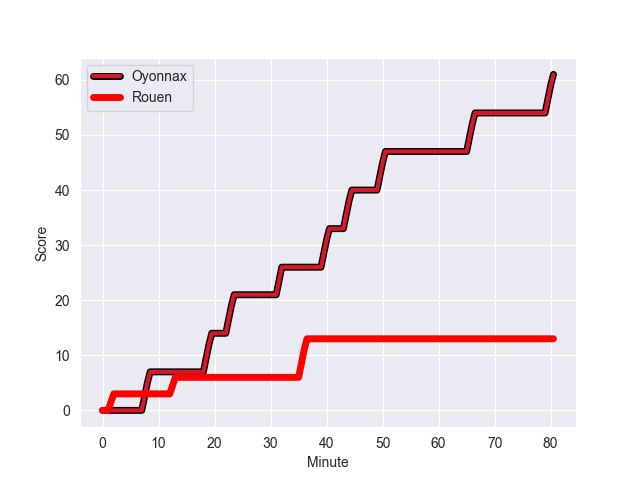
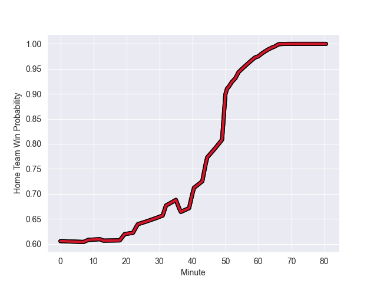

---  
layout: page  
title: Rouen at Oyonnax; 13-61  
date: 2022-11-04 19:30:00 18:00:00 -0500  
categories: match review  
---
# Rouen (1445.76) at Oyonnax (1631.47); 13-61

# Prediction: Oyonnax by 21.6

Oyonnax by 18.6 on a neutral field
## Scores over Time

## Win Probability over Time

# Pre-Match Prediction: Oyonnax by 20.1

Oyonnax by 17.1 on a neutral pitch

|   Away Minutes | Away Player          |   Away elo |   Away Percentile |   Number |   Home Percentile |   Home elo | Home Player         |   Home Minutes |
|---------------:|:---------------------|-----------:|------------------:|---------:|------------------:|-----------:|:--------------------|---------------:|
|             52 | Soulemane Camara     |     107.27 |                82 |        1 |                31 |      91.83 | Tommy Raynaud       |             50 |
|             46 | Jean-Étienne Lesueur |      88.3  |                17 |        2 |                77 |     102.76 | Benjamin Geledan    |             50 |
|             52 | Cody Thomas          |     104.17 |                78 |        3 |                19 |      88.35 | Thibault Berthaud   |             61 |
|             66 | Raphaël Vieilledent  |      92.4  |                37 |        4 |                99 |     143.56 | Tom Murday          |             60 |
|             80 | Shay Kerry           |      87.16 |                19 |        5 |                99 |     141.94 | Phoenix Battye      |             80 |
|             80 | Fabien Vincent       |     110.52 |                88 |        6 |                87 |     109.51 | Kevin Lebreton      |             80 |
|             41 | Jean Leleu           |      99.3  |                62 |        7 |                41 |      93.22 | Loïc Credoz         |             54 |
|             80 | Julien Ruaud         |     100.54 |                63 |        8 |                98 |     135.88 | Rory Grice          |             80 |
|             61 | Adrien Brissard      |      95.39 |               nan |        9 |                89 |     111.22 | Charlie Cassang     |             61 |
|             47 | Thibault Olender     |      96.03 |                50 |       10 |                83 |     108.31 | Jules Soulan        |             50 |
|             47 | Paul Surano          |      93.71 |                40 |       11 |                92 |     115.58 | Aurelien Callandret |             80 |
|             80 | JT Jackson           |      83.96 |                12 |       12 |                12 |      83.52 | Gaby Lovobalavu     |             50 |
|             80 | Alex Luatua          |     102.68 |                73 |       13 |                32 |      91.12 | Florian Vialelle    |             80 |
|             80 | Amidou Marciniek     |      95    |               nan |       14 |                80 |     105.6  | Joe Ravouvou        |             80 |
|             80 | Marius Marty         |      94.65 |                47 |       15 |                87 |     111.17 | Darren Sweetnam     |             80 |
|             39 | Tienie Burger        |     100.04 |                61 |       16 |                 3 |      81.54 | Adrien Bordenave    |             30 |
|             34 | Lucas Malbert        |      95    |               nan |       17 |               nan |      94.92 | Leo Treilles        |             30 |
|             33 | Kevin Milhorat       |      87.03 |                19 |       18 |                53 |      96.17 | Teddy Durand        |             30 |
|             33 | Opetera Peleseuma    |      94.24 |                45 |       19 |                70 |     101.54 | Justin Bouraux      |             30 |
|             28 | Antoine Fournier     |     106.22 |                84 |       20 |                95 |     126.38 | Filimo Taofifenua   |             26 |
|             28 | Mohamed Boughanmi    |      90.92 |                26 |       21 |                88 |     110.18 | Hugo Fabregue       |             20 |
|             19 | Joris Lezat          |      92.64 |                37 |       22 |                82 |     105.46 | Victor Delmas       |             19 |
|             14 | Lucas Costa          |      95.97 |                50 |       23 |                45 |      94.4  | Ilan El Khattabi    |             19 |

