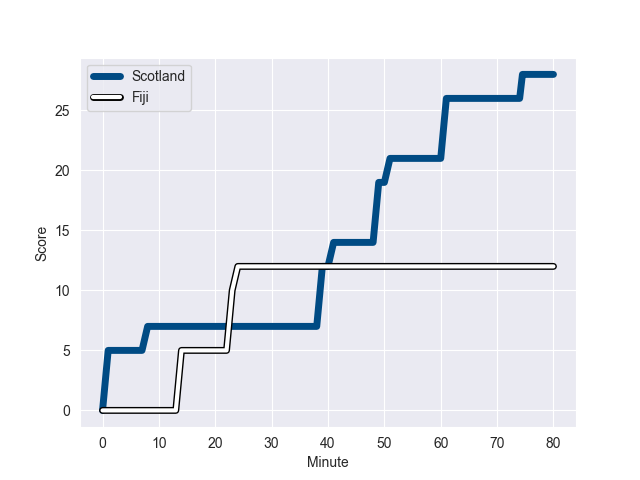
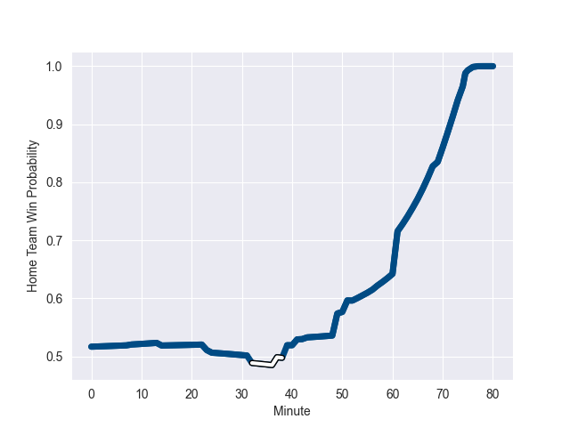

---  
layout: page  
title: Fiji at Scotland; 12.0-28.0  
date: 2022-11-04 13:00:00 18:00:00 -0500  
categories: match review  
---
# Fiji (1533.68) at Scotland (1562.93); 12.0-28.0

# Prediction: Scotland by 5.9

Scotland by 2.9 on a neutral field
## Scores over Time

## Win Probability over Time

# Pre-Match Prediction: Scotland by 6.1

Scotland by 3.1 on a neutral pitch

|   Away Minutes | Away Player        |   Away elo |   Away Percentile |   Number |   Home Percentile |   Home elo | Home Player         |   Home Minutes |
|---------------:|:-------------------|-----------:|------------------:|---------:|------------------:|-----------:|:--------------------|---------------:|
|             58 | Eroni Mawi         |      93.71 |                41 |        1 |                13 |      85.98 | Pierre Schoeman     |             52 |
|             73 | Sam Matavesi       |      97.79 |                62 |        2 |                96 |     117.6  | George Turner       |             32 |
|             51 | Manasa Saulo       |      95    |               nan |        3 |                93 |     113.22 | Zander Fagerson     |             69 |
|             55 | Temo Mayanavanua   |      98.71 |                63 |        4 |                17 |      85.99 | Richie Gray         |             80 |
|             80 | Ratu Rotuisolia    |      90.51 |                28 |        5 |                83 |     106.64 | Grant Gilchrist     |             61 |
|             73 | Albert Tuisue      |     104.49 |                76 |        6 |                97 |     123.1  | Jamie Ritchie       |             80 |
|             73 | Levani Botia       |      95    |               nan |        7 |                68 |     100.31 | Hamish Watson       |             52 |
|             80 | Viliame Mata       |      96.09 |                47 |        8 |                87 |     112.76 | Matt Fagerson       |             80 |
|             65 | Frank Lomani       |      97.25 |                56 |        9 |                73 |     102.48 | Ali Price           |             52 |
|             80 | Vilimoni Botitu    |      99.5  |                62 |       10 |                97 |     128.73 | Adam Hastings       |             43 |
|             80 | Vinaya Habosi      |      94.84 |                47 |       11 |                22 |      89.29 | Duhan van der Merwe |             80 |
|             57 | Kalaveti Ravouvou  |     102.54 |                72 |       12 |                75 |     103.78 | Cameron Redpath     |             80 |
|             80 | Waisea Nayacalevu  |      95    |               nan |       13 |                72 |     102.5  | Chris Harris        |             69 |
|             80 | Setariki Tuicuvu   |     166.36 |               100 |       14 |                87 |     110.68 | Darcy Graham        |             80 |
|             37 | Kini Murimurivalu  |     124.71 |                97 |       15 |                70 |     102.64 | Stuart Hogg         |             80 |
|              7 | Tevita Ikanivere   |      96.35 |                54 |       16 |                42 |      93.06 | Ewan Ashman         |             48 |
|             29 | Livai Natave       |      95    |               nan |       17 |                51 |      94.83 | Rory Sutherland     |             28 |
|             29 | Luke Tagi          |      92.57 |                35 |       18 |               nan |      90.24 | Murphy Walker       |             11 |
|             25 | Api Ratuniyarawa   |      99.32 |                64 |       19 |                78 |     103.73 | Jonny Gray          |             19 |
|              7 | Kitione Kamikamica |      96.34 |                49 |       20 |                 6 |      79.06 | Jack Dempsey        |             28 |
|             15 | Peni Matawalu      |      98.21 |                58 |       21 |                81 |     106.25 | Ben White           |             28 |
|             23 | Teti Tela          |      99.59 |                65 |       22 |                98 |     133.68 | Blair Kinghorn      |             37 |
|             43 | Sireli Maqala      |      95    |               nan |       23 |                 4 |      77.35 | Sione Tuipulotu     |             11 |

