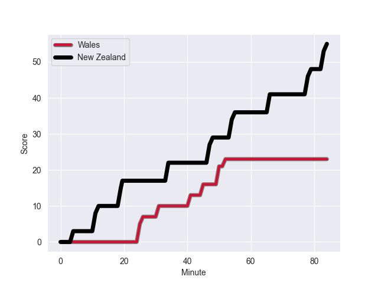
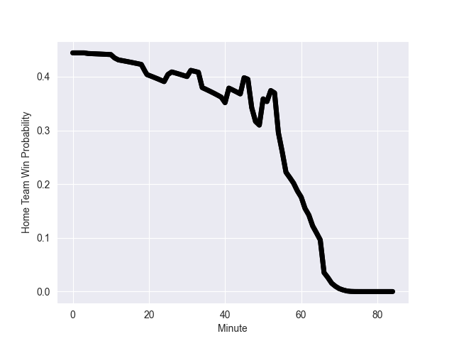

---  
layout: page  
title: New Zealand at Wales; 55.0-23.0  
date: 2022-11-04 15:15:00 18:00:00 -0500  
categories: match review  
---
# New Zealand (1685.05) at Wales (1588.17); 55.0-23.0

# Prediction: New Zealand by 6.7

New Zealand by 9.7 on a neutral field
## Scores over Time

## Win Probability over Time

# Pre-Match Prediction: New Zealand by 5.8

New Zealand by 8.8 on a neutral pitch

|   Away Minutes | Away Player         |   Away elo |   Away Percentile |   Number |   Home Percentile |   Home elo | Home Player       |   Home Minutes |
|---------------:|:--------------------|-----------:|------------------:|---------:|------------------:|-----------:|:------------------|---------------:|
|             56 | Ethan de Groot      |     103.59 |                77 |        1 |                 9 |      83.57 | Gareth Thomas     |             45 |
|             59 | Codie Taylor        |      89.63 |                19 |        2 |                75 |     101.83 | Ken Owens         |             68 |
|             59 | Tyrel Lomax         |     109.67 |                88 |        3 |                98 |     120.68 | Tomas Francis     |             40 |
|             84 | Sam Whitelock       |     105.43 |                81 |        4 |                54 |      96.38 | Will Rowlands     |             84 |
|             71 | Scott Barrett       |     122.41 |                96 |        5 |                72 |     101.16 | Adam Beard        |             41 |
|             63 | Shannon Frizell     |     101.85 |                72 |        6 |                96 |     121.45 | Justin Tipuric    |             84 |
|             84 | Dalton Papali'i     |     102.19 |                71 |        7 |                97 |     126.26 | Tommy Reffell     |             56 |
|             84 | Ardie Savea         |     123.74 |                94 |        8 |                55 |      98.49 | Taulupe Faletau   |             84 |
|             68 | Aaron Smith         |     109.52 |                85 |        9 |                90 |     112.07 | Tomos Williams    |             68 |
|             71 | Richie Mo'unga      |     128.16 |                96 |       10 |                45 |      94.7  | Rhys Priestland   |             68 |
|             84 | Caleb Clarke        |      99.91 |                67 |       11 |                 2 |      74.97 | Rio Dyer          |             84 |
|             84 | Jordie Barrett      |     129.82 |                99 |       12 |                99 |     130.32 | Nick Tompkins     |             61 |
|             84 | Rieko Ioane         |      89.73 |                26 |       13 |                98 |     128.64 | George North      |             84 |
|             59 | Sevu Reece          |     122.14 |                96 |       14 |                73 |     101.85 | Louis Rees-Zammit |             84 |
|             84 | Beauden Barrett     |     136.31 |                99 |       15 |                83 |     108.96 | Gareth Anscombe   |             84 |
|             25 | Samisoni Taukei'aho |     112.98 |                93 |       16 |                88 |     108.96 | Ryan Elias        |             16 |
|             28 | Ofa Tu'ungafasi     |     117.29 |                96 |       17 |                39 |      92.69 | Nicky Smith       |             39 |
|             25 | Fletcher Newell     |      90.78 |                15 |       18 |                92 |     111.99 | Dillon Lewis      |             44 |
|             13 | Tupou Vaa'i         |      99.63 |                66 |       19 |                91 |     113.72 | Alun Wyn Jones    |             43 |
|             21 | Akira Ioane         |     120.41 |                96 |       20 |                35 |      91.67 | Christ Tshiunza   |             28 |
|             16 | Brad Weber          |     127.84 |                98 |       21 |                88 |     109.63 | Kieran Hardy      |             16 |
|             13 | David Havili        |     126.74 |                97 |       22 |                 3 |      76.46 | Sam Costelow      |             16 |
|             25 | Anton Lienert-Brown |     124.38 |                96 |       23 |                87 |     111.4  | Owen Watkin       |             23 |

