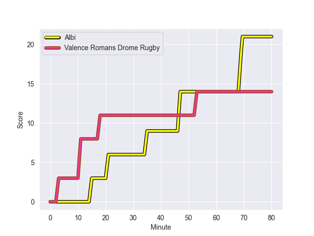
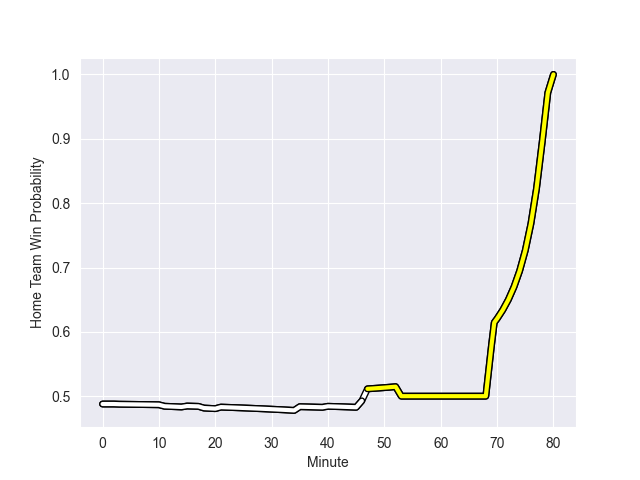

---  
layout: page  
title: Valence Romans Drome Rugby at Albi; 14-21  
date: 2022-11-05 18:30:00 18:00:00 -0500  
categories: match review  
---
# Valence Romans Drome Rugby (1469.99) at Albi (1449.39); 14-21

# Prediction: Albi by 0.9

Valence Romans Drome Rugby by 2.1 on a neutral field
## Scores over Time

## Win Probability over Time

# Pre-Match Prediction: Valence Romans Drome Rugby by 1.4

Valence Romans Drome Rugby by 4.4 on a neutral pitch

|   Away Minutes | Away Player           |   Away elo |   Away Percentile |   Number |   Home Percentile |   Home elo | Home Player                |   Home Minutes |
|---------------:|:----------------------|-----------:|------------------:|---------:|------------------:|-----------:|:---------------------------|---------------:|
|             57 | Sami Zouhair          |     106.37 |                85 |        1 |                 4 |      80.91 | Maxime Escur               |             46 |
|             48 | Mehdi Boundjema       |     102.46 |                77 |        2 |                 1 |      72.58 | Reinach Venter             |             46 |
|             48 | Vincent Pelo          |      93.92 |                42 |        3 |                27 |      92.34 | Dimitri Tchapnga           |             46 |
|             59 | Darrell Dyer          |      96.5  |                56 |        4 |               nan |      95.51 | Pilbarnon Djossou Lokossou |             46 |
|             54 | Ian Groenewald        |     111.29 |                89 |        5 |                22 |      88.06 | Jacques Engelbrecht        |             80 |
|             80 | Axel Bruchet          |      71.01 |                 1 |        6 |                57 |      97.42 | Lucas Guillaume            |             80 |
|             80 | Ioane Iashagashvili   |     105.9  |                82 |        7 |                93 |     115.53 | Pierre Roussel             |             80 |
|             80 | Sven Bernat Girlando  |     104.75 |                78 |        8 |                34 |      93.31 | Camille Jarreau            |             40 |
|             70 | Tim Menzel            |      87.73 |                17 |        9 |                17 |      88.02 | Théo Vidal                 |             64 |
|             80 | Joris Moura           |      96.11 |                51 |       10 |                39 |      93.57 | Benjamin Pehau             |             80 |
|             56 | Noe Perret-Tourlonias |      98.08 |                61 |       11 |                88 |     112.67 | Enzo Marzocca              |             80 |
|             80 | Charles Bouldoire     |     116.87 |                93 |       12 |                87 |     111.3  | Baptiste Couchinave        |             80 |
|             80 | Jonathan Quinnez      |     105.59 |                79 |       13 |                88 |     111.9  | Wandile Mjekevu            |             80 |
|             80 | Adam Vargas           |     101.68 |                73 |       14 |                32 |      91.81 | Luca Sperandio             |             80 |
|             80 | Guillaume Cazes       |      81.06 |                 9 |       15 |                31 |      91.19 | Téo Dospital               |             71 |
|             23 | Anthony Aléo          |     108.22 |                88 |       16 |                71 |     101.08 | Antoine Soave              |             34 |
|             32 | Dorian Marco Pena     |      86.24 |                12 |       17 |                25 |      90.21 | Arthur Castant             |             34 |
|             32 | Enzo Bailly           |      96.22 |               nan |       18 |                35 |      92.65 | Jean Baptiste De Clercq    |             34 |
|             21 | Florian Goumat        |      93.98 |                45 |       19 |                 6 |      80.03 | Hugo Boutin                |             34 |
|             26 | Francois Uys          |     106.16 |                82 |       20 |                61 |      99.89 | Sandrick Maciotta          |             40 |
|             10 | Léopold Dupas         |      93.07 |                41 |       21 |                22 |      89.67 | Titouan Pouzoullic         |             16 |
|             24 | Anatole Pauvert       |      89.33 |                24 |       22 |                34 |      91.54 | Paul Clergue               |              9 |

