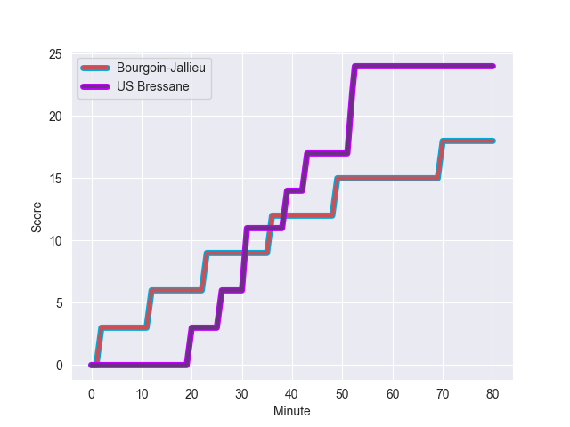
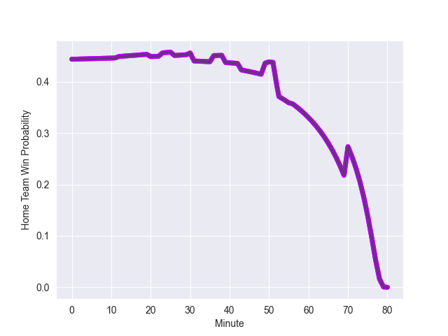

---  
layout: page  
title: US Bressane at Bourgoin-Jallieu; 24-18  
date: 2022-11-05 18:30:00 18:00:00 -0500  
categories: match review  
---
# US Bressane (1477.91) at Bourgoin-Jallieu (1385.08); 24-18

# Prediction: US Bressane by 6.3

US Bressane by 9.3 on a neutral field
## Scores over Time

## Win Probability over Time

# Pre-Match Prediction: US Bressane by 5.4

US Bressane by 8.4 on a neutral pitch

|   Away Minutes | Away Player               |   Away elo |   Away Percentile |   Number |   Home Percentile |   Home elo | Home Player           |   Home Minutes |
|---------------:|:--------------------------|-----------:|------------------:|---------:|------------------:|-----------:|:----------------------|---------------:|
|             65 | Vazha Kapanadze           |      80.04 |                 5 |        1 |                33 |      91.08 | Nugzar Somkhishvili   |             56 |
|             65 | Clement Jullien           |      88.44 |                17 |        2 |                61 |      97.71 | Killian Tripier       |             56 |
|             65 | Erich de Jager            |     107.91 |                87 |        3 |                57 |      96.95 | Michael Simutoga      |             56 |
|             80 | Wael May                  |      95    |                45 |        4 |                19 |      86.9  | Robin Gascou          |             30 |
|             80 | Koen Bloemen              |      97.2  |                59 |        5 |                58 |      96.96 | Léandre Cotte         |             50 |
|             50 | Lucas Lyons               |     101.01 |                70 |        6 |                49 |      95.07 | Bynjamin Rabatel      |             80 |
|             71 | Loic Baradel              |      91.91 |                33 |        7 |                 8 |      81.75 | Theophile Cotte       |             80 |
|             77 | Adrien Buatier            |      90.9  |                29 |        8 |                42 |      94.43 | Lakisipone Lee        |             43 |
|             71 | Nicolas Faure             |     119.38 |                96 |        9 |                56 |      97.16 | Tomas Munilla lo Duca |             80 |
|             80 | Sebastian Poet            |      94.54 |                44 |       10 |                11 |      83.24 | Nicolas Vuillemin     |             80 |
|             80 | Kavekini Tabu             |      98.96 |                64 |       11 |                43 |      92.75 | Quentin Lefort        |             56 |
|             71 | Parataiso Silafai-Lea'ana |     103.42 |                74 |       12 |                71 |     100.94 | Christopher Bosch     |             80 |
|             80 | Maile Mamao               |      99.66 |                63 |       13 |                22 |      88.69 | Pablo Patilla         |             80 |
|             80 | Audric Sanlaville         |     100.04 |                68 |       14 |                36 |      92.6  | Makalea Foliaki       |             56 |
|             80 | Pierre Berard             |     114.45 |                91 |       15 |                15 |      85.52 | Nicolas Cachet        |             80 |
|             30 | Thomas Déliance           |      98.88 |                63 |       16 |                38 |      92.63 | Jonathan Kpoku        |             50 |
|             15 | Sione Anga'aelangi        |     114.43 |                94 |       17 |                70 |     101.08 | Théo Lepage           |             37 |
|             15 | Teo Bordenave             |      91.36 |                28 |       18 |                69 |      99.73 | Kemueli Lavetanakoroi |             30 |
|             15 | Melvin Champenois         |      95    |               nan |       19 |                14 |      86.9  | Romain Favaretto      |             24 |
|              9 | Jeremy Valencot           |      91.26 |                27 |       20 |                57 |      97.7  | Oktay Yilmaz          |             24 |
|              9 | Benjamin Doy              |      69.06 |                 1 |       21 |                37 |      92.4  | Mohamed Khribache     |             24 |
|              9 | TJ Ioane                  |      76.13 |                 3 |       22 |                14 |      85.71 | Matthieu Nicolas      |             24 |
|              3 | Romain Falcoz             |      92.9  |               nan |       23 |                42 |      93.79 | Remi Bouet            |             24 |

