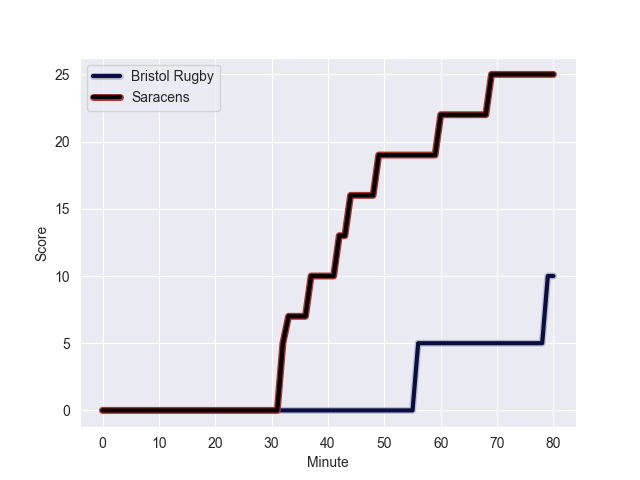
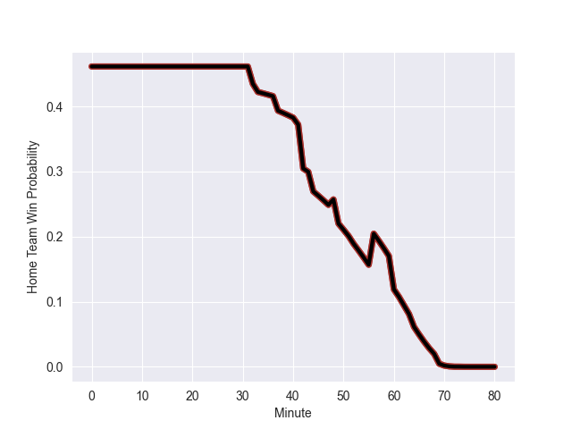

---  
layout: page  
title: Saracens at Bristol Rugby; 25.0-10.0  
date: 2022-11-05 13:00:00 18:00:00 -0500  
categories: match review  
---
# Saracens (1550.14) at Bristol Rugby (1483.04); 25.0-10.0

# Prediction: Saracens by 3.7

Saracens by 6.7 on a neutral field
## Scores over Time

## Win Probability over Time

# Pre-Match Prediction: Saracens by 0.6

Saracens by 3.6 on a neutral pitch

|   Away Minutes | Away Player        |   Away elo |   Away Percentile |   Number |   Home Percentile |   Home elo | Home Player       |   Home Minutes |
|---------------:|:-------------------|-----------:|------------------:|---------:|------------------:|-----------:|:------------------|---------------:|
|             74 | Robin Hislop       |      99.57 |                66 |        1 |                67 |     101.44 | Yann Thomas       |             61 |
|             73 | Theo Dan           |     104.09 |                79 |        2 |                62 |      99.71 | Bryan Byrne       |             52 |
|             70 | Marco Riccioni     |      95.16 |                45 |        3 |                96 |     119.07 | Jay Tyack         |             64 |
|             80 | Callum Hunter-Hill |      74.82 |                 4 |        4 |                37 |      91.39 | Ed Holmes         |             75 |
|             78 | Hugh Tizard        |     112.95 |                90 |        5 |                68 |      99.98 | Joe Batley        |             80 |
|             78 | Andy Christie      |      93.03 |                40 |        6 |                38 |      92.63 | Magnus Bradbury   |             80 |
|             80 | Ben Earl           |     116.84 |                94 |        7 |                 7 |      83.1  | Jake Heenan       |             48 |
|             80 | Jackson Wray       |     127.68 |                96 |        8 |                67 |     101.75 | Fitz Harding      |             80 |
|             79 | Ivan van Zyl       |      98.14 |                60 |        9 |                37 |      92.29 | Will Porter       |             70 |
|             80 | Alex Goode         |     120.73 |                94 |       10 |                88 |     112.97 | Callum Sheedy     |             80 |
|             79 | Sean Maitland      |     123.21 |                95 |       11 |               nan |      95.55 | Gabriel Ibitoye   |             80 |
|             80 | Alex Lozowski      |      94.12 |                44 |       12 |                56 |      97.48 | Sam Bedlow        |             80 |
|             78 | Elliot Daly        |     107.72 |                84 |       13 |               nan |      95    | Joe Jenkins       |             72 |
|             80 | Alex Lewington     |      95.19 |                48 |       14 |                 6 |      80.06 | Deago Bailey      |             80 |
|             80 | Max Malins         |      91    |                27 |       15 |                99 |     144.96 | Luke Morahan      |             42 |
|              7 | Ethan Lewis        |      86.65 |                13 |       16 |                54 |      96.27 | Harry Thacker     |             28 |
|              6 | James Flynn        |      82.81 |                10 |       17 |                81 |     105.11 | Jake Woolmore     |             19 |
|             10 | Alec Clarey        |      98.05 |                54 |       18 |               nan |      92.85 | Jono Benz-Salomon |             16 |
|              2 | Andrew Kitchener   |      78.31 |                 6 |       19 |                12 |      83.53 | John Hawkins      |              5 |
|              2 | Toby Knight        |      93.85 |                43 |       20 |                83 |     107.36 | Daniel Thomas     |             32 |
|              1 | Gareth Simpson     |     100.42 |                69 |       21 |                 1 |      72.61 | Andy Uren         |             10 |
|              2 | Josh Hallett       |      92.37 |               nan |       22 |                44 |      93.08 | Ioan Lloyd        |             38 |
|              1 | Tom Howe           |      82.72 |                 9 |       23 |                15 |      86.22 | Jack Bates        |              8 |

