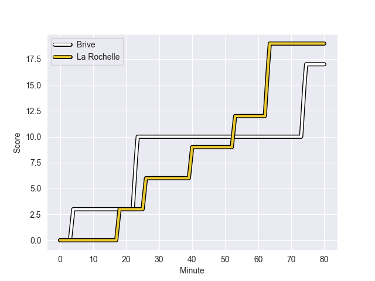
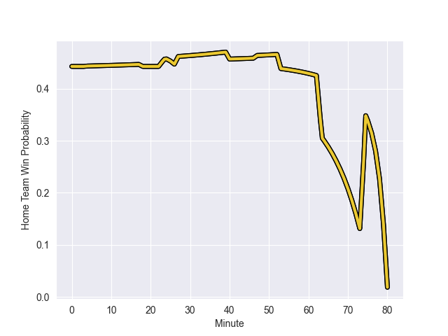

---  
layout: page  
title: La Rochelle at Brive; 19-17  
date: 2022-11-05 17:00:00 18:00:00 -0500  
categories: match review  
---
# La Rochelle (1474.17) at Brive (1373.93); 19-17

# Prediction: La Rochelle by 7.0

La Rochelle by 10.0 on a neutral field
## Scores over Time

## Win Probability over Time

# Pre-Match Prediction: La Rochelle by 7.2

La Rochelle by 10.2 on a neutral pitch

|   Away Minutes | Away Player           |   Away elo |   Away Percentile |   Number |   Home Percentile |   Home elo | Home Player           |   Home Minutes |
|---------------:|:----------------------|-----------:|------------------:|---------:|------------------:|-----------:|:----------------------|---------------:|
|             80 | Thierry Paiva         |      92.42 |                34 |        1 |                14 |      86.77 | Daniel Brennan        |             47 |
|             54 | Quentin Lespiaucq     |      86.8  |                15 |        2 |                29 |      90.67 | Motu Matu'u           |             47 |
|             54 | Georges-Henri Colombe |      85.24 |                11 |        3 |                73 |     101.62 | Marcel van der Merwe  |             80 |
|             80 | Thomas Lavault        |     102    |                74 |        4 |                22 |      88    | Julien Delannoy       |             25 |
|             59 | Remi Picquette        |      96.08 |                72 |        5 |                53 |      93.84 | Oskar Rixen           |             80 |
|             80 | Matthias Haddad       |      95.24 |                45 |        6 |                21 |      88.25 | Matthieu Voisin       |             80 |
|             27 | Ultan Dillane         |     105.67 |                82 |        7 |                22 |      88.72 | Sasha Gue             |             80 |
|             80 | Yoan Tanga            |     100.61 |                69 |        8 |                14 |      86.07 | Esteban Abadie        |             80 |
|             72 | Tawera Kerr-Barlow    |     126.55 |                99 |        9 |                 5 |      79.19 | Paul Abadie           |             68 |
|             80 | Antoine Hastoy        |      83.26 |                11 |       10 |                88 |     113.17 | Enzo Herve            |             80 |
|             80 | Dillyn Leyds          |     107.89 |                84 |       11 |                78 |     103.91 | Axel Muller           |             80 |
|             80 | Pierre Boudehent      |      91.47 |                30 |       12 |                45 |      94.45 | Stuart Olding         |             80 |
|             80 | Raymond Rhule         |     101    |                68 |       13 |                11 |      82.82 | Sammy Arnold          |             80 |
|             80 | Teddy Thomas          |     102.39 |                75 |       14 |                51 |      95.87 | Joris Jurand          |             80 |
|             80 | Brice Dulin           |     112.71 |                89 |       15 |                 7 |      78.55 | Mathis Ferté          |             73 |
|             53 | Kyle Hatherell        |      76.37 |                 3 |       16 |                 6 |      78.03 | Andres Zafra Tarazona |             55 |
|             26 | Samuel Lagrange       |     102.85 |                77 |       17 |               nan |      96.92 | Nathan Fraissenon     |             33 |
|             26 | Leo Aouf              |      93.08 |                37 |       18 |                31 |      91.34 | Vano Karkadze         |             33 |
|             21 | Romain Sazy           |      92.61 |                38 |       19 |                15 |      86.34 | Enzo Sanga            |             12 |
|              8 | Jules Le Bail         |     100.6  |                68 |       20 |                93 |     116.84 | Thomas Laranjeira     |              7 |

