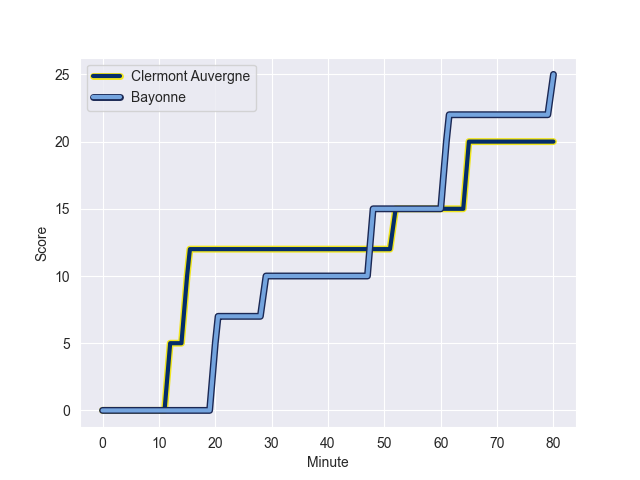
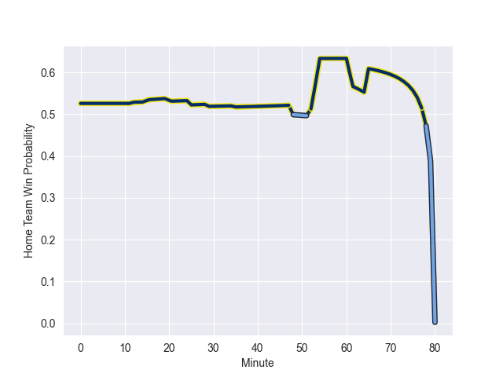

---  
layout: page  
title: Bayonne at Clermont Auvergne; 25-20  
date: 2022-11-05 17:00:00 18:00:00 -0500  
categories: match review  
---
# Bayonne (1467.92) at Clermont Auvergne (1508.1); 25-20

# Prediction: Clermont Auvergne by 7.0

Clermont Auvergne by 4.0 on a neutral field
## Scores over Time

## Win Probability over Time

# Pre-Match Prediction: Clermont Auvergne by 10.9

Clermont Auvergne by 7.9 on a neutral pitch

|   Away Minutes | Away Player           |   Away elo |   Away Percentile |   Number |   Home Percentile |   Home elo | Home Player           |   Home Minutes |
|---------------:|:----------------------|-----------:|------------------:|---------:|------------------:|-----------:|:----------------------|---------------:|
|             41 | Matis Perchaud        |      72.95 |                 2 |        1 |                90 |     109.35 | Etienne Falgoux       |             54 |
|             35 | Torsten van Jaarsveld |     107.53 |                86 |        2 |                56 |      97.35 | Yohan Beheregaray     |             69 |
|             74 | Pieter Scholtz        |      89.06 |                25 |        3 |               nan |      95.99 | Valentin Simutoga     |             62 |
|             80 | Denis Marchois        |     109.32 |                87 |        4 |                49 |      94.91 | Paul Jedrasiak        |             69 |
|             80 | Thomas Ceyte          |     110.19 |                88 |        5 |                91 |     113.08 | Sebastien Vahaamahina |             80 |
|             80 | Pierre Huguet         |      87.88 |                19 |        6 |                82 |     106.34 | Thibaud Lanen         |             80 |
|             53 | Baptiste Heguy        |      99.68 |                66 |        7 |                69 |      99.33 | Killian Tixeront      |             62 |
|             80 | OJ Noa                |      97.64 |                60 |        8 |                62 |     100.06 | Loic Godener          |             80 |
|             53 | Michael Ruru          |     110.75 |               nan |        9 |                95 |     117.77 | Sebastien Bezy        |             53 |
|             80 | Jason Robertson       |      76.74 |                 3 |       10 |                89 |     113.97 | Anthony Belleau       |             80 |
|             80 | Victor Hannoun        |      94.39 |                45 |       11 |                88 |     112.3  | Alivereti Raka        |             80 |
|             80 | Eneriko Buliruarua    |      88.76 |                22 |       12 |                49 |      95.71 | Julien Heriteau       |             53 |
|             55 | Peyo Muscarditz       |     118.59 |                94 |       13 |                 9 |      81.68 | Samuel Ezeala         |             80 |
|             80 | Bastien Pourailly     |      80.84 |                 7 |       14 |                12 |      84.69 | Marvin O'Connor       |             80 |
|             25 | Yohan Orabé           |      95    |               nan |       15 |                47 |      95.04 | Cheikh Tiberghien     |             56 |
|             55 | Camille Lopez         |     129.01 |                97 |       16 |                80 |     105.75 | Apisai Naqalevu       |             27 |
|             45 | Thomas Acquier        |     116.84 |                95 |       17 |                46 |      94.6  | Baptiste Jauneau      |             27 |
|             39 | Chris Talakai         |      94.5  |                52 |       18 |                73 |     102.67 | Daniel Bibi Biziwu    |             26 |
|             27 | Maxime Machenaud      |     100.86 |                71 |       19 |                21 |      87.84 | Jean Pascal Barraque  |             24 |
|             27 | Geoff Cridge          |      99.79 |                66 |       20 |                69 |     100.42 | Giorgi Beria          |             18 |
|             25 | Arnaud Erbinartegaray |      95    |               nan |       21 |                43 |      93.53 | Benjamin Boudou       |             18 |
|              6 | Pascal Cotet          |      91.04 |                27 |       22 |                23 |      89.49 | Miles Amatosero       |             11 |
|            nan | nan                   |     nan    |               nan |       23 |                71 |      99.88 | Adrien Pelissie       |             11 |

