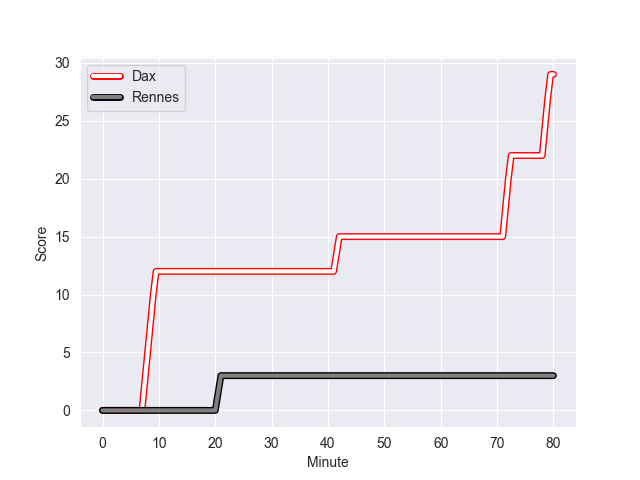
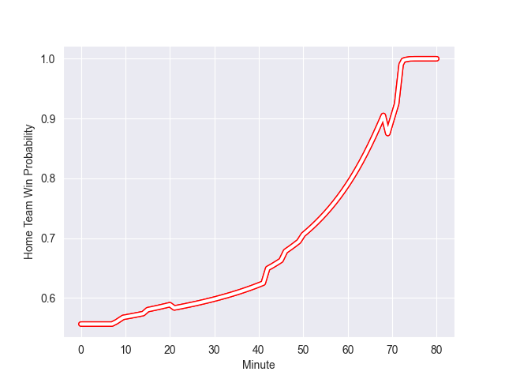

---  
layout: page  
title: Rennes at Dax; 3-29  
date: 2022-11-05 19:00:00 18:00:00 -0500  
categories: match review  
---
# Rennes (1325.77) at Dax (1424.11); 3-29

# Prediction: Dax by 12.8

Dax by 9.8 on a neutral field
## Scores over Time

## Win Probability over Time

# Pre-Match Prediction: Dax by 11.0

Dax by 8.0 on a neutral pitch

|   Away Minutes | Away Player          |   Away elo |   Away Percentile |   Number |   Home Percentile |   Home elo | Home Player       |   Home Minutes |
|---------------:|:---------------------|-----------:|------------------:|---------:|------------------:|-----------:|:------------------|---------------:|
|             46 | Baptiste Le Jallé    |      88.25 |                19 |        1 |                84 |     105.05 | Asa Faitotoa      |             50 |
|             69 | Pierre Strippoli     |      95    |               nan |        2 |                34 |      92.01 | Maxime Delonca    |             50 |
|             46 | Atonio Ulutuipalelei |      94.83 |                54 |        3 |                 7 |      80.46 | Thibaud Dréan     |             50 |
|             80 | Alexandre Gueroult   |      83.73 |                13 |        4 |                26 |      89.77 | Mattieu Bidau     |             80 |
|             62 | Gabriel Quesmel      |      96.87 |                57 |        5 |                80 |     104.56 | Yoan Gaune        |             50 |
|             46 | Vincent Wenger       |      92.22 |                41 |        6 |                67 |      99.88 | Arnaud Aletti     |             80 |
|             80 | Luca Di Salvatore    |      89.07 |                23 |        7 |                44 |      93.86 | Théo Tremeau      |             80 |
|             80 | Gaétan Béraud        |      81.44 |                 9 |        8 |                17 |      87.55 | Jean Despiau      |             43 |
|             46 | Lucas Ollion         |      82.85 |                 9 |        9 |                 6 |      79.8  | Adrien Ayestaran  |             50 |
|             80 | Yvan Leroyer         |      84.1  |                13 |       10 |                64 |      99.51 | Hugo Cerisier     |             80 |
|             80 | Vaha Ma'afu          |      93.7  |                42 |       11 |                48 |      95.22 | Guillaume Bouche  |             80 |
|             62 | Hypolite Cornu       |      92.56 |               nan |       12 |                81 |     105.44 | Hugo Fourquet     |             80 |
|             80 | Alexis François      |      90.76 |                30 |       13 |                84 |     107.06 | Sylvère Reteau    |             80 |
|             69 | Alexandre Nicoue     |      76.74 |                 4 |       14 |                 9 |      83.41 | Alexandre Pilati  |             15 |
|             80 | Pedro Soto           |      91.06 |                31 |       15 |                22 |      89.51 | Théo Gatelier     |             54 |
|             34 | Grégory Querin       |      89.19 |                23 |       16 |                25 |      90.59 | Julien Dechavanne |             65 |
|             34 | Matéo Jeune-Joly     |      90.91 |                28 |       17 |                17 |      87.38 | Diaby Doucouré    |             37 |
|             34 | Victor Fromenteze    |      68.48 |                 1 |       18 |                88 |     108    | Elvis Levi        |             30 |
|             34 | Luvuyo Pupuma        |      93.51 |                39 |       19 |                42 |      94.03 | Louis Mary        |             30 |
|             18 | Baptiste Beaujouan   |      92.47 |                40 |       20 |                16 |      84.64 | Mat Luamanu       |             30 |
|             18 | Mateo Carrere        |      91.34 |                31 |       21 |                28 |      93.79 | Anthony Pelmard   |             30 |
|             11 | Théo Platon          |      89.76 |                23 |       22 |                 9 |      82.84 | Simon Garrouteigt |             30 |
|             11 | Guillaume Cazette    |      86.91 |                16 |       23 |                73 |     104.05 | Théo Duprat       |             26 |

