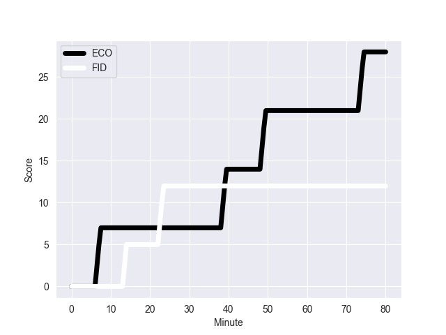
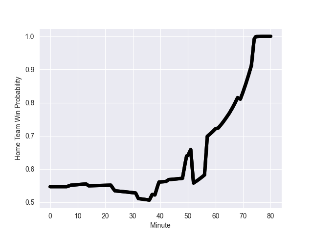

---  
layout: page  
title: FID at ECO; 12-28  
date: 2022-11-05 14:00:00 18:00:00 -0500  
categories: match review  
---
# FID (1521.49) at ECO (1602.87); 12-28

# Prediction: ECO by 15.1

ECO by 8.1 on a neutral field
## Scores over Time

## Win Probability over Time

# Pre-Match Prediction: ECO by 14.1

ECO by 7.1 on a neutral pitch

|   Away Minutes | Away Player                    |   Away elo |   Away Percentile |   Number |   Home Percentile |   Home elo | Home Player         |   Home Minutes |
|---------------:|:-------------------------------|-----------:|------------------:|---------:|------------------:|-----------:|:--------------------|---------------:|
|             51 | Eroni Mawi                     |      92.44 |                34 |        1 |                12 |      85.78 | Pierre Schoeman     |             52 |
|             73 | Sam Matavesi                   |      97.57 |                61 |        2 |                97 |     120.38 | George Turner       |             32 |
|             51 | Manasa Saulo Romumu            |     117.54 |                97 |        3 |                98 |     120.32 | Zander Fagerson     |             69 |
|             55 | Temo Mayanavanua               |      94.94 |                50 |        4 |                33 |      91.28 | Richie Gray         |             80 |
|             80 | Ratu Rotuisolia                |      88.92 |                23 |        5 |                92 |     112.36 | Grant Gilchrist     |             61 |
|             80 | Albert Tuisue                  |     103.63 |                79 |        6 |                95 |     119.48 | Jamie Ritchie       |             80 |
|             73 | Levani Botia Veivuke           |     136.36 |                99 |        7 |                69 |      99.56 | Hamish Watson       |             52 |
|             80 | Viliame Mata                   |      89.83 |                24 |        8 |                90 |     114.28 | Matt Fagerson       |             80 |
|             65 | Frank Lomani                   |      96.55 |                56 |        9 |                73 |     101.73 | Ali Price           |             52 |
|             80 | Vilimoni Botitu                |      98.14 |                59 |       10 |                97 |     128.76 | Adam Hastings       |             43 |
|             80 | Vinaya Habosi                  |      94.12 |                45 |       11 |                41 |      93.55 | Duhan van der Merwe |             80 |
|             57 | Kalaveti Ravouvou              |     102.76 |                75 |       12 |                84 |     107.07 | Cameron Redpath     |             80 |
|             80 | Waisea Nayacalevu Vuidravuwalu |     117.44 |                94 |       13 |                81 |     105.96 | Chris Harris        |             69 |
|             80 | Seta Tuicuvu                   |      95.8  |                49 |       14 |                95 |     120.43 | Darcy Graham        |             80 |
|             37 | Kini Murimurivalu              |     123.52 |                97 |       15 |                76 |     104.23 | Stuart Hogg         |             80 |
|             43 | Sireli Maqala                  |      94.33 |                43 |       16 |                98 |     137.08 | Blair Kinghorn      |             37 |
|             29 | Livai Rasala Natave            |      95    |               nan |       17 |                46 |      94.91 | Ewan Ashman         |             48 |
|             29 | Luke Tagi                      |      92.47 |                39 |       18 |               nan |     110.15 | Ben White           |             28 |
|             25 | Api Ratuniyarawa               |      95.79 |                55 |       19 |                 6 |      77.88 | Jack Dempsey        |             28 |
|             23 | Teti Tela                      |      99.59 |                69 |       20 |                69 |      99.49 | Rory Sutherland     |             28 |
|              7 | Tevita Ikanivere               |      96.53 |                57 |       21 |                65 |      99.37 | Jonny Gray          |             19 |
|              7 | Kitione Kamikamica             |      93.99 |                42 |       22 |                56 |      97.35 | Murphy Walker       |             11 |
|             15 | Peni Matawalu                  |      97.8  |                59 |       23 |                 2 |      71.34 | Sione Tuipulotu     |             11 |

