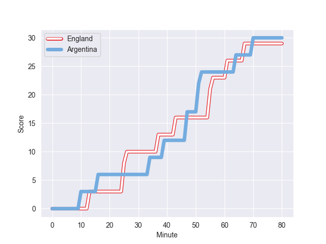
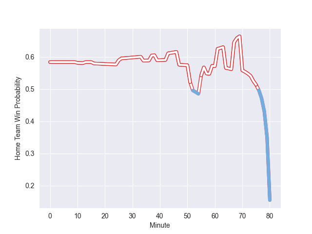

---  
layout: page  
title: Argentina at England; 30.0-29.0  
date: 2022-11-05 14:15:00 18:00:00 -0500  
categories: match review  
---
# Argentina (1582.54) at England (1730.01); 30.0-29.0

# Prediction: England by 17.7

England by 14.7 on a neutral field
## Scores over Time

## Win Probability over Time

# Pre-Match Prediction: England by 17.4

England by 14.4 on a neutral pitch

|   Away Minutes | Away Player            |   Away elo |   Away Percentile |   Number |   Home Percentile |   Home elo | Home Player         |   Home Minutes |
|---------------:|:-----------------------|-----------:|------------------:|---------:|------------------:|-----------:|:--------------------|---------------:|
|             80 | Thomas Gallo           |     103.88 |                82 |        1 |                91 |     110.57 | Ellis Genge         |             59 |
|             68 | Julian Montoya         |     100.04 |                70 |        2 |                93 |     113.31 | Luke Cowan-Dickie   |             80 |
|             59 | Francisco Gomez Kodela |     111.9  |                92 |        3 |                93 |     112.27 | Kyle Sinckler       |             74 |
|             80 | Matias Alemanno        |     118.22 |                94 |        4 |                 8 |      82.28 | Alex Coles          |             75 |
|             57 | Tomas Lavanini         |     109.35 |                87 |        5 |                61 |      98.13 | Jonny Hill          |             80 |
|             80 | Juan Martin Gonzalez   |     113.86 |                91 |        6 |                96 |     122.71 | Maro Itoje          |             80 |
|             74 | Marcos Kremer          |      88.46 |                21 |        7 |                88 |     110.47 | Tom Curry           |             80 |
|             80 | Pablo Matera           |     116.28 |                90 |        8 |                99 |     139.14 | Billy Vunipola      |             57 |
|             80 | Gonzalo Bertranou      |      98.38 |                58 |        9 |                93 |     115.13 | Ben Youngs          |             55 |
|             80 | Santiago Carreras      |     124.26 |                97 |       10 |                93 |     122.2  | Marcus Smith        |             80 |
|             80 | Emiliano Boffelli      |      88.23 |                23 |       11 |                79 |     104.69 | Joe Cokanasiga      |             80 |
|             80 | Jeronimo de la Fuente  |     114.05 |                90 |       12 |                99 |     144.8  | Owen Farrell        |             80 |
|             80 | Matias Moroni          |     113.47 |                90 |       13 |                97 |     126.19 | Manu Tuilagi        |             68 |
|             68 | Mateo Carreras         |      94.11 |                44 |       14 |                96 |     122.25 | Jack Nowell         |             80 |
|             80 | Juan Cruz Mallia       |      99.09 |                63 |       15 |                78 |     105.93 | Freddie Steward     |             80 |
|             12 | Ignacio Ruiz           |      94.59 |               nan |       16 |                72 |     100.79 | Jack Singleton      |              0 |
|              0 | Nahuel Tetaz Chaparro  |     108.35 |                88 |       17 |                99 |     136.86 | Mako Vunipola       |             21 |
|             21 | Eduardo Bello          |      95.54 |                48 |       18 |                70 |     100.74 | Joe Heyes           |              6 |
|              0 | Lucas Paulos Adler     |      95    |               nan |       19 |                86 |     108.66 | David Ribbans       |              0 |
|             23 | Facundo Isa            |     120.19 |                96 |       20 |                92 |     119.1  | Sam Simmonds        |             23 |
|              0 | Eliseo Morales Abraham |     102.98 |                74 |       21 |                95 |     117.52 | Jack Willis         |              5 |
|              0 | Tomas Albornoz         |     111.43 |                86 |       22 |                89 |     110.74 | Jack van Poortvliet |             25 |
|             12 | Matias Orlando         |      78.03 |                 5 |       23 |                94 |     118.48 | Henry Slade         |             12 |

